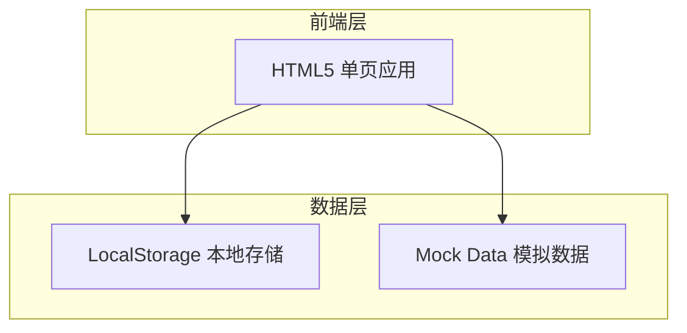

# 网络建设项目管理系统 - 技术架构文档

## 1. 架构设计



## 2. 技术选型

- **前端**：HTML5 + CSS3 + Vanilla JavaScript
- **图表库**：Chart.js（轻量级图表）
- **图标**：Lucide Icons（线性图标）
- **布局**：CSS Grid + Flexbox
- **数据存储**：LocalStorage（演示用）

## 3. 页面路由

| 路由 | 页面名称 | 功能描述 |
|------|----------|----------|
| /login | 登录页 | 用户登录、注册、SSO入口 |
| /dashboard | 工作台 | 项目统计、待办事项、快捷入口 |
| /projects | 项目列表 | 项目检索、筛选、批量操作 |
| /project/:id | 项目详情 | 项目信息、进度、文档、审批 |
| /project/new | 项目立项 | 立项表单、预算编制、申请提交 |
| /approval | 审批管理 | 审批流程配置、待办审批 |
| /reports | 报表中心 | 多维度报表、图表可视化 |
| /contracts | 合同管理 | 合同列表、起草、签章 |
| /personnel | 人员管理 | 人员档案、考勤、绩效 |
| /pricing | 单价管理 | 材料/设备/人工单价、版本管理 |

## 4. 数据模型

### 4.1 项目模型

```json
{
  "id": "string",
  "code": "string",
  "name": "string",
  "type": "机房建设|分配网建设|入户安装",
  "status": "筹备|立项审批中|已立项|进行中|验收中|已完成|已结算",
  "budget": "number",
  "progress": "number",
  "startDate": "date",
  "endDate": "date",
  "team": ["userId"],
  "createBy": "userId",
  "createTime": "datetime"
}
```

### 4.2 用户模型

```json
{
  "id": "string",
  "name": "string",
  "phone": "string",
  "role": "员工|项目经理|监理方|施工队",
  "department": "string",
  "avatar": "url",
  "createTime": "datetime"
}
```

### 4.3 合同模型

```json
{
  "id": "string",
  "code": "string",
  "name": "string",
  "projectId": "string",
  "partyA": "string",
  "partyB": "string",
  "amount": "number",
  "status": "起草中|审核中|已签订|执行中|已变更|已结算",
  "signDate": "date",
  "expireDate": "date",
  "attachments": ["url"]
}
```

### 4.4 人员模型

```json
{
  "id": "string",
  "name": "string",
  "phone": "string",
  "idCard": "string",
  "role": "string",
  "skills": ["string"],
  "team": "string",
  "status": "在职|离职|休假",
  "attendance": [{
    "date": "date",
    "status": "正常|迟到|早退|缺勤"
  }],
  "wages": {
    "base": "number",
    "bonus": "number",
    "deduction": "number"
  }
}
```

### 4.5 单价模型

```json
{
  "id": "string",
  "category": "材料|设备|人工|分包",
  "name": "string",
  "unit": "string",
  "price": "number",
  "effectiveDate": "date",
  "expireDate": "date",
  "supplier": "string",
  "remark": "string"
}
```

## 5. 功能模块实现说明

### 5.1 用户认证

- 演示模式：使用 LocalStorage 模拟登录状态
- 支持切换不同角色查看权限差异
- 登录表单包含表单验证和错误提示

### 5.2 项目管理

- 项目列表支持表格和卡片两种视图
- 筛选条件：项目状态、类型、时间范围
- 项目详情展示 Tab 切换：基本信息、进度节点、资金流向、文档资料

### 5.3 审批流程

- 可视化流程节点展示
- 审批历史时间线
- 支持会签/或签模式展示

### 5.4 报表系统

- 基于 Chart.js 实现图表可视化
- 支持按时间段筛选数据
- 导出功能模拟

### 5.5 合同管理

- 合同状态标签可视化
- 电子签章按钮模拟
- 付款节点进度展示

### 5.6 人员管理

- 人员卡片展示头像、信息、状态
- 考勤日历模拟
- 工时统计图表

### 5.7 单价管理

- 价格曲线图展示历史趋势
- 版本对比功能
- 分类筛选展示

## 6. 页面布局规范

### 6.1 整体布局

- 左侧导航栏宽度：240px（可折叠至64px）
- 顶部导航高度：64px
- 内容区内边距：24px
- 卡片间距：16px

### 6.2 组件规范

- 按钮高度：36px（主按钮）、32px（次按钮）
- 输入框高度：40px
- 卡片圆角：8px
- 阴影：0 2px 8px rgba(0,0,0,0.08)

## 7. 交互规范

### 7.1 动画效果

- 页面切换：淡入淡出 300ms ease-out
- 卡片悬停：轻微上浮 + 阴影加深
- 按钮点击：缩放0.98
- 数据加载：骨架屏占位

### 7.2 反馈机制

- 操作成功：绿色提示 toast
- 操作失败：红色错误提示
- 加载中：中心旋转图标
- 空状态：插画 + 引导文案
