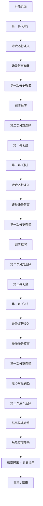

# 《少年渡》互动叙事H5小游戏 产品需求文档（PRD）

## 1. 产品概述

《少年渡》是一款面向12-17岁青少年的心理向互动叙事H5网页游戏，通过模拟学业困境、人际隔阂、自我内耗场景，以无说教、低压力、强共情的方式引导青少年学会求助、接纳自我、缓解焦虑。

- **核心价值**：在安全虚拟场景中预演应对方式，完成情绪疏导与自我成长
- **目标用户**：12-17岁初、高中青少年
- **单局时长**：15-20分钟（三幕完整闭环体验）
- **产品定位**：纯公益治愈体验，无广告、无付费、无隐私收集

## 2. 核心功能

### 2.1 用户角色

| 角色 | 注册方式 | 核心权限 |
|------|----------|----------|
| 玩家 | 无需注册，直接进入 | 体验完整三幕剧情、获取结局、查看徽章、本地存档 |

### 2.2 功能模块

1. **开始页面**：游戏标题、开始按钮、氛围营造
2. **第一幕《家》**：深夜卧室场景、学业内耗、亲子误解、双分支选择
3. **第二幕《校》**：日间教室场景、课堂失语、自我否定、双分支选择
4. **第三幕《人》**：傍晚操场场景、温柔救赎、自我接纳、双分支选择
5. **结局页面**：四类成长结局推演、全局兜底提示、求助热线
6. **徽章系统**：勇敢者、思考者、坚持者、成长者四类徽章
7. **复盘系统**：每幕结束后的情绪复盘引导
8. **存档系统**：LocalStorage本地存储游戏进度与选择记录

### 2.3 页面详情

| 页面名称 | 模块名称 | 功能描述 |
|----------|----------|----------|
| 开始页 | 标题区域 | 游戏名称「少年渡」、副标题、渐入动画 |
| 开始页 | 开始按钮 | 点击进入第一幕，带微动效 |
| 游戏页 | 诗歌区 | 逐行淡入诗歌文字，可点击跳过 |
| 游戏页 | 场景插图区 | 动态适配当前剧情情绪的背景插图 |
| 游戏页 | 叙事文本区 | 内心独白、剧情描述，逐字显示 |
| 游戏页 | 选择按钮区 | 2个分支选项，正向/消极选择有不同视觉反馈 |
| 游戏页 | 进度条 | 三幕进度指示，随情绪变色（浅灰→淡蓝→暖橙） |
| 复盘页 | 复盘文案 | 每幕结束后的情绪引导文案 |
| 结局页 | 结局标题 | 四类结局之一的标题 |
| 结局页 | 结局文案 | 详细的成长型结局描述 |
| 结局页 | 兜底提示 | 12355青少年服务热线信息 |
| 结局页 | 徽章展示 | 已获得徽章的展示区域 |
| 结局页 | 重玩按钮 | 重新开始游戏的入口 |

## 3. 核心流程

### 3.1 主流程描述

玩家进入游戏后，首先看到诗意的开始页面。点击开始后，进入第一幕《家》：诗歌逐行淡入，展现深夜书桌前的学业内耗场景，随后母亲喊话触发冲突，玩家做出两次分支选择，幕末出现复盘引导。接着转场进入第二幕《校》：教室场景中体验课堂失语的迷茫，同样两次选择后转场。第三幕《人》：操场看台上被温柔救赎，完成最后两次选择后，根据三幕所有选择的权重匹配四类成长结局之一，展示结局文案与获得的徽章，并提供12355求助热线兜底。

### 3.2 流程图

## 4. 用户界面设计

### 4.1 设计风格

- **整体调性**：安静、温柔、低刺激、治愈，无尖锐元素、无刺眼配色
- **标准配色**：
  - 主色：米白 #FEFAF6
  - 辅助色：青蓝 #4A7C8C
  - 点缀色：琥珀 #D4A574
- **字体规范**：
  - 正文：无衬线字体（清晰适配移动端）
  - 开幕诗歌：衬线字体（增强文学氛围感）
- **按钮风格**：圆角柔和、淡入淡出过渡，无硬边阴影
- **布局风格**：全屏沉浸式、居中内容、大量留白
- **动画规范**：全程淡入淡出渐变动画，无抖动、无闪烁、无剧烈转场，节奏舒缓

### 4.2 页面设计概述

| 页面名称 | 模块名称 | UI元素 |
|----------|----------|--------|
| 开始页 | 标题区域 | 衬线大标题「少年渡」、淡入动画、柔和光晕背景 |
| 开始页 | 开始按钮 | 青蓝底色、圆角、悬停微放大、点击涟漪效果 |
| 游戏页 | 进度条 | 顶部细进度条，三幕分段，颜色随情绪变化 |
| 游戏页 | 诗歌文本 | 衬线字体、逐行淡入、行间距宽松、居中排列 |
| 游戏页 | 场景插图 | 全屏背景、低透明度、朦胧滤镜、情绪适配色调 |
| 游戏页 | 叙事文本 | 无衬线字体、逐字显示、底部留白、舒适行高 |
| 游戏页 | 选择按钮 | 两个并列、卡片式、正向选择琥珀边框、消极选择浅灰边框 |
| 复盘页 | 复盘文案 | 居中排列、青蓝色调、引导性语气 |
| 结局页 | 结局标题 | 大字号、温暖色调、居中显示 |
| 结局页 | 结局文案 | 段落式、舒适行高、两侧留白 |
| 结局页 | 徽章区 | 四枚徽章图标排列、已获得的亮起、未获得的灰度 |
| 结局页 | 兜底提示 | 浅灰底、小字、12355热线醒目 |
| 结局页 | 重玩按钮 | 琥珀色、圆角、底部居中 |

### 4.3 响应式设计

- **移动优先**：以移动端H5为主要设计基准，375px-428px宽度优化
- **PC兼容**：最大内容宽度限制在600px，居中显示，保持移动端比例
- **触摸优化**：按钮最小高度48px，足够的点击热区
- **横竖屏**：竖屏优化，横屏时保持内容居中比例

### 4.4 视听联动设计

- **诗歌动画**：文字逐行淡入，每行间隔1.5s，可点击跳过，搭配纸张翻页音效
- **插图情绪适配**：正向选择画面微提亮、色调变暖；消极选择画面微压暗、色调偏冷
- **选择音效区分**：正向选项触发轻柔风铃音；消极选项触发低沉钢琴单音
- **进度条情绪变色**：第一幕浅灰、第二幕淡蓝、第三幕暖橙
- **BGM情绪递进**：三幕BGM从静谧压抑→疏离焦虑→温暖治愈逐步上扬

## 5. 内容伦理与安全规范

- 全程无负面引导、无自我伤害、无极端冲突
- 所有消极剧情均有正向兜底，避免玩家陷入情绪内耗
- 结局页面固定展示12355青少年服务热线
- 无广告、无付费、无隐私收集，纯公益治愈体验
- 无容貌/成绩人格否定内容
