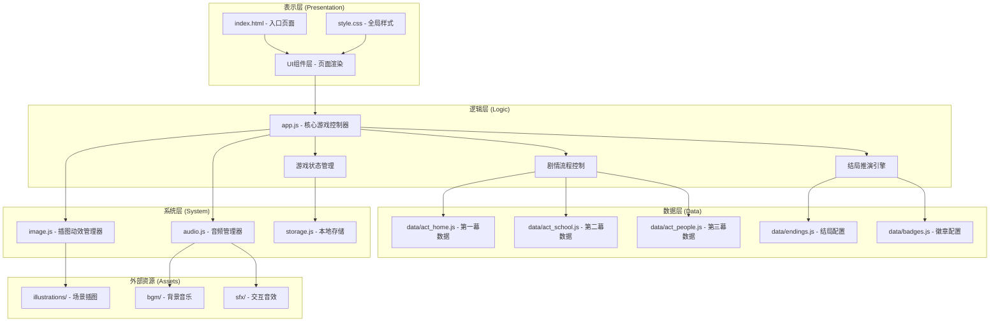
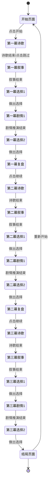

# 《少年渡》互动叙事H5小游戏 技术架构文档

## 1. 架构设计

### 1.1 整体架构图



## 2. 技术选型说明

- **前端框架**：原生 Vanilla JS + CSS + HTML（轻量无框架，保证加载速度和兼容性）
- **数据存储**：LocalStorage（存档、徽章、选择记录，无需后端）
- **音频控制**：Web Audio API + HTML5 Audio（BGM播放、音效触发）
- **动画实现**：CSS Transitions + CSS Animations + JS 逐帧控制
- **部署方式**：纯静态页面，可托管于 GitHub Pages / Vercel / 任意静态服务器
- **构建工具**：无需构建工具，直接运行

### 2.1 技术选型理由

1. **原生JS**：游戏逻辑相对简单，无需React/Vue等重型框架，减少包体积，提升加载速度
2. **LocalStorage**：纯前端游戏，无需后端服务，数据本地存储保护隐私
3. **CSS动画**：淡入淡出等简单动画用CSS实现性能更好
4. **静态部署**：降低运维成本，适合公益项目

## 3. 文件结构定义

```
少年渡/
├── index.html              # 项目入口页面
├── style.css               # 全局样式
├── app.js                  # 核心游戏逻辑控制器
├── audio.js                # 音频音效管理模块
├── image.js                # 插图动画管理模块
├── storage.js              # 本地存储管理模块
├── data/
│   ├── act_home.js         # 第一幕《家》剧情数据
│   ├── act_school.js       # 第二幕《校》剧情数据
│   ├── act_people.js       # 第三幕《人》剧情数据
│   ├── endings.js          # 结局文案配置
│   └── badges.js           # 徽章配置数据
└── assets/
    ├── illustrations/      # 三幕场景插图（SVG/CSS生成）
    ├── bgm/                 # 三幕背景音乐（Web Audio合成）
    └── sfx/                 # 交互音效（Web Audio合成）
```

## 4. 核心数据模型

### 4.1 游戏状态 (GameState)

```javascript
{
  currentAct: 0,           // 当前幕次 (0=家, 1=校, 2=人)
  currentScene: 'start',   // 当前场景 (start/poem/narrative/choice/ending)
  choices: [],             // 所有选择记录 [{act, choiceIndex, isPositive}]
  positiveCount: 0,        // 正向选择计数
  badges: [],              // 已获得徽章ID列表
  currentPoemLine: 0,      // 当前诗歌行索引
  textDisplayIndex: 0,     // 文本逐字显示索引
  audioEnabled: true,      // 是否开启音效
  bgmVolume: 0.3,          // BGM音量
  sfxVolume: 0.5           // 音效音量
}
```

### 4.2 幕次数据结构 (ActData)

```javascript
{
  id: 'home',
  title: '家',
  poem: [...],             // 诗歌行数组
  scenes: [
    {
      id: 'narrative1',
      type: 'narrative',   // narrative / choice / reflection
      text: '...',
      nextScene: 'choice1'
    },
    {
      id: 'choice1',
      type: 'choice',
      question: '...',
      options: [
        { text: '...', isPositive: true, nextScene: '...', consequence: '...' },
        { text: '...', isPositive: false, nextScene: '...', consequence: '...' }
      ]
    }
  ],
  reflection: '...',       // 幕末复盘文案
  bgm: 'home_bgm',
  illustration: 'home_bg'
}
```

### 4.3 结局数据结构 (Ending)

```javascript
{
  id: 'growth',
  title: '成长者',
  description: '...',
  condition: (state) => { ... }  // 判定函数
}
```

## 5. 核心模块设计

### 5.1 游戏控制器 (app.js)

**核心职责**：
- 初始化游戏状态
- 管理场景切换流程
- 处理用户选择事件
- 协调各模块（音频、图像、存储）
- 结局推演计算

**核心方法**：
- `init()` - 初始化游戏
- `startGame()` - 开始新游戏
- `nextScene()` - 进入下一场景
- `makeChoice(optionIndex)` - 处理选择
- `calculateEnding()` - 计算结局
- `goToAct(actIndex)` - 切换幕次

### 5.2 音频管理器 (audio.js)

**核心职责**：
- BGM播放、暂停、切换
- 交互音效触发
- 音量控制
- Web Audio API 合成音效

**核心方法**：
- `playBGM(trackName)` - 播放BGM
- `stopBGM()` - 停止BGM
- `playSFX(effectName)` - 播放音效
- `setVolume(type, value)` - 设置音量
- `toggleMute()` - 静音切换

### 5.3 插图管理器 (image.js)

**核心职责**：
- 场景插图切换
- 情绪色调调整（暖色/冷色滤镜）
- 诗歌段落对应画面渐显
- 转场动画效果

**核心方法**：
- `setIllustration(name)` - 设置当前插图
- `adjustMood(isPositive)` - 调整情绪色调
- `transitionTo(name, duration)` - 过渡切换插图
- `highlightRegion(region)` - 高亮画面区域

### 5.4 存储管理器 (storage.js)

**核心职责**：
- 游戏进度存档/读档
- 徽章数据持久化
- 选择记录存储
- 设置项保存

**核心方法**：
- `saveGame(state)` - 保存游戏进度
- `loadGame()` - 读取游戏进度
- `saveBadges(badges)` - 保存徽章
- `loadBadges()` - 读取徽章
- `clearAll()` - 清除所有数据

## 6. 页面状态流转



## 7. 性能优化策略

1. **懒加载**：非首屏资源延迟加载
2. **CSS动画优先**：尽量使用CSS而非JS动画
3. **内存管理**：及时清理无用DOM节点和事件监听
4. **图片优化**：使用WebP格式，提供响应式图片
5. **音频优化**：使用Web Audio API合成简单音效，减少资源请求
6. **节流防抖**：用户输入事件添加防抖处理

## 8. 兼容性要求

- **浏览器**：Chrome 80+、Safari 13+、Firefox 75+、Edge 80+
- **移动端**：iOS Safari 13+、Android Chrome 80+
- **屏幕尺寸**：320px - 1200px 自适应
- **无依赖**：不依赖任何第三方库，纯原生实现
