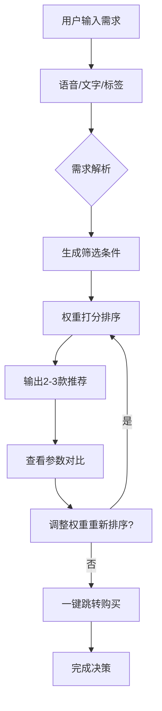

# 购物快速决策辅助小程序 - 产品需求文档

## 1. 产品概述

一款轻量化微信小程序原型，帮助用户在30秒内从海量商品中锁定最优选择，解决"决策疲劳"问题。

目标用户：电商购物时面临选择困难的消费者，聚焦入门级电子产品和日常生活用品两类品类。

核心价值：将"模糊需求"转化为"明确选择"，提供端到端的购买决策闭环体验。

## 2. 功能模块

### 2.1 核心功能

1. **首页/需求输入页**
   - 语音输入：按住说话，自动解析为结构化筛选条件
   - 文字输入：直接描述购物需求
   - 标签点选：通过预设标签快速表达需求
   - 产品类别选择：电子产品 / 日常生活用品

2. **智能筛选与排序页**
   - 规则引擎驱动：根据输入需求生成筛选条件
   - 权重打分系统：价格、品牌、评分、销量等多维度评分
   - 推荐结果展示：2-3款最优产品排序展示
   - 产品卡片：商品名、图片、核心参数、评分、价格

3. **产品详情对比页**
   - 参数对比表格：多产品关键参数并排展示
   - 用户短评聚合：真实用户反馈提炼
   - 一键购买按钮：跳转电商平台链接

4. **权重调整面板**
   - 优先级滑块：价格 vs 品牌 vs 评分 vs 续航等
   - 实时预览：拖动滑块即时更新推荐结果

## 3. 核心流程

## 4. 视觉设计

### 4.1 设计风格
- **风格定位**：极简高效、科技感强、决策导向
- **主色调**：深邃蓝 #1A2B4C 为主，活力橙 #FF6B35 为强调色
- **字体**：思源黑体 (简体中文)，Roboto (英文/数字)
- **布局**：卡片式设计，大留白，信息层次分明

### 4.2 页面结构
| 页面 | 主要元素 |
|------|----------|
| 首页 | 顶部logo，输入区域（语音/文字/标签），开始决策按钮 |
| 筛选结果页 | 筛选条件标签，推荐产品卡片流，权重调整抽屉 |
| 对比详情页 | 产品对比表格，用户评论聚合，购买按钮 |

### 4.3 交互设计
- 语音输入：长按录音，波形动画反馈
- 滑块调整：拖拽手感优化，数值实时更新
- 页面切换：左滑返回，流畅过渡动画

### 4.4 响应式设计
- 移动端优先，触摸优化
- 适配微信小程序视图
