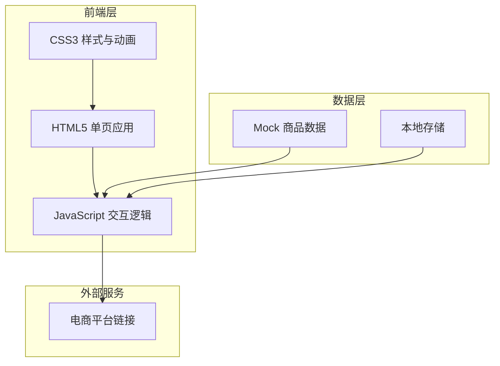

# 购物快速决策辅助小程序 - 技术架构文档

## 1. 架构设计



## 2. 技术选型

- **前端**：纯 HTML5 + CSS3 + JavaScript（原生，无框架依赖）
- **样式**：CSS3 Flexbox/Grid，CSS Variables，CSS Animations
- **数据**：JSON Mock 数据模拟后端响应
- **图标**：Lucide Icons（SVG图标库）
- **字体**：Google Fonts - 思源黑体

## 3. 页面路由

| 路由 | 页面 | 功能描述 |
|------|------|----------|
| #home | 首页 | 需求输入（语音/文字/标签） |
| #results | 筛选结果页 | 推荐产品列表与权重调整 |
| #compare | 对比详情页 | 产品参数对比与购买入口 |

## 4. 核心数据结构

### 4.1 商品数据结构
```javascript
{
  id: string,
  name: string,
  category: "electronics" | "daily",
  price: number,
  brand: string,
  rating: number,
  sales: number,
  tags: string[],
  specs: {
    [key: string]: string | number
  },
  comments: string[],
  link: string
}
```

### 4.2 筛选条件结构
```javascript
{
  category: string,
  priceRange: [min, max],
  brand: string[],
  tags: string[],
  weights: {
    price: number,
    rating: number,
    sales: number
  }
}
```

## 5. 页面详情

### 5.1 首页 (#home)
- **组件**：Logo区、输入模式切换Tab、语音录制按钮、文本输入框、标签选择器、类别选择器、开始决策按钮
- **状态**：输入内容、选中标签、选择类别、录音状态

### 5.2 筛选结果页 (#results)
- **组件**：筛选条件摘要、产品卡片列表、权重调整抽屉、重新搜索按钮
- **状态**：推荐产品列表、当前权重配置

### 5.3 对比详情页 (#compare)
- **组件**：产品对比表格、用户评论区、购买按钮
- **状态**：待对比产品列表（2-3款）

## 6. 权重算法

评分公式：`score = w1*价格分 + w2*评分分 + w3*销量分 + w4*标签匹配分`

- 价格分：越低价得分越高
- 评分分：基于商品评分计算
- 销量分：销量越高得分越高
- 标签匹配分：与用户需求标签匹配数量

权重范围：每个维度 0-100，用户可拖动滑块调整。
