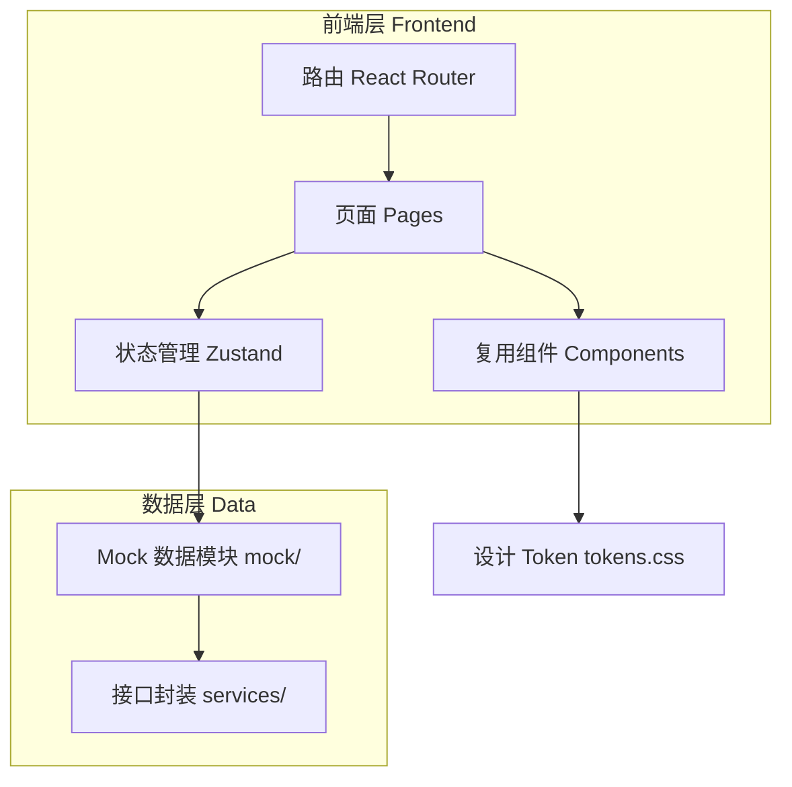

# 菇管家小程序 — 技术架构文档

## 1. 架构设计
纯前端单页应用，使用 React + Vite，内置 Mock 数据层模拟后端接口，无外部服务依赖，开箱即跑。



## 2. 技术说明
- **前端框架**：React 18 + TypeScript
- **构建工具**：Vite（开发热更新 + 生产打包）
- **样式方案**：Tailwind CSS + CSS 变量（设计 Token，与设计稿 `colors_and_type.css` 完全对齐）
- **路由**：react-router-dom v6
- **状态管理**：Zustand（全局：当前菇棚、告警、Toast、诊断流程状态）
- **图标**：lucide-react
- **图表**：纯 SVG/CSS 手绘折线图（历史曲线），零额外依赖，兼容性好
- **数据**：前端内置 Mock，`src/services` 封装为 Promise，模拟接口延迟，便于未来对接真实后端
- **包管理**：pnpm

## 3. 路由定义
| 路由 | 页面 | 层级 |
|------|------|------|
| `/` | 重定向到 `/home` | — |
| `/home` | 首页 · 环境监测（Tab 1） | 一级 |
| `/ai` | AI 助手（Tab 2） | 一级 |
| `/archive` | 种植档案（Tab 3） | 一级 |
| `/profile` | 我的（Tab 4） | 一级 |
| `/diagnosis/:id` | 病害诊断结果 | 二级 |
| `/alerts` | 告警列表 | 二级 |
| `/chart/:metric` | 历史曲线 | 二级 |
| `/multi-shed` | 多棚管理 | 二级 |
| `/classroom` | 农技课堂 | 二级 |
| `/device/:id` | 设备详情 | 二级 |
| `/batch/:id` | 批次详情 | 二级 |
| `/alert-settings` | 告警设置 | 二级 |

## 4. 数据模型（Mock 接口）
所有接口返回 `{ code: 0, data: {...} }` 结构，对应设计文档 Mock 总表：

- `getDashboard(shedId)` → 当前棚指标（temperature/humidity/co2/light/soilTemp）+ alerts + updateTime
- `getSheds()` → 多棚列表（含状态摘要）
- `diagnose(imageUrl)` → 病害诊断结果（diseaseName/confidence/symptoms/treatment）
- `voiceAsk(question)` → 问答结果（answer/relatedVideos）
- `getBatches(stage?)` → 批次列表
- `getBatchDetail(id)` → 批次详情（timeline/envAvg7d）
- `getAlerts(filter)` → 告警列表（pending/resolved/all）
- `getDevices()` / `getDeviceDetail(id)` → 设备列表/详情
- `getUser()` → 用户信息 + 告警设置

## 5. 目录结构
```
src/
  components/      # 复用组件（PhoneShell、NavBar、TabBar、MetricCard、AlertCard、Toast 等）
  pages/           # 各页面
  services/        # Mock 接口封装
  mock/            # Mock 数据
  store/           # Zustand store
  styles/          # tokens.css 设计 Token
  utils/           # 工具函数（语音播报、格式化）
  App.tsx          # 路由 + 布局
  main.tsx         # 入口
```

## 6. 关键实现策略
- **设计 Token 复用**：将设计稿 `colors_and_type.css` 的 CSS 变量原样迁入 `src/styles/tokens.css`，并在 Tailwind 中扩展同名颜色，保证视觉一致。
- **手机壳布局**：`PhoneShell` 组件模拟微信小程序容器（375px 宽、状态栏 44px、导航栏 44px、底部 Tab 50px + 安全区），桌面端居中带阴影。
- **状态即颜色**：封装 `statusColor(status)` 工具，normal→绿、warning→橙、danger→红、offline→灰，统一驱动指标卡、告警卡、按钮。
- **语音播报**：使用浏览器 `SpeechSynthesis` API 实现温度/诊断结果播报；语音输入用 `webkitSpeechRecognition`（可选降级）。
- **手势**：下拉刷新（touch 事件 + 位移阈值）、左右滑动切棚（touchstart/move/end + 指标卡区域）、长按语音（press 检测）。
- **历史曲线**：根据 Mock 数据用 SVG 绘制 24h/7d/30d 折线，含网格、坐标、状态色填充，无第三方图表库。
