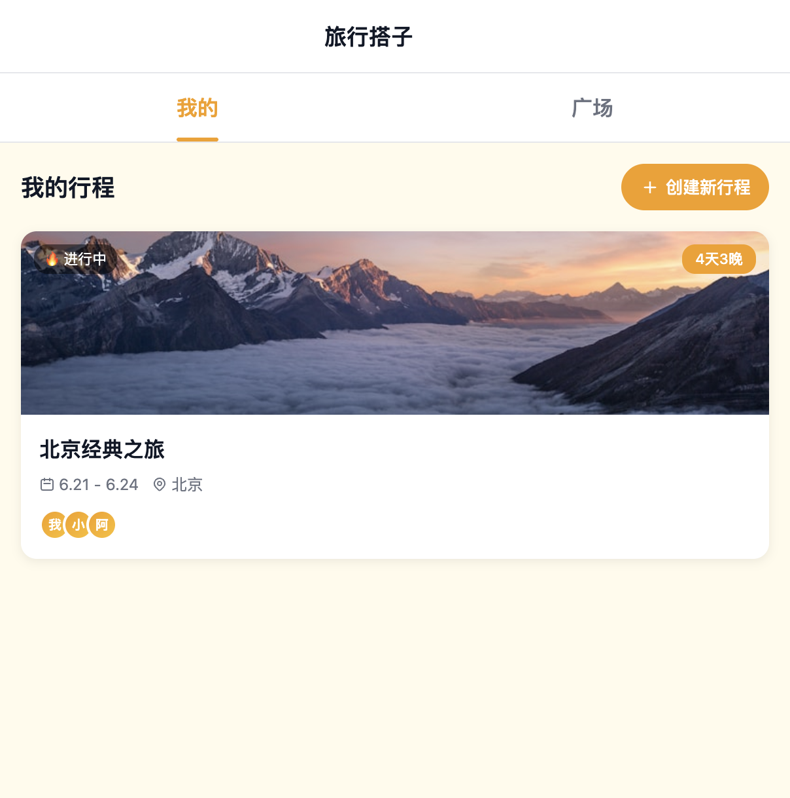
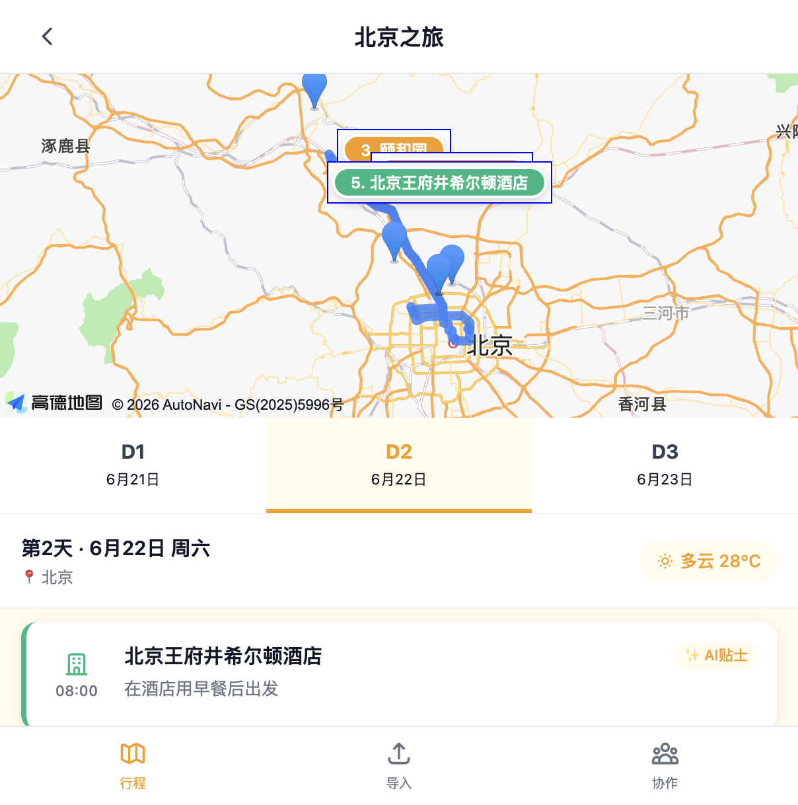
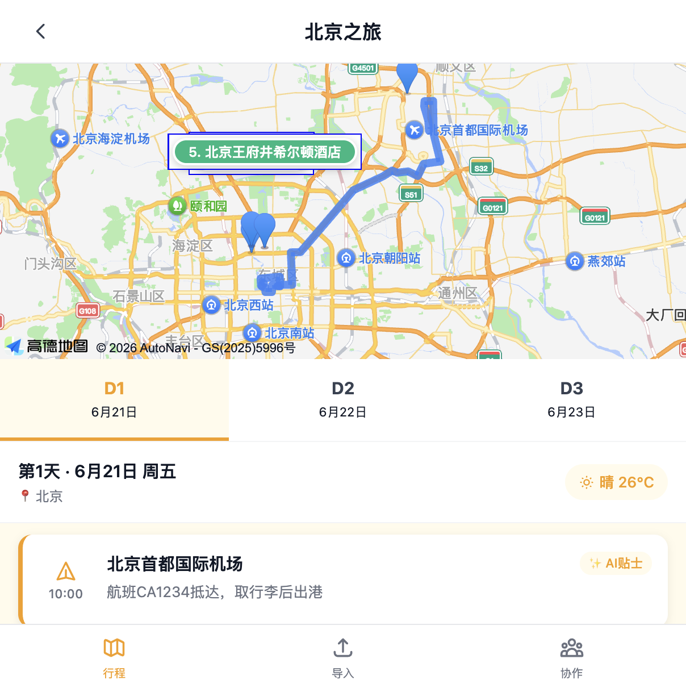
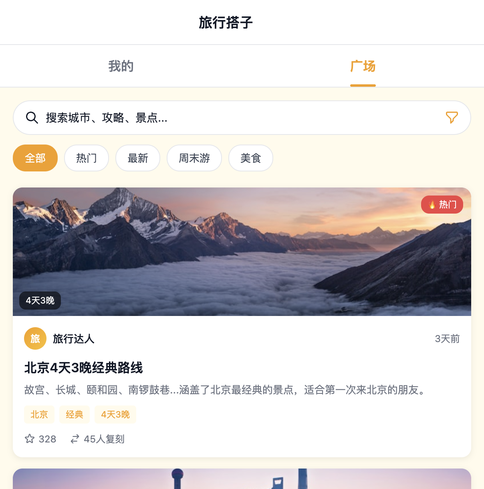

【标签】#生活娱乐

【标题】生活娱乐 · 旅行搭子 Easy Trip — 你的AI旅行攻略助手

---

## 1. Demo 简介

### 是什么
「旅行搭子 Easy Trip」是一款基于 AI 的**Web 端旅行行程规划工具**，主打「攻略一键导入 + AI 智能排程 + 多人协作」，让做旅行攻略从几小时缩短到几分钟。

### 面向谁
- 喜欢自由行、但不想花太多时间做攻略的年轻人
- 和朋友一起旅行、需要共同规划行程的小团体
- 看到小红书/公众号攻略想直接拿来用的「收藏党」

### 核心功能

#### 🎯 攻略一键复刻，AI 自动识别
看到喜欢的攻略直接复制粘贴，AI 自动识别景点、餐厅、交通信息，一键生成完整行程。

#### 🗺️ 地图可视化 + 每日行程
每天行程在地图上直观展示，景点、酒店、机场一目了然，路线自动规划。支持 D1/D2/D3 天 Tab 切换，想看哪天点哪天。

#### ✨ AI 智能建议
每个景点都有 AI 贴士（避坑指南、最佳游览时间、预约提醒等），行程顶部还有 AI 智能建议卡片，帮你避开旅行雷区。

#### 👥 多人协作 + 攻略广场
邀请好友一起规划行程，广场页还有精选攻略可以直接「一键复刻」，热门/最新/周末游/美食多维度筛选。

---

## 2. Demo 创作思路

### 灵感来源
每次和朋友出去旅行，做攻略都是最头疼的事：在小红书上收藏了几十篇攻略，但真要整理成可执行的行程，得一个个查地址、算时间、排顺序，少则几小时多则一整天。

而且经常遇到这种情况：
- 收藏了一堆攻略，真正用的时候找不到
- 和朋友一起规划，信息同步特别麻烦
- 到了景点才发现需要预约，白跑一趟

### 想解决的问题
1. **攻略导入效率低**：图文攻略 → 可执行行程，中间差了一大步
2. **行程规划不直观**：纯文字行程看不出地理位置和路线
3. **多人协作成本高**：微信群里你一言我一语，最后谁也记不住
4. **信息差容易踩坑**：哪些景点需要预约？几点去人最少？新手很容易踩坑

### 为什么做这个方向
- **痛点真实**：自己和身边朋友都有这个需求，是高频刚需
- **AI 能真正帮上忙**：自然语言理解、信息结构化，正好是 AI 擅长的事
- **有想象空间**：从行程规划可以延伸到预订、结伴、目的地服务等

---

## 3. Demo 体验地址

> 本地开发版本，可通过 `http://localhost:8000/index.html` 访问
> 
> （*提交时请替换为实际部署链接或上传 Zip 包*）

---

## 4. TRAE 实践过程

整个 Demo 完全由我和 TRAE 协作完成，从 0 到 1 只花了不到一天时间。作为一个前端开发者，TRAE 让我的效率至少提升了 3 倍。

### 开发流程

#### 第一步：需求梳理 + 原型搭建
最开始我只有一个模糊的想法，跟 TRAE 描述了「旅行攻略小程序」的概念后，它很快帮我梳理出核心功能模块：
- 首页（我的行程 + 攻略广场）
- 行程详情页（地图 + 每日行程列表）
- 导入攻略流程
- 多人协作功能

TRAE 直接帮我生成了第一版可运行的原型，黄色主题配色也是我们一起定下来的。

#### 第二步：核心功能迭代
有了原型之后，我开始逐点提需求、TRAE 负责实现：

1. **广场筛选功能**：热门/最新/周末游/美食标签，点击真实筛选对应攻略
2. **搜索功能**：按城市、天数、旅行类型多维度搜索
3. **地图集成**：接入高德地图 JS API，实现景点标记和路线绘制
4. **AI 功能强化**：每个景点加 AI 贴士、行程顶部 AI 建议卡片、AI 解析攻略

每次我只需要用自然语言描述需求，TRAE 就能直接改代码，改完刷新浏览器就能看到效果，特别爽。

#### 第三步：细节打磨 + 逻辑优化
这部分是让我最惊喜的——TRAE 不仅能做功能，还能帮你想逻辑：

比如我提到「行程逻辑不对，第一天肯定有大交通」，TRAE 直接帮我重构了行程数据结构：
- 第一天：机场到达 → 酒店入住 → 景点 → 回酒店
- 中间天：酒店出发 → 景点 → 回酒店
- 最后一天：酒店出发 → 景点 → 退房 → 机场返程

还有时间冲突的问题、门票预约的交互、复刻行程的弹窗流程，都是我提一个大概的想法，TRAE 帮我把细节都想清楚并实现了。

### 关键步骤截图

（*这里放 3 张以上开发过程截图，比如：*）
1. 初始版本 vs 最终版本对比
2. 地图集成过程
3. AI 功能迭代前后

### 关键任务 Session ID

> 以下是开发过程中关键任务的对话 Session ID，用于验证作品由 TRAE 开发完成：

- **Session 1**：`6a4341b77051533c33123e49` — 整体框架搭建、配色方案、复刻行程功能、地图集成
- **Session 2**：*（请补充第二个 Session ID）*
- **Session 3**：*（请补充第三个 Session ID）*

---

## 5. 开发心得

这次用 TRAE 做 Demo 的体验，让我对 AI 编程有了全新的认识：

1. **想法落地速度前所未有**：以前想到一个点子，光搭框架就要半天，现在跟 TRAE 聊几分钟就能看到原型
2. **细节不用自己抠**：CSS 调样式、边界情况处理、错误提示这些琐碎的事，直接丢给 TRAE 就行
3. **更像「产品经理 + 开发」的组合**：我负责想清楚要什么，TRAE 负责怎么实现，效率特别高

当然也有需要注意的地方：
- 需求要描述得尽量清楚，模糊的需求会导致反复修改
- 关键逻辑最好自己 review 一遍，确保符合预期
- 复杂功能拆成小步来，一步步迭代效果最好

总的来说，TRAE 真的是独立开发者的神器，强烈推荐大家试试看！

---

📎 **报名帖链接**：*（请补充社区报名通过的帖子链接）*
