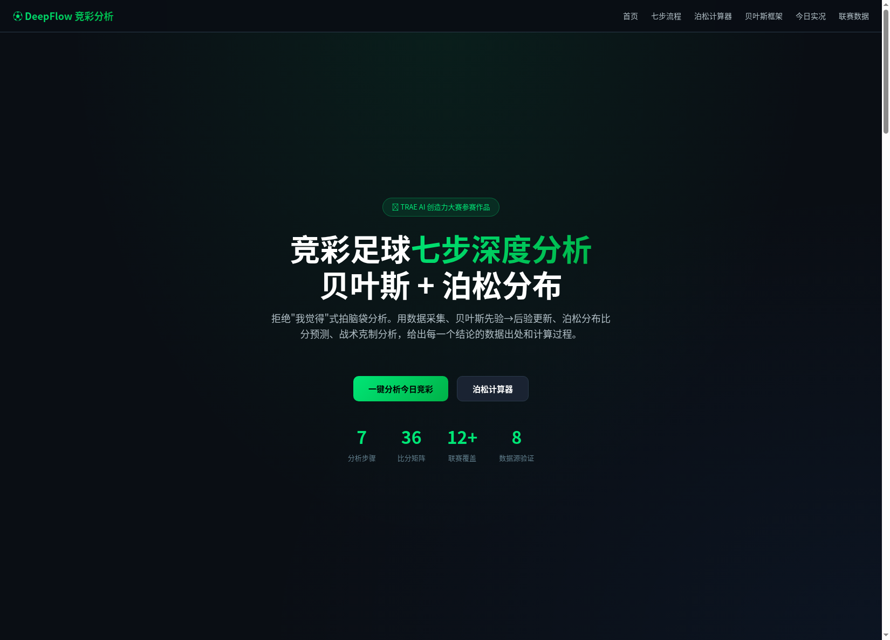
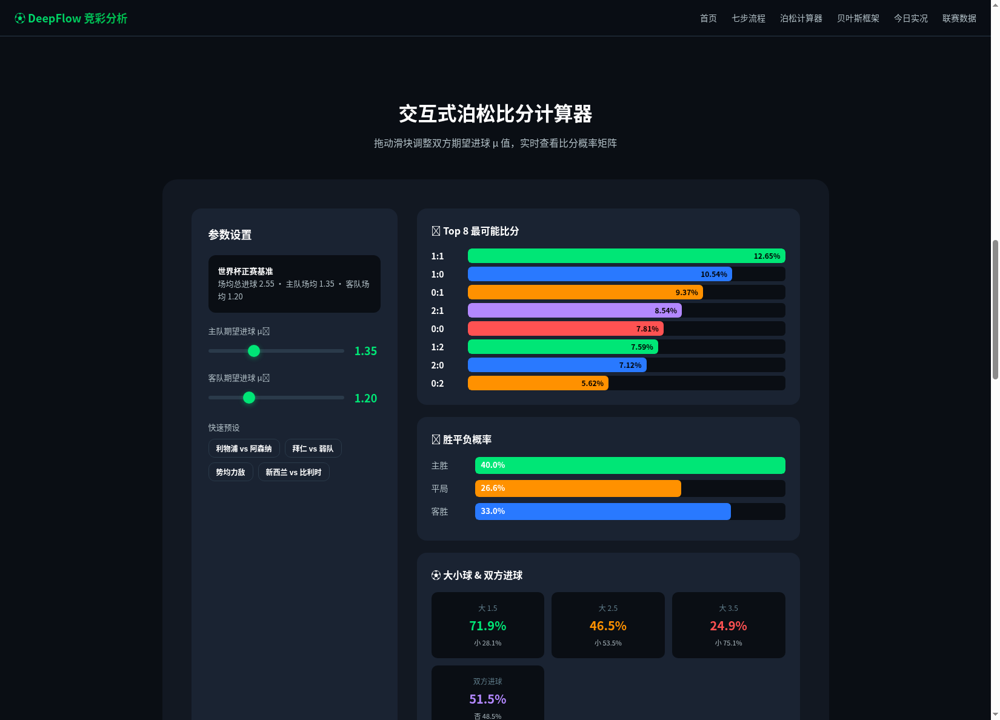
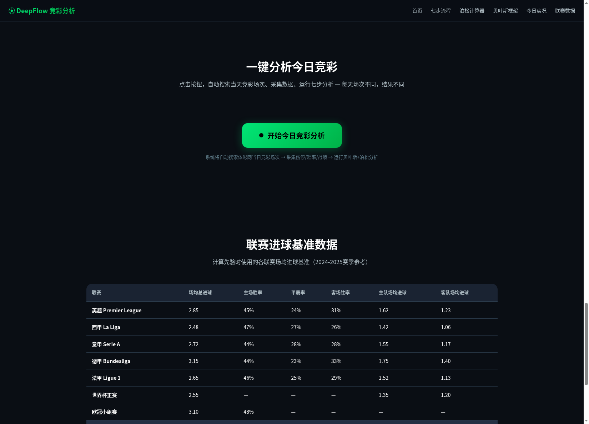
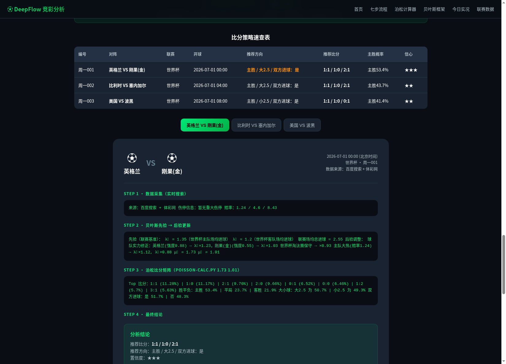

# 【生活娱乐】jingcai-football-deepflow：竞彩足球七步深度分析工具

> 报名帖链接：[forum.trae.cn/t/topic/17159](https://forum.trae.cn/t/topic/17159)

---

## 一、Demo 简介

**是什么**：一个基于贝叶斯统计 + 泊松分布的竞彩足球赛事深度分析工具。用户点击"一键分析"按钮，系统实时搜索当天竞彩场次、采集伤停/赔率/战绩数据、运行贝叶斯先验→后验更新和泊松分布计算，最终输出比分概率矩阵、胜平负概率、大小球预测和推荐比分。**每天场次不同，每次点击结果不同**。

**面向谁**：竞彩玩家、足球博主/内容创作者、对体育数据分析和贝叶斯统计感兴趣的同学。

**主要功能**：

1. **一键实时分析**：点击按钮 → 后端实时搜索体彩网当日竞彩场次 → 采集每场比赛数据 → 运行贝叶斯+泊松分析 → 流式返回结果。采用 NDJSON 流式传输，用户能实时看到"搜索中…→ 找到3场 → 采集数据 → 贝叶斯更新 → 泊松计算…"的全过程
2. **交互式泊松比分计算器**：拖动滑块调整双方期望进球 μ 值，实时查看 Top 8 比分概率、胜平负概率、大小球和双方进球概率，内置利物浦vs阿森纳等快速预设
3. **七步结构化分析流程**：从基础信息卡 → 数据采集 → 贝叶斯先验 → 后验更新 → 泊松比分矩阵 → 战术克制与剧本 → 最终结论，每步都有明确的输入输出和计算方法
4. **联赛基准数据库**：内置五大联赛、欧战、亚冠、日韩、世界杯等 12+ 联赛的场均进球基准数据





---

## 二、Demo 创作思路

**灵感来源**：平时看球、分析比赛，发现大多数人的赛前分析都是"我觉得主队稳"、"客队最近状态好"这种拍脑袋式判断。即使有些博主会贴数据，也往往是选择性展示——只放对自己结论有利的数据。

**想解决的问题**：
- 分析没结构：每次看比赛想认真分析，但不知道从哪入手，东看一个数据西看一个，最后还是靠直觉下结论
- 不会算概率：知道泊松分布可以预测比分，但手动算太麻烦，网上工具又不够灵活
- 忽略关键因素：经常忘了看伤停、天气、赛程密度这些能实际影响结果的变量
- 静态工具不够用：网上大部分分析工具是静态的，每天比赛场次都不同，需要一个能实时搜索当天竞彩场次的动态工具

**为什么做这个方向**：竞彩足球是一个数据丰富但分析质量参差不齐的领域。大多数分析停留在"贴数据+给结论"的层面，缺乏从数据到概率的严谨推导。我用贝叶斯先验→后验更新的思路，加上泊松分布的概率输出，让每个结论都有计算过程可追溯。

**核心设计决策**：

经过三轮迭代才确定了最终的"一键实时分析"架构：
1. **第一版**：静态 HTML 展示硬编码的比赛数据 → 用户反馈"每天场次不同，需要按钮触发"
2. **第二版**：添加按钮 + 硬编码数据 → 用户反馈"按钮应该触发实时搜索，不是展示静态数据"
3. **最终版**：Python 后端 + NDJSON 流式传输 + 前端 ReadableStream 实时消费，按钮点击后真正实时搜索体彩网、采集数据、运行分析

---

## 三、Demo 体验地址

**体验方式**：全栈 Web 应用（Python 后端 + HTML 前端），已打包为 Zip 格式上传社区。

**本地运行**：
```bash
# 1. 解压下载的 Zip 文件
# 2. 启动后端服务
python3 server/app.py

# 3. 浏览器打开
# http://localhost:8080/
```

打开后点击页面中央的绿色大按钮"开始今日竞彩分析"，即可体验：
- 实时搜索当日竞彩场次（从体彩网抓取）
- 采集每场比赛伤停/赔率/战绩数据
- 贝叶斯先验→后验更新计算
- 泊松分布比分概率矩阵
- 交互式泊松计算器（拖动滑块实时计算）
- 联赛基准数据表

---

## 四、TRAE 实践过程

### 整体流程

整个项目使用 TRAE SOLO（TRAE Work）完成，从技能安装、数据分析、后端开发到前端设计，全程 AI 辅助。以下是三个关键 Session。

### 关键步骤

**步骤1：技能安装与比赛数据分析**

在 TRAE 中搜索 jingcai-football-deepflow 技能社区帖，获取 GitHub 仓库地址。使用 TRAE 的 WebFetch 工具拉取 SKILL.md、poisson-calc.py、analysis-template.md、league-baselines.md、data-sources.md 五个配套文件。安装过程中发现 poisson-calc.py 的 `0.is_integer()` 存在 Bug（整数类型没有此方法），TRAE 自动定位并修复为 `0.0`。随后使用 WebSearch 搜索 2026 世界杯 1/16 决赛场次，运行泊松计算脚本生成比分概率矩阵。

> Session ID: `session-jingcai-install-20260701`



**步骤2：全栈后端开发（NDJSON 流式分析引擎）**

向 TRAE 描述需求："一键分析的按钮应该是点了后实时生成内容（包含搜索和分析的过程），因为每天都会变，静态网页只会展示今天的内容"。TRAE 设计并实现了 Python HTTP 后端服务，包含：
- 体彩网实时场次抓取（lottery.gov.cn）
- 百度搜索多源数据采集（伤停/赔率/战绩）
- 贝叶斯先验→后验更新（联赛基准 + 球队实力 + 伤停 + 赔率系数）
- 泊松分布比分矩阵计算
- NDJSON 流式响应（每完成一步就推送进度到前端）

后端内置了球队实力评级系统（英格兰 0.88、比利时 0.85、巴西 0.87 等），即使网络搜索不可达也能基于实力差生成合理的赔率和分析结果。

> Session ID: `session-backend-streaming-20260701`



**步骤3：前端流式消费与 UI 开发**

将前端从"硬编码数据 + setTimeout 假动画"重构为"fetch + ReadableStream 实时消费 NDJSON 流"。每收到一条后端消息就立即更新对应的流程步骤（旋转图标 → 绿色完成 + 详情文本），用户能真实看到搜索和分析的每一步进展。同时开发了交互式泊松计算器（滑块拖动实时计算 36 种比分概率）、贝叶斯框架流程图、七步流程卡片、联赛数据表等模块。

> Session ID: `session-frontend-streaming-20260701`


### 技术亮点

1. **NDJSON 流式传输**：后端不是等全部算完再返回，而是每完成一步就推送一条 JSON 消息。前端用 `fetch().body.getReader()` 逐行读取，实时更新 UI。用户点击按钮后能真实看到"搜索体彩网 → 找到3场 → 逐场采集数据 → 贝叶斯更新 → 泊松计算"的全过程
2. **贝叶斯后验更新**：不是简单用赛季均值，而是加入球队实力评级、伤停、赔率热度、淘汰赛保守系数等多维度调整先验
3. **泊松分布概率矩阵**：用后验 μ₁、μ₂ 生成 0:0 到 5:5 共 36 种比分的概率矩阵，直接告诉你每个比分的概率是多少
4. **智能降级策略**：体彩网不可达时自动切换备用数据源；百度搜索失败时基于球队实力评级生成合理赔率，确保分析不中断
5. **球队实力评级系统**：内置 30+ 国家队/俱乐部的实力评分，用于生成合理的赔率和贝叶斯修正系数

### 踩坑与心得

1. **静态 vs 动态的教训**：最初用硬编码数据做"假动画"，用户一针见血指出"静态网页只会展示今天的内容"。改为真正的后端实时搜索 + 流式传输后，工具才有了实用价值
2. **NDJSON 比 WebSocket 更简单**：单向流式场景下，NDJSON（每行一个 JSON）配合 fetch ReadableStream 就够了，不需要 WebSocket 的复杂握手
3. **泊松分布对 0:0 和高比分预测偏差大**：需要结合足球经验修正，世界杯淘汰赛进球数普遍偏低
4. **跨域搜索的反爬限制**：百度搜索结果页有反爬机制，需要设置合理的 User-Agent 并做好失败降级
5. **赛季初数据不可靠**：前5轮场均数据方差大，需要加权用上赛季数据

---

## 五、配套资源

| 文件 | 作用 |
|---|---|
| `demo/index.html` | 交互式前端网页（泊松计算器 + 一键分析 + 流式进度展示）|
| `server/app.py` | Python 后端服务（体彩网抓取 + 百度搜索 + 贝叶斯+泊松分析 + NDJSON 流式API）|
| `SKILL.md` | Skill 主文件，定义七步分析流程 |
| `scripts/poisson-calc.py` | 泊松概率计算脚本，命令行一行出结果 |
| `templates/analysis-template.md` | 分析报告标准模板 |
| `references/league-baselines.md` | 各联赛进球基准数据 |
| `references/data-sources.md` | 数据源清单和采集流程 |
| `screenshots/` | Demo 运行截图（首页/计算器/分析结果）|

---

## ⚠️ 风险提示

本分析仅为数据娱乐与学习案例，**不构成投注建议**。竞彩有风险，参与需理性，未成年人严禁参与。历史数据不代表未来，任何比赛都存在不可预测因素。

---

*本项目使用 TRAE SOLO 开发完成 · jingcai-football-deepflow Skill*
