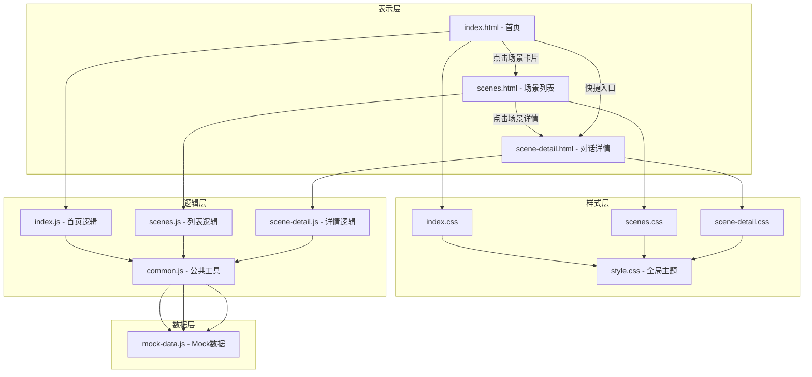
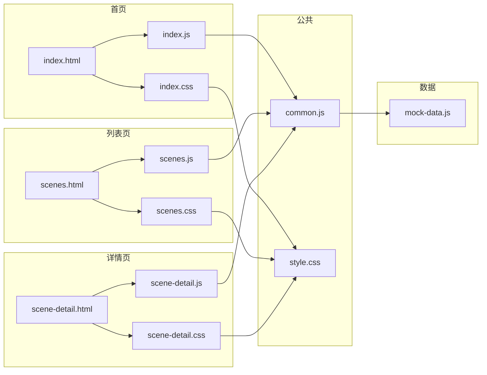
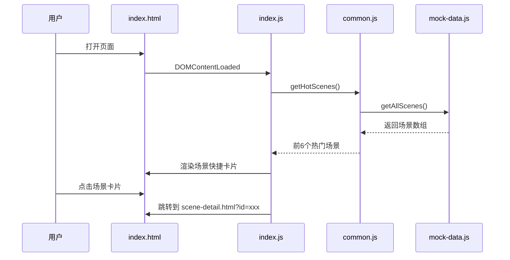
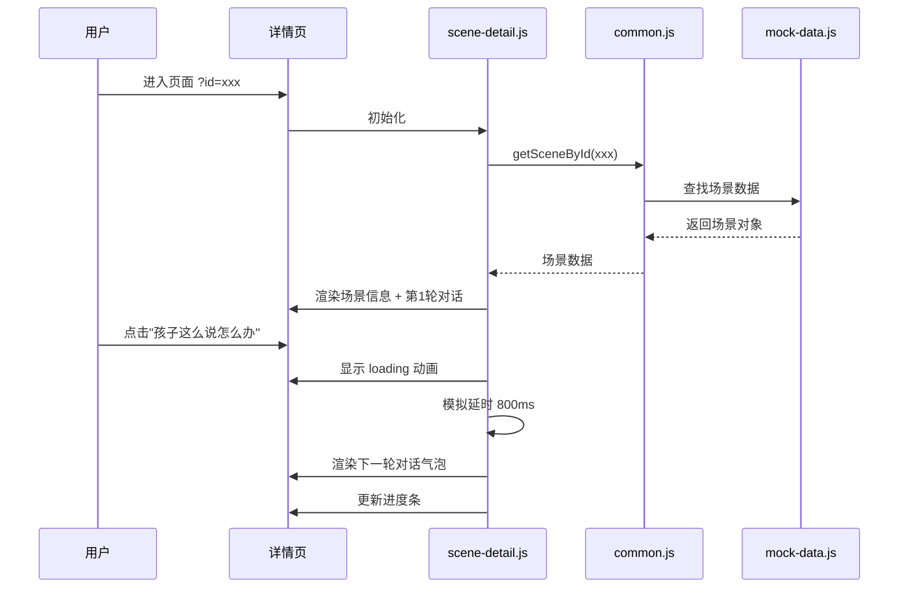

# DESIGN - 亲子对话卡 Demo 架构设计文档

> 创建日期：2026-07-01
> 阶段：Architect（架构阶段）

---

## 一、整体架构图



---

## 二、分层设计

### 2.1 数据层（Mock Data）
**职责**：提供所有场景和对话数据，与视图完全分离

**文件**：`js/mock-data.js`

**数据模型**：

```javascript
// 场景分类
const categories = [
  { id: 'all', name: '全部场景', icon: '✨' },
  { id: 'behavior', name: '行为问题', icon: '📱' },
  { id: 'academic', name: '学业压力', icon: '📚' },
  { id: 'relationship', name: '亲子关系', icon: '💬' },
  { id: 'emotion', name: '情感问题', icon: '💕' },
  { id: 'school', name: '校园问题', icon: '🏫' }
];

// 单轮对话结构
const roundSchema = {
  step: 1,           // 轮次编号
  title: '',         // 本阶段标题
  parentLine: '',    // 家长话术（建议说的话）
  childResponse: '', // 孩子可能的回应
  tips: [],          // 沟通要点提示
  whyItWorks: '',    // 为什么这样说（心理学原理解释）
  emotion: 'calm'    // 情绪标签：calm / tense / warm / firm
};

// 完整场景结构
const sceneSchema = {
  id: '',
  title: '',
  category: '',      // 对应 categories.id
  icon: '',          // emoji 图标
  coverGradient: '', // 卡片渐变色
  description: '',   // 场景描述
  difficulty: 2,     // 1-3 难度
  estimatedTime: '', // 预计沟通时长
  warning: '',       // 注意事项/红线
  rounds: []         // 对话轮次数组
};
```

### 2.2 逻辑层（Logic）
**职责**：页面交互逻辑、数据处理、状态管理

**公共模块** `js/common.js`：
- 主题变量管理
- 工具函数（格式化、DOM操作、动画）
- 路由跳转辅助（带参数传递）
- Mock 数据访问接口

**页面模块**：
- `js/index.js` - 首页：场景快捷入口渲染、功能模块展示
- `js/scenes.js` - 列表页：分类筛选、场景卡片渲染、搜索
- `js/scene-detail.js` - 详情页：对话渲染、轮次展开、进度追踪

### 2.3 样式层（Styles）
**设计令牌（Design Tokens）**：

```css
:root {
  /* 主色调 - 暖色系 */
  --color-primary: #FF6B4A;       /* 主色-暖橘 */
  --color-primary-light: #FF8F73; /* 主色-浅 */
  --color-primary-dark: #E55A3A;  /* 主色-深 */
  --color-secondary: #FFB347;     /* 辅助色-暖黄 */
  
  /* 背景色 */
  --color-bg: #FFFAF7;            /* 页面背景-暖白 */
  --color-bg-card: #FFFFFF;       /* 卡片背景 */
  --color-bg-soft: #FFF1EB;       /* 浅橘背景 */
  
  /* 文字色 */
  --color-text: #2D2A26;          /* 主文字 */
  --color-text-secondary: #6B6560;/* 次文字 */
  --color-text-light: #9E9791;    /* 辅助文字 */
  
  /* 功能色 */
  --color-success: #52C41A;
  --color-warning: #FAAD14;
  --color-error: #FF4D4F;
  
  /* 对话气泡 */
  --color-bubble-parent: #FF8F73; /* 家长气泡 */
  --color-bubble-child: #F0EDE9;  /* 孩子气泡 */
  --color-bubble-ai: #FFF1EB;     /* AI提示气泡 */
  
  /* 圆角 */
  --radius-sm: 8px;
  --radius-md: 12px;
  --radius-lg: 20px;
  --radius-xl: 28px;
  --radius-full: 9999px;
  
  /* 阴影 */
  --shadow-sm: 0 2px 8px rgba(255, 107, 74, 0.08);
  --shadow-md: 0 4px 16px rgba(255, 107, 74, 0.12);
  --shadow-lg: 0 8px 32px rgba(255, 107, 74, 0.16);
  
  /* 间距 */
  --space-xs: 4px;
  --space-sm: 8px;
  --space-md: 16px;
  --space-lg: 24px;
  --space-xl: 40px;
  --space-2xl: 64px;
  
  /* 过渡 */
  --transition-fast: 0.15s ease;
  --transition-base: 0.3s ease;
  --transition-slow: 0.5s ease;
}
```

### 2.4 表示层（Pages）

**首页结构** `index.html`：
- Header：品牌Logo、导航
- Hero区：主标题、副标题、CTA按钮
- 功能亮点区：3个核心功能卡片
- 热门场景区：6个场景快捷入口
- 价值主张区：为什么有用
- Footer：版权、声明

**列表页结构** `scenes.html`：
- Header：返回首页、搜索框
- 分类筛选栏：横向滑动分类标签
- 场景卡片网格：响应式卡片布局
- 空状态/加载状态

**详情页结构** `scene-detail.html`：
- Header：返回按钮、场景标题
- 场景概览：描述、难度、预计时间、红线提示
- 对话进度条：可视化当前轮次
- 对话区域：
  - 聊天气泡（家长/孩子交替）
  - 步骤标签和要点提示
  - "为什么这么说"折叠面板
  - "孩子这么说怎么办"按钮（展开下一轮）
- 底部操作：重新开始、返回列表

---

## 三、模块依赖关系图



---

## 四、接口契约定义

### 4.1 数据访问接口（Mock API）

```javascript
// 获取所有场景
function getAllScenes() → Scene[]

// 按分类获取场景
function getScenesByCategory(categoryId) → Scene[]

// 根据ID获取单个场景
function getSceneById(sceneId) → Scene | null

// 搜索场景
function searchScenes(keyword) → Scene[]

// 获取所有分类
function getAllCategories() → Category[]
```

### 4.2 页面间参数传递

```
// 场景详情页参数
scene-detail.html?id={sceneId}

// 示例
scene-detail.html?id=phone-addiction
```

### 4.3 事件契约

| 事件名 | 触发时机 | 数据 |
|--------|----------|------|
| scene:click | 点击场景卡片 | { sceneId } |
| category:change | 切换分类 | { categoryId } |
| round:expand | 展开新对话轮 | { step } |
| dialog:restart | 重新开始对话 | - |

---

## 五、数据流向图

### 5.1 首页数据流



### 5.2 详情页对话流



---

## 六、异常处理策略

### 6.1 数据异常
| 异常情况 | 处理方式 |
|----------|----------|
| 场景ID不存在 | 显示"场景未找到"友好提示，提供返回列表按钮 |
| 数据加载失败 | 显示空状态插画 + 重试按钮 |
| URL参数缺失 | 默认展示第一个场景 / 返回列表页 |

### 6.2 交互异常
| 异常情况 | 处理方式 |
|----------|----------|
| 快速重复点击 | 防抖处理，避免重复渲染 |
| 对话到底部 | 禁用展开按钮，显示"已完成全部对话" |
| 浏览器不支持ES6 | 降级提示（Demo产品可忽略） |

### 6.3 容错设计
- Mock 数据硬编码在 JS 文件中，不会有网络请求失败
- 所有 DOM 操作前检查元素是否存在
- 使用 try-catch 包裹初始化逻辑，失败时显示友好错误页

---

## 七、组件设计

### 7.1 可复用组件清单

| 组件名 | 功能 | 出现页面 |
|--------|------|----------|
| SceneCard | 场景卡片 | 首页、列表页 |
| CategoryTabs | 分类标签栏 | 列表页 |
| DialogBubble | 对话气泡 | 详情页 |
| ProgressSteps | 步骤进度条 | 详情页 |
| TipsPanel | 要点提示面板 | 详情页 |
| LoadingDots | 加载动画 | 详情页 |
| Header | 顶部导航 | 全部页面 |
| Footer | 页脚 | 全部页面 |

---

*架构设计文档完成，进入 Atomize 原子化拆分阶段*
