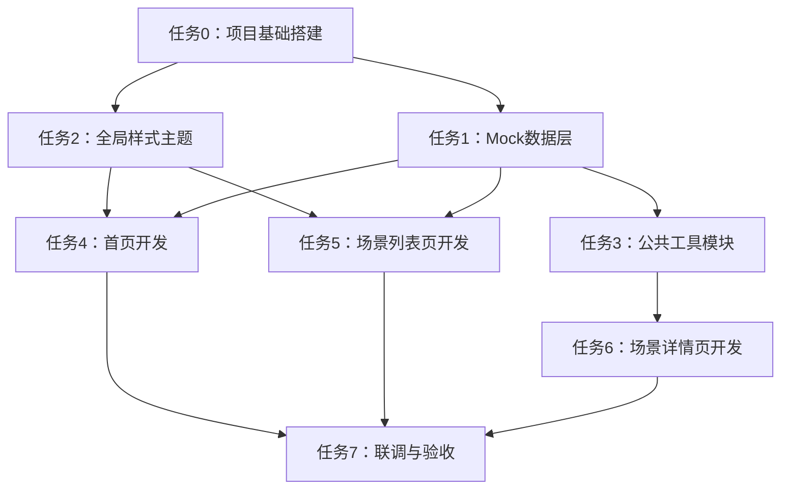

# TASK - 亲子对话卡 Demo 原子任务拆分

> 创建日期：2026-07-01
> 阶段：Atomize（原子化阶段）

---

## 一、任务依赖图

---

## 二、原子任务清单

### 任务0：项目基础搭建

**输入契约：**
- 前置依赖：无
- 环境：浏览器可直接打开 HTML 文件
- 工具：无需构建工具

**输出契约：**
- 交付物：项目目录结构、空 HTML/CSS/JS 文件骨架
- 验收标准：目录结构完整，各文件存在且基本结构正确

**实现约束：**
- 严格遵循 CONSENSUS 中的目录结构
- HTML 使用 HTML5 语义化标签
- CSS 使用 CSS 变量定义主题

**依赖关系：**
- 后置任务：任务1、任务2
- 并行任务：无

---

### 任务1：Mock 数据层开发

**输入契约：**
- 前置依赖：任务0 完成
- 输入数据：6个场景的内容文案
- 环境：纯 JS 文件

**输出契约：**
- 交付物：`js/mock-data.js` 文件
- 验收标准：
  - 包含 6 个分类标签
  - 包含 6 个完整场景数据
  - 每个场景至少 4 轮对话
  - 每轮对话包含：标题、家长话术、孩子回应、要点提示、原理解释
  - 数据结构符合 DESIGN 中定义的 schema

**实现约束：**
- 数据导出为全局变量 `window.MockData`
- 数据结构清晰，字段命名语义化
- 文案真实可用，符合亲子沟通场景

**依赖关系：**
- 前置任务：任务0
- 后置任务：任务3、任务4、任务5、任务6
- 并行任务：任务2

---

### 任务2：全局样式主题

**输入契约：**
- 前置依赖：任务0 完成
- 输入数据：DESIGN 中的设计令牌

**输出契约：**
- 交付物：`css/style.css` 文件
- 验收标准：
  - 完整的 CSS 变量主题系统
  - 通用 reset 样式
  - 通用组件样式（按钮、卡片、标签等）
  - 暖色系配色方案落地
  - 圆角、阴影、间距统一

**实现约束：**
- 使用 CSS 自定义属性（:root）
- 移动端基础响应式（桌面优先）
- 类名采用 BEM 或语义化命名

**依赖关系：**
- 前置任务：任务0
- 后置任务：任务4、任务5、任务6
- 并行任务：任务1

---

### 任务3：公共工具模块

**输入契约：**
- 前置依赖：任务1 完成
- 输入数据：Mock 数据接口

**输出契约：**
- 交付物：`js/common.js` 文件
- 验收标准：
  - 封装数据访问函数（getAllScenes、getSceneById 等）
  - URL 参数解析工具
  - DOM 操作工具函数
  - 动画/过渡辅助函数
  - 防抖节流工具

**实现约束：**
- 导出为 `window.App` 命名空间
- 函数注释清晰
- 纯函数优先，无副作用

**依赖关系：**
- 前置任务：任务1
- 后置任务：任务6
- 并行任务：任务4、任务5

---

### 任务4：首页开发

**输入契约：**
- 前置依赖：任务1、任务2 完成
- 输入数据：Mock 场景数据、全局样式

**输出契约：**
- 交付物：`index.html` + `css/index.css` + `js/index.js`
- 验收标准：
  - Header 品牌区
  - Hero 主视觉区（主标题、副标题、CTA）
  - 3个核心功能亮点卡片
  - 6个热门场景快捷入口
  - 价值主张/产品理念区
  - Footer 版权声明
  - 卡片 hover 动效
  - 点击场景跳转到详情页

**实现约束：**
- 视觉风格与设计图一致
- 暖色系 + 圆角卡片
- 桌面端 1280px+ 显示良好
- 代码结构清晰，注释完整

**依赖关系：**
- 前置任务：任务1、任务2
- 后置任务：任务7
- 并行任务：任务5、任务6

---

### 任务5：场景列表页开发

**输入契约：**
- 前置依赖：任务1、任务2 完成
- 输入数据：Mock 场景数据、分类数据

**输出契约：**
- 交付物：`scenes.html` + `css/scenes.css` + `js/scenes.js`
- 验收标准：
  - 返回首页入口
  - 搜索框（基础搜索）
  - 分类标签筛选栏
  - 场景卡片网格布局
  - 点击卡片跳转到详情页
  - 分类切换动效
  - 空状态展示

**实现约束：**
- 卡片样式与首页保持一致
- 分类切换无刷新
- 响应式网格布局

**依赖关系：**
- 前置任务：任务1、任务2
- 后置任务：任务7
- 并行任务：任务4、任务6

---

### 任务6：场景详情页开发

**输入契约：**
- 前置依赖：任务1、任务2、任务3 完成
- 输入数据：单场景完整对话数据

**输出契约：**
- 交付物：`scene-detail.html` + `css/scene-detail.css` + `js/scene-detail.js`
- 验收标准：
  - 返回按钮 + 场景标题
  - 场景概览信息（描述、难度、预计时间、红线提示）
  - 对话进度条（步骤可视化）
  - 混合式对话展示：
    - 聊天气泡（家长/孩子/AI 三种样式）
    - 每轮对话标题和步骤标签
    - 要点提示面板
    - "为什么这么说"折叠面板
  - "孩子这么说怎么办？"展开按钮
  - 模拟 loading 效果
  - 对话渐入动画
  - 4 轮对话完整展示
  - 完成状态提示
  - 重新开始按钮

**实现约束：**
- 对话按轮次逐步展开
- 家长气泡右侧暖橘色，孩子气泡左侧灰色
- AI 提示气泡浅色背景
- 进度条实时更新
- 滚动自动定位到最新对话

**依赖关系：**
- 前置任务：任务1、任务2、任务3
- 后置任务：任务7
- 并行任务：任务4、任务5

---

### 任务7：联调与验收

**输入契约：**
- 前置依赖：任务4、任务5、任务6 全部完成
- 输入数据：3 个页面完整代码

**输出契约：**
- 交付物：完整可运行的 Demo
- 验收标准：
  - 首页 → 列表页 → 详情页 跳转链路完整
  - 首页快捷入口 → 详情页 跳转正常
  - 详情页返回功能正常
  - 所有 6 个场景均可访问
  - 每个场景 4 轮对话均可展开
  - 所有交互效果正常（hover、动画、loading）
  - 样式一致性检查
  - 控制台无报错
  - 双击 index.html 可直接运行

**实现约束：**
- 无外部依赖
- 纯静态文件
- 浏览器兼容性：Chrome / Edge 最新版

**依赖关系：**
- 前置任务：任务4、任务5、任务6
- 后置任务：无（最终交付）

---

## 三、任务执行顺序

| 批次 | 任务 | 说明 |
|------|------|------|
| 第一批 | 任务0 + 任务1 + 任务2 | 基础搭建 + 数据 + 样式（可并行） |
| 第二批 | 任务3 + 任务4 + 任务5 | 工具模块 + 首页 + 列表页（可并行） |
| 第三批 | 任务6 | 详情页（最复杂，单独一批） |
| 第四批 | 任务7 | 联调验收 |

---

## 四、质量检查清单

每个任务完成后需检查：
- [ ] 代码格式规范，缩进一致
- [ ] 关键逻辑有注释
- [ ] 命名语义化，可读性好
- [ ] 无语法错误
- [ ] 符合设计文档规范
- [ ] 与其他模块接口一致

---

*任务拆分完成，进入 Approve 审批阶段*
