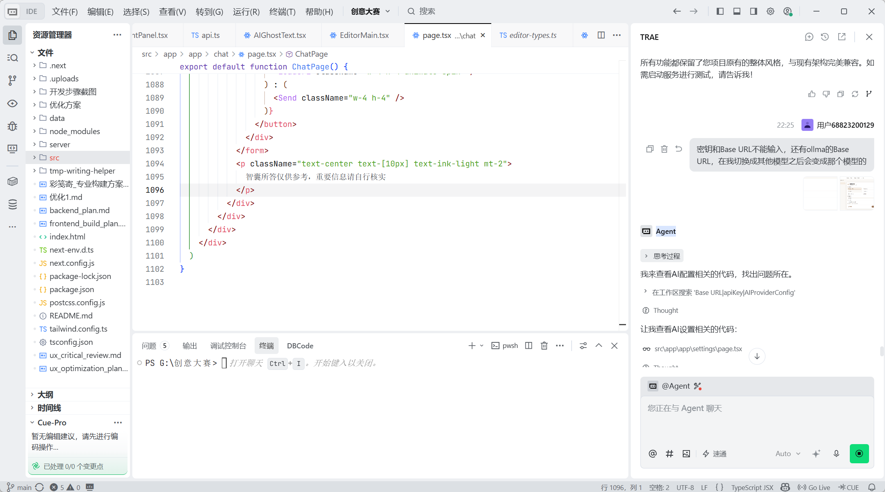
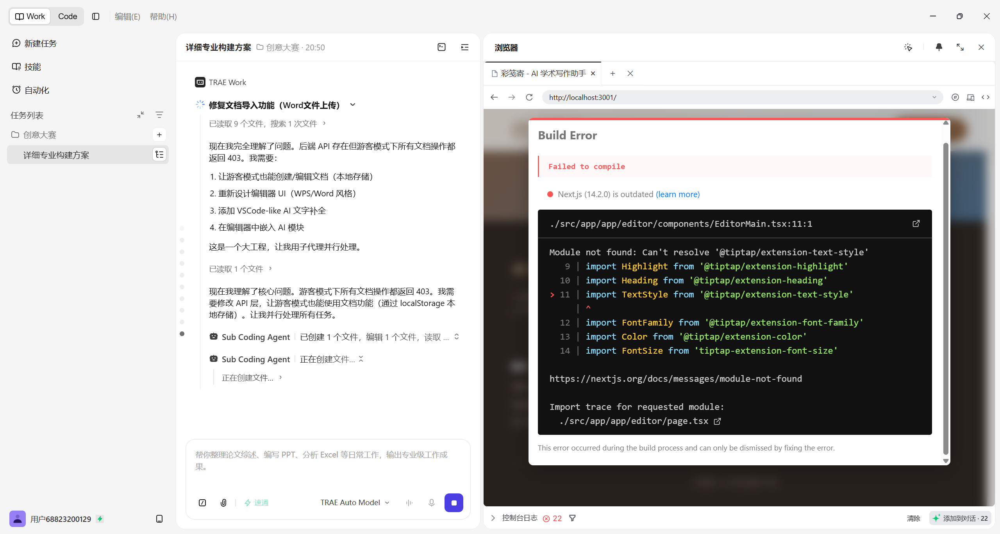
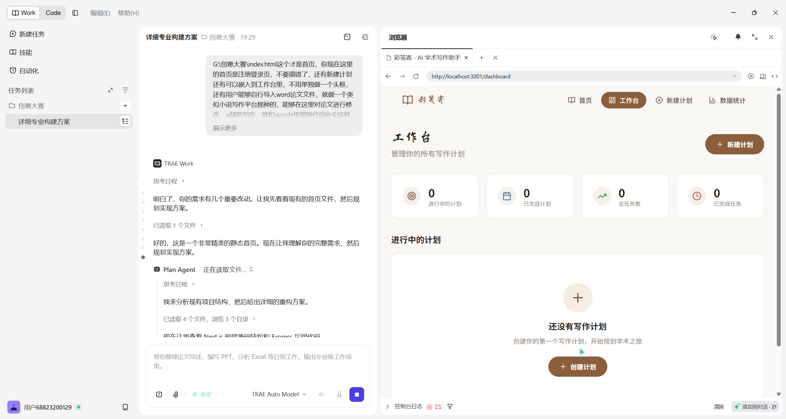
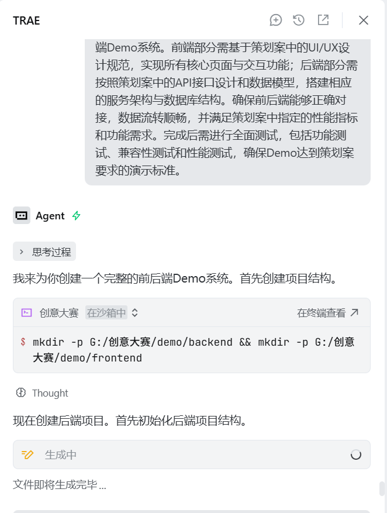
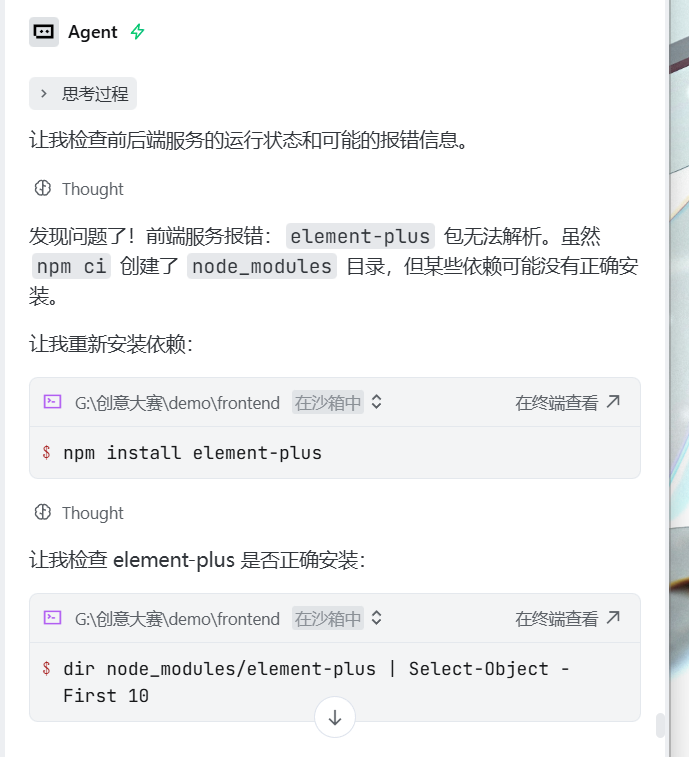
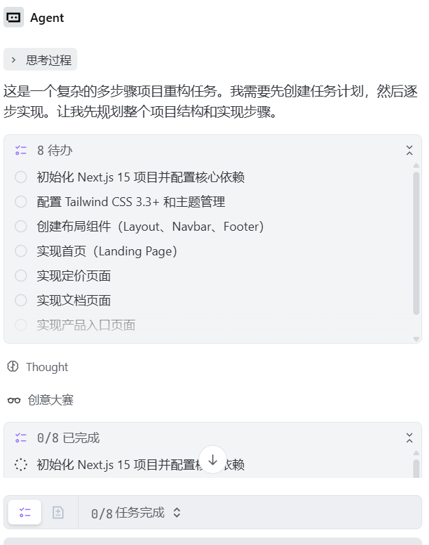

# 彩笺寄 - 创意大赛初赛专区发帖

---

## 【标签】学习工作

## 【标题】学习工作 - 彩笺寄：AI 学术写作规划工具

---

## 【正文】

### 1. Demo 简介

**是什么**：彩笺寄是一款基于 Web 的 AI 学术写作规划工具，以"文房四宝"为设计理念，将 AI 辅助写作、计划甘特图、文献管理三大能力整合在同一平台中，帮助学术写作者从"开题"到"定稿"全程有章可循。

**面向谁**：核心用户是学术写作者——本科/硕士/博士论文撰写者、科研工作者、期刊投稿人。同时支持游客模式"过客一览"，降低试用门槛。

**主要功能**：

**① AI 辅助学术写作编辑器**

基于 TipTap 富文本编辑器，支持标题层级、字体颜色、高亮标注、表格、图片插入、LaTeX 数学公式、上下标等完整学术排版能力。内嵌 AI 智能续写（幽灵文本）、AI 润色（4 种风格 + diff 对比）、文档结构分析（检测摘要/关键词/参考文献/结论完整度并给出评分和改进建议）、Slash 快捷指令触发 AI 操作。



**② 写作计划与进度追踪**

内置本科/硕士/博士/期刊四种写作计划模板，一键创建自动填充任务和里程碑。甘特图可视化时间线，风险热力图高亮潜在延期点。仪表盘统计总字数、连续写作天数、七日热力图和时辰分布。



**③ 学术资源一站式管理**

集成 arXiv 实时检索，支持按关键词/作者/分类搜索文献，一键收藏并导出 BibTeX 引用。AI 对话模块支持多模型（Ollama/DeepSeek/OpenAI/Grok），可随时与 AI 讨论学术问题、解读论文。知识图谱以力导向图呈现知识关联。



---

### 2. Demo 创作思路

**灵感来源**：
"彩笺寄"取自中国传统文化中的"彩笺"——古人用以书写诗文的精美信纸。我们希望将这种"运笔成文、寄托思想"的古典意境带入现代学术写作流程。整个 UI 贯穿水墨古韵风格：宣纸底色、赭石色主调、朱砂印章、水墨晕染动画、浮动汉字粒子。这不是一个冷冰冰的工具，而是一方让思想自然流淌的"数字书房"。

**想解决的问题**：
长周期学术写作存在三个核心痛点——

1. **缺乏规划感**：学位论文周期长达数月甚至一年，传统 Word 写作方式缺乏任务分解、进度追踪和里程碑管理，容易陷入"写到哪算哪"的困境。
2. **写作质量难保证**：非母语写作者常面临语言表达不地道、论文结构不完整的问题，写完才发现"摘要没写""参考文献漏了"。
3. **文献与写作脱节**：文献检索、阅读笔记、正文撰写往往是割裂的三个步骤，来回切换打断写作流。

**为什么做这个方向**：
市面上有 Notion 这样的通用写作工具，也有 Zotero 这样的文献管理工具，但它们各自独立、缺乏深度整合。学术写作是一个需要"规划-检索-撰写-修改-定稿"闭环的过程，我们判断在这个垂直场景下存在明确的产品空白——用一个 AI 原生的工具把这个闭环打通，比在通用工具上加插件更彻底。

---

### 3. Demo 体验地址

**本地运行方式**（需 Node.js 20+）：

```bash
# 1. 克隆项目后进入目录
cd 彩笺寄

# 2. 安装依赖
npm install

# 3. 启动前端（Next.js 14）
npm run dev

# 4. 另开终端启动后端（Express + SQLite）
cd server
node index.js
```

前端默认运行在 `http://localhost:3000`，后端默认运行在 `http://localhost:3001`。

也支持通过首页"游客模式"直接进入，无需注册即可体验核心功能。

> 注：完整部署版本可联系作者获取线上体验链接。

---

### 4. TRAE 实践过程

整个项目从 zero 到完成 Demo，**100% 使用 TRAE IDE 开发**。以下是完整的开发流程：

**开发阶段总览**：

| 阶段 | 内容 | 关键产出 |
|---|---|---|
| Stage 1: 项目策划 | 前后端架构设计、技术选型、页面路由规划 | 完整的前后端架构方案，Next.js + Express + SQLite 技术栈确定 |
| Stage 2: 初步实现 | 项目脚手架搭建、数据库模型定义、核心页面框架 | 登录/注册/仪表盘/编辑器等核心页面骨架完成 |
| Stage 3: 报错修复 | 解决 TypeScript 类型错误、API 联调、服务启动问题 | 前后端打通，核心流程可跑通 |
| Stage 4: 前端优化 | 水墨极简 UI 风格实施、动画效果、响应式布局 | 宣纸纹理、墨韵粒子、书法字体、朱红印章等视觉系统落地 |
| Stage 5: 功能优化 | AI 写作文本分析、润色、计划甘特图、文献检索 | AI 能力深度集成，写作计划可视化 |
| Stage 6: 功能细化 | 编辑器模式切换、文档导入导出、知识图谱、番茄钟 | 细节打磨，功能闭环完整 |
| Stage 7: AI 功能打磨 | AI 幽灵文本、多模型支持、流式对话、Slash 指令 | AI 体验优化，支持多 AI 提供商 |

**开发关键步骤截图**（7 张）：









**关键任务对话 Session ID**（7 个）：

| Session | 阶段 | Session ID |
|---|---|---|
| Session 1 | 项目策划（前后端） | `.757976681686363:c86198afb381df5b403cc86eba008912_6a37d2b79008248c36543cf3.6a38fb598a65b3764e79257a.6a38fb59a03e2358d07263ba:Trae CN.T(2026/6/22 17:07:37)` |
| Session 2 | 策划案的初步实现 | `.757976681686363:3e86bccd38dc959b5ac8c026f4e96d6d_6a37d2b79008248c36543cf3.6a38fe3a8a65b3764e7925dc.6a38fe3aa03e2358d07263bf:Trae CN.T(2026/6/22 17:19:55)` |
| Session 3 | 报错初步解决 | `.757976681686363:99e6f02162fd7d7eb3cfe6ca6fb42a78_6a37d2b79008248c36543cf3.6a3903ec8a65b3764e79269a.6a3903eba03e2358d07263c1:Trae CN.T(2026/6/22 17:44:12)` |
| Session 4 | 前端优化 | `.757976681686363:550dcd54999d3aebd0754874dae4110b_6a37d2b79008248c36543cf3.6a3905dc8a65b3764e7926e4.6a3905dca03e2358d07263c3:Trae CN.T(2026/6/22 17:52:28)` |
| Session 5 | 功能优化 | `757976681686363:8ce65b9da0840a0f5fa7114c42bfdf30_6a3a2c2f4a2aa5963ca59854.6a3a6dfa4a2aa5963ca5a0f8.6a3a6dfa4a2aa5963ca5a0f6:TRAE Work CN.0.1.21.no_sid.no_ppe.T(2026/6/23 19:28:58)` |
| Session 6 | 功能细化 | `757976681686363:ef4461572a9ff0b191fdff029f21550f_6a3a2c2f4a2aa5963ca59854.6a3a80874a2aa5963ca5a5d8.6a3a80874a2aa5963ca5a5d6:TRAE Work CN.0.1.21.no_sid.no_ppe.T(2026/6/23 20:48:07)` |
| Session 7 | AI 功能优化 | `.757976681686363:b4c28dd7883bd3a9183472b552233197_6a3a29b350724f765737c063.6a3be8cc59d5c0db0ec01cc0.6a3be8cb52f051e2edd4a11c:Trae CN.T(2026/6/24 22:25:16)` |

---

### 5. 开发经验总结

**用 TRAE 开发的真实体验**：

1. **从策划到代码的无缝衔接**：在 Stage 1 的对话中，TRAE 先帮我产出了完整的前后端架构方案（路由设计、数据模型、API 设计），然后在同一对话中直接开始生成代码。这意味着「策划文档」和「代码实现」之间没有切换成本——策划的结论直接变成了代码的参数。

2. **报错修复的迭代效率**：Stage 3 是典型的"跑不起来→定位→修复→再跑"循环。TRAE 能读取终端错误日志、定位源文件、提出修复方案、执行修改，整个过程在一个 IDE 内闭环，不需要切换到浏览器查 StackOverflow 再切回来改代码。

3. **UI 风格的持续打磨**：Stage 4 的前端优化经历了多轮迭代——从最初的基本样式 → 古风装饰 → 水墨极简 → 现代融合，每一轮都是通过对话中「用户反馈 → TRAE 理解意图 → 修改样式 → 预览验证」的循环完成的。TRAE 对 CSS/Tailwind 的修改非常精准，单轮改动通常就能达到预期效果的 80% 以上。

4. **AI 功能集成的天然优势**：Stage 5-7 的 AI 功能开发（幽灵文本、流式对话、多模型支持）中，TRAE 展现了对 AI SDK 的深度理解。比如在实现 SSE 流式输出时，我不需要去查 `@ai-sdk/react` 的文档，直接描述需求，TRAE 就能给出正确的 API 调用方式。

5. **关键教训**：复杂的状态管理（如编辑器的 ProseMirror 插件注册/注销）是 TRAE 容易出错的地方。这类问题往往表现为`RangeError: Adding different instances of a keyed plugin`之类的运行时错误，需要开发者对底层机制有一定理解来配合排查。

**技术栈一览**：

| 层级 | 技术 |
|---|---|
| 前端框架 | Next.js 14 (App Router) |
| UI 库 | React 18 + Tailwind CSS 3 |
| 编辑器 | TipTap (ProseMirror) × 20+ 扩展 |
| AI 对话 | @ai-sdk/react (流式 SSE) |
| 后端 | Express + SQLite + JWT 鉴权 |
| 文档处理 | mammoth（Word 导入）+ docx（Word 导出） |
| 数学公式 | KaTeX (LaTeX 渲染) |
| 图表可视化 | Recharts（仪表盘图表、甘特图） |
| AI 提供商 | Ollama / DeepSeek / OpenAI / Grok / 自定义兼容 API |
| 图表 | Recharts 2.10.x |

---

*本项目 100% 使用 TRAE IDE 开发完成。*
