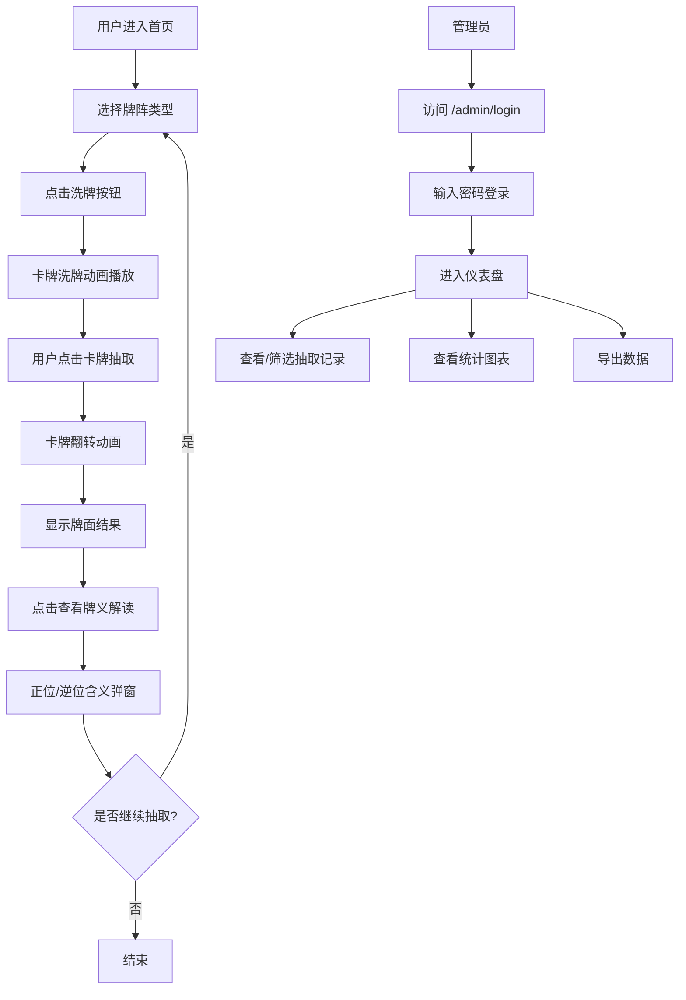

## 1. 产品概述

塔罗牌在线抽取网站——一个充满神秘氛围的在线塔罗牌占卜平台。用户可以进行多种牌阵的塔罗牌抽取，获得沉浸式的占卜体验；管理员可通过后台查看每个时间段的抽取详情和统计数据。

- **目标用户**：对塔罗牌占卜感兴趣的普通用户、需要管理数据的管理员
- **核心价值**：提供美观、沉浸式的在线塔罗牌占卜体验，同时为运营者提供数据洞察

## 2. 核心功能

### 2.1 用户角色

| 角色 | 注册方式 | 核心权限 |
|------|----------|----------|
| 普通用户 | 无需注册，直接使用 | 抽取塔罗牌、查看牌义解读、选择牌阵 |
| 管理员 | 密码登录 | 查看抽取记录、按时间段筛选、数据统计 |

### 2.2 功能模块

1. **首页（塔罗牌抽取页）**：牌阵选择、洗牌动画、翻牌交互、牌义解读弹窗
2. **牌阵选择页**：单张牌、三张牌（过去/现在/未来）、凯尔特十字（10张牌）
3. **牌义详解页**：每张牌的详细含义、正位/逆位解读
4. **管理员登录页**：管理员密码认证
5. **管理员仪表盘**：抽取记录表格、时间段筛选、统计图表、导出功能

### 2.3 页面详情

| 页面名称 | 模块名称 | 功能描述 |
|----------|----------|----------|
| 首页 | 星空背景 | 动态粒子星空背景，营造神秘氛围 |
| 首页 | 牌阵选择 | 三种牌阵可选：单张牌、三张牌、凯尔特十字 |
| 首页 | 洗牌动画 | 卡牌飞散、旋转、聚拢的洗牌动画 |
| 首页 | 抽牌交互 | 用户点击卡牌翻转，显示牌面 |
| 首页 | 牌义解读 | 弹出模态框显示正位/逆位含义 |
| 首页 | 音效开关 | 背景音乐和音效开关 |
| 管理员页 | 登录 | 管理员密码登录 |
| 管理员页 | 记录列表 | 分页展示所有抽取记录 |
| 管理员页 | 时间筛选 | 按日期范围筛选记录 |
| 管理员页 | 统计图表 | 卡牌抽取频率、牌阵使用分布、时间段统计 |
| 管理员页 | 导出功能 | 导出CSV记录 |

## 3. 核心流程

## 4. 用户界面设计

### 4.1 设计风格

- **主题**：神秘暗黑风格，深紫色和金色为主色调
- **主色**：深紫 #1a0a2e、暗金 #d4a853、星尘紫 #7b2d8e
- **辅色**：月光银 #c0c0d0、深邃蓝 #0d1b3e
- **按钮风格**：圆角边框，悬停发光效果，金色描边
- **字体**：标题使用衬线字体（Playfair Display），正文使用无衬线字体（Cormorant Garamond）
- **布局**：居中卡片式布局，星空粒子背景
- **动画**：卡牌翻转3D动画、粒子漂浮、光晕呼吸效果、魔法阵旋转

### 4.2 页面设计概览

| 页面名称 | 模块名称 | UI元素 |
|----------|----------|--------|
| 首页 | 星空背景 | 多层粒子星空，缓慢移动，星星闪烁 |
| 首页 | 标题区 | 居中大字标题"命运之轮"，副标题，发光效果 |
| 首页 | 牌阵选择 | 三张悬浮卡片，悬停放大，金色描边 |
| 首页 | 抽牌区 | 卡牌扇形排列，3D翻转动画 |
| 首页 | 结果展示 | 牌面大图，正位/逆位标识，关键词 |
| 首页 | 牌义弹窗 | 居中模态框，毛玻璃效果，金色边框 |
| 管理员 | 登录页 | 居中表单，神秘氛围背景 |
| 管理员 | 仪表盘 | 侧边栏导航，数据表格，图表卡片 |

### 4.3 响应式设计

- 桌面端优先设计，适配1920px、1440px、1366px
- 平板端（768px-1024px）：卡牌缩小，牌阵选择纵向排列
- 手机端（<768px）：单列布局，卡牌堆叠，触摸滑动翻牌

## 5. 塔罗牌数据

- 包含全部78张塔罗牌（22张大阿尔卡纳 + 56张小阿尔卡纳）
- 每张牌包含：名称、关键词、正位含义、逆位含义、元素属性、星座对应
- 卡牌图片使用CSS绘制（符号化图案），而非外部图片