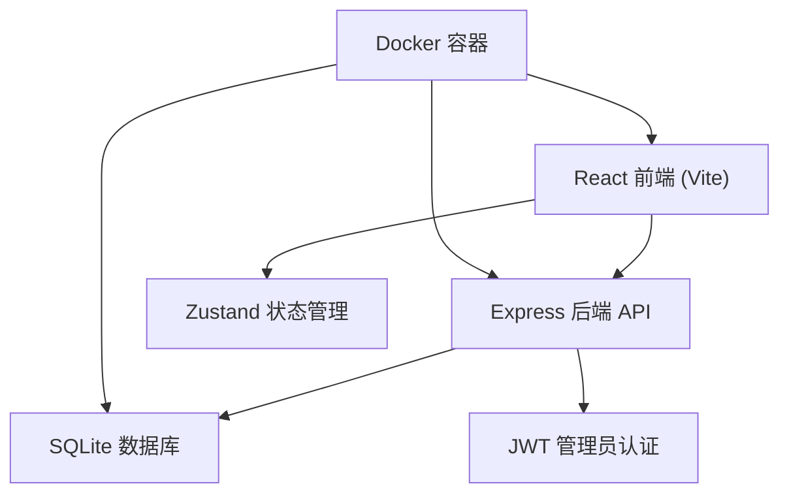
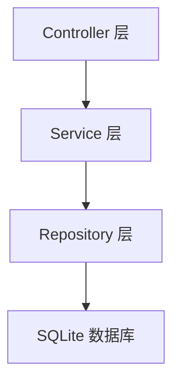
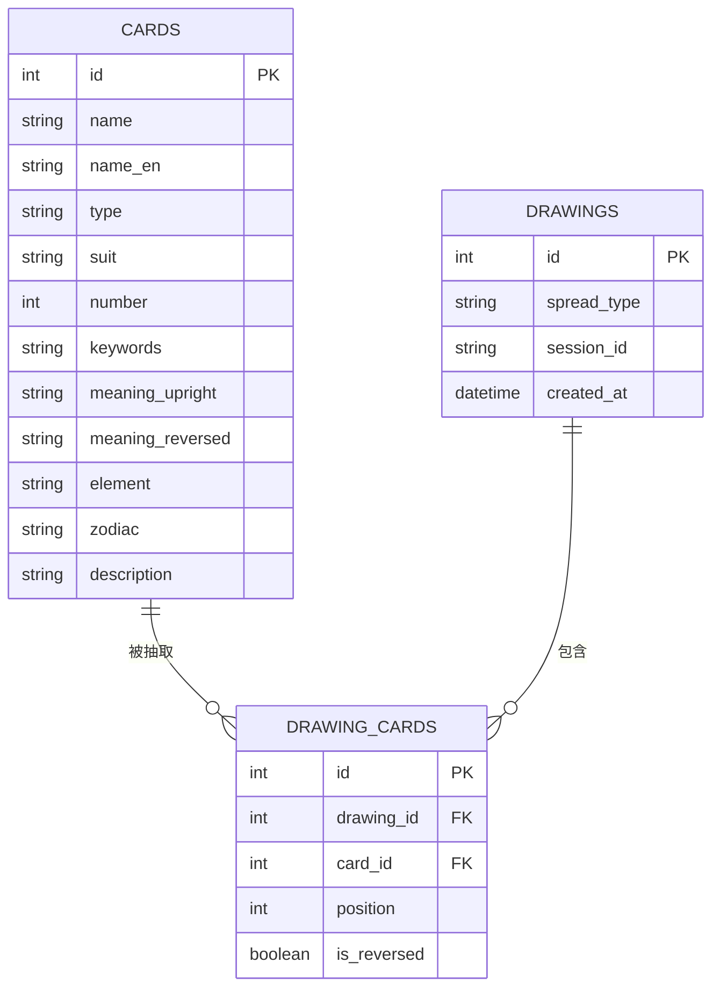

## 1. 架构设计



## 2. 技术选型

* **前端**：React\@18 + TypeScript + TailwindCSS\@3 + Vite

* **状态管理**：Zustand

* **路由**：React Router v6

* **图标**：Lucide React

* **图表**：Recharts（管理员统计图表）

* **后端**：Express\@4 + TypeScript

* **数据库**：better-sqlite3（轻量级，无需额外数据库服务）

* **认证**：JWT（管理员登录）

* **部署**：Docker + Docker Compose

* **端口**：前端 3000，后端 3001（不占用80和443）

## 3. 路由定义

| 路由                | 用途        |
| ----------------- | --------- |
| /                 | 首页（塔罗牌抽取） |
| /admin/login      | 管理员登录页    |
| /admin/dashboard  | 管理员仪表盘    |
| /admin/records    | 抽取记录管理    |
| /admin/statistics | 统计图表      |

## 4. API 定义

```typescript
// 塔罗牌相关
GET    /api/cards              // 获取所有塔罗牌列表
GET    /api/cards/:id          // 获取单张牌详情
GET    /api/cards/random       // 随机抽取卡牌（支持参数 count）
GET    /api/spreads            // 获取牌阵类型列表

// 抽取记录
POST   /api/drawings           // 保存抽取记录
GET    /api/drawings           // 获取抽取记录（支持分页、时间筛选）

// 管理员认证
POST   /api/admin/login        // 管理员登录
POST   /api/admin/verify       // 验证 token

// 管理员数据
GET    /api/admin/records      // 获取所有抽取记录（分页+筛选）
GET    /api/admin/statistics   // 获取统计数据
GET    /api/admin/export       // 导出CSV

// 类型定义
interface Card {
  id: number;
  name: string;
  nameEn: string;
  type: 'major' | 'minor';
  suit?: 'wands' | 'cups' | 'swords' | 'pentacles';
  number: number;
  keywords: string;
  meaningUpright: string;
  meaningReversed: string;
  element?: string;
  zodiac?: string;
  description: string;
}

interface Drawing {
  id: number;
  spreadType: string;
  cards: { cardId: number; position: number; isReversed: boolean }[];
  createdAt: string;
  sessionId: string;
}

interface SpreadType {
  id: string;
  name: string;
  count: number;
  description: string;
  positions: string[];
}
```

## 5. 服务端架构



## 6. 数据模型

### 6.1 ER 图



### 6.2 DDL

```sql
CREATE TABLE cards (
    id INTEGER PRIMARY KEY AUTOINCREMENT,
    name TEXT NOT NULL,
    name_en TEXT NOT NULL,
    type TEXT NOT NULL CHECK(type IN ('major', 'minor')),
    suit TEXT CHECK(suit IN ('wands', 'cups', 'swords', 'pentacles')),
    number INTEGER NOT NULL,
    keywords TEXT NOT NULL,
    meaning_upright TEXT NOT NULL,
    meaning_reversed TEXT NOT NULL,
    element TEXT,
    zodiac TEXT,
    description TEXT
);

CREATE TABLE drawings (
    id INTEGER PRIMARY KEY AUTOINCREMENT,
    spread_type TEXT NOT NULL,
    session_id TEXT NOT NULL,
    created_at DATETIME DEFAULT CURRENT_TIMESTAMP
);

CREATE TABLE drawing_cards (
    id INTEGER PRIMARY KEY AUTOINCREMENT,
    drawing_id INTEGER NOT NULL,
    card_id INTEGER NOT NULL,
    position INTEGER NOT NULL,
    is_reversed BOOLEAN NOT NULL DEFAULT 0,
    FOREIGN KEY (drawing_id) REFERENCES drawings(id),
    FOREIGN KEY (card_id) REFERENCES cards(id)
);

CREATE INDEX idx_drawings_created_at ON drawings(created_at);
CREATE INDEX idx_drawings_session ON drawings(session_id);
```

## 7. Docker 部署

```yaml
# docker-compose.yml
version: '3.8'
services:
  app:
    build: .
    ports:
      - "3000:3000"   # 前端
      - "3001:3001"   # 后端API
    volumes:
      - ./data:/app/data
    environment:
      - ADMIN_PASSWORD=admin123
      - JWT_SECRET=tarot-secret-key
      - PORT=3001
      - DB_PATH=/app/data/tarot.db
```

