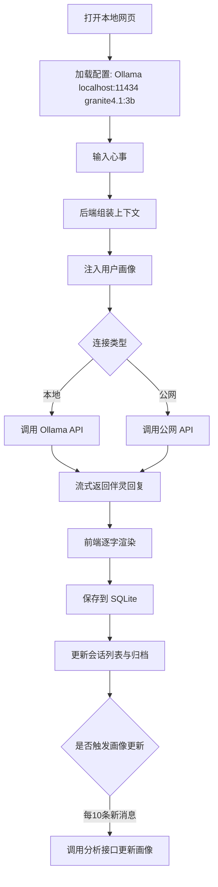

# 痴话小棉袄 —— 产品需求文档

## 1. 产品概述

痴话小棉袄是一方纯本地离线运行的私密心灵角落，基于 Node.js + HTML + SQLite 轻轻搭起。所有对话、心事与思绪只静悄悄躺在本地数据库，不上传任何网络，为你营造完全私密、安全、专属的精神倾诉空间。支持连接 Ollama 本地大模型，也可切换公网 API，让每位使用者拥有可自定义名字、性格预设的专属 AI 伴灵。

## 2. 核心功能

### 2.1 功能模块

1. **对话空间**：与专属伴灵进行多轮对话，实时流式输出，支持 Markdown 渲染，左侧会话列表，右侧对话信息与标签
2. **伴灵设置**：切换本地 Ollama / 公网 API，配置地址与模型名称，选择伴灵性格预设，自定义系统提示词与角色名字
3. **思绪归档**：按时间线展示所有历史对话，支持标签筛选、搜索、月度统计，完整沉淀个人思绪资产
4. **懂你的心**：基于全部历史对话自动分析生成你的专属画像——常聊话题、情绪倾向、表达风格、内心关注点，让伴灵越聊越懂你；支持手动编辑与重新分析

### 2.2 页面详情

| 页面名称 | 模块名称 | 功能描述 |
|---------|---------|---------|
| 对话空间 | 聊天区域 | 消息输入、流式输出、Markdown 渲染、代码高亮 |
| 对话空间 | 会话列表 | 按时间分组（今天/昨天/上周/更早），新建会话，删除会话 |
| 对话空间 | 对话信息 | 显示本次对话标签、对话时长、字数统计、伴灵心情 |
| 伴灵设置 | 模型连接 | 切换本地 Ollama / 公网 API，配置地址、模型名、检测连接 |
| 伴灵设置 | 性格预设 | 温柔倾听 / 哲理引导 / 灵感碰撞 三选一 |
| 伴灵设置 | 系统提示词 | 自定义伴灵系统提示词，角色名字设置 |
| 思绪归档 | 统计卡片 | 总计对话数、本月对话数、总文字量 |
| 思绪归档 | 对话列表 | 按月份分组展示，显示日期、标题、摘要、情绪标签、字数 |
| 思绪归档 | 筛选搜索 | 按标签筛选（全部/深夜倾诉/灵感记录/情绪梳理/哲学思考），关键词搜索 |
| 懂你的心 | 画像展示 | 常聊话题、情绪倾向、表达风格、内心关注点、陪伴建议 |
| 懂你的心 | 分析操作 | 一键重新分析全部历史对话，手动编辑画像内容 |
| 懂你的心 | 画像开关 | 是否将画像融入对话，调整融入强度（轻度/中度/深度） |

## 3. 核心流程

你打开本地网页 → 系统自动连接默认 Ollama 模型 → 输入心事 → 后端构建提示词（含系统提示词 + 用户画像 + 历史上下文）→ 调用 Ollama / API 流式生成 → 前端逐字显示回复 → 保存对话到 SQLite → 可在思绪归档中随时翻阅全部过往

## 4. 用户界面设计

### 4.1 设计风格

- **主色调**：温暖米白背景 `#FDF8F3`，主文字 `#3D2C24`，次要文字 `#8C7B70`
- **强调色**：温润陶土色 `#D4A574`，浅粉点缀 `#F5E6DC`
- **按钮样式**：圆角 12px，柔和阴影，hover 时微抬升
- **字体**：标题使用 "Noto Serif SC" 衬线体，正文使用 "Noto Sans SC" 无衬线体
- **布局**：三栏式（左侧导航/会话列表 280px，中间聊天区域自适应，右侧信息面板 260px）
- **图标风格**：Lucide 线性图标，圆润简洁

### 4.2 页面设计概述

| 页面名称 | 模块名称 | UI 元素 |
|---------|---------|---------|
| 对话空间 | 整体布局 | 三栏布局，米色背景，圆角消息气泡 |
| 对话空间 | 你的消息 | 右侧，陶土色背景 `#E8C4A8`，圆角 16px |
| 对话空间 | 伴灵消息 | 左侧，白色背景 `#FFFFFF`，圆角 16px，带头像 |
| 对话空间 | 输入框 | 底部固定，圆角输入框，发送按钮陶土色 |
| 伴灵设置 | 表单区 | 卡片式布局，切换开关，单选卡片 |
| 懂你的心 | 画像卡片 | 分区展示：常聊话题、情绪倾向、表达风格、内心关注点、陪伴建议 |
| 懂你的心 | 编辑区 | 可手动修改各维度内容，textarea 输入 |
| 懂你的心 | 操作栏 | 重新分析按钮、融入对话开关、强度选择（轻/中/深） |
| 思绪归档 | 列表区 | 时间线分组，卡片悬停阴影，情绪标签彩色圆点 |

### 4.3 响应式适配

- 桌面端优先设计（1280px+ 完整三栏）
- 中等屏幕（1024px）隐藏右侧信息面板
- 小屏幕（768px）左侧会话列表可折叠

### 4.4 交互细节

- 消息发送后显示「正在输入...」脉冲动画
- 流式输出时打字机效果，伴灵名字旁显示闪烁光标
- 新建会话时自动聚焦输入框
- 对话列表 hover 显示删除按钮
- 标签可点击切换，支持多选
