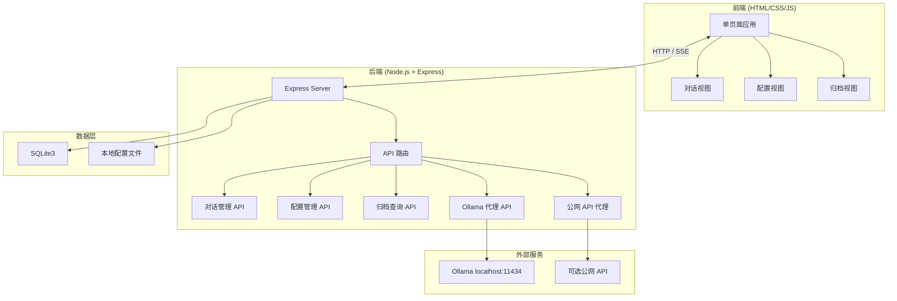
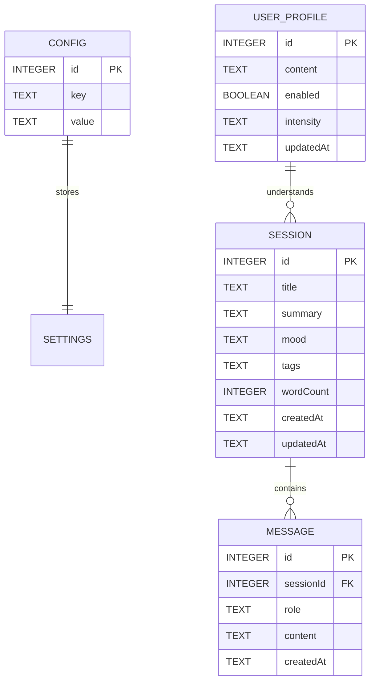

# 痴话小棉袄 —— 技术架构文档

## 1. 架构设计



## 2. 技术描述

- **前端**：原生 HTML5 + CSS3 + Vanilla JavaScript，单页面应用通过路由切换视图
- **后端**：Express.js 4.x，Node.js v22.14.0
- **数据库**：SQLite3 (better-sqlite3 驱动)
- **外部集成**：Ollama API (本地，默认 granite4.1:3b)，可选 OpenAI 兼容格式公网 API
- **流式输出**：Server-Sent Events (SSE) 实现打字机效果
- **包管理**：npm

## 3. 路由定义

| 路由 | 用途 |
|-----|------|
| GET / | 返回主页面 index.html |
| GET /api/config | 获取当前模型配置 |
| POST /api/config | 保存模型配置 |
| POST /api/config/test | 测试模型连接 |
| GET /api/sessions | 获取会话列表 |
| POST /api/sessions | 创建新会话 |
| DELETE /api/sessions/:id | 删除会话 |
| GET /api/sessions/:id/messages | 获取会话消息 |
| POST /api/chat | 发送消息（SSE 流式返回） |
| GET /api/archive | 获取归档列表（支持标签筛选、搜索） |
| GET /api/archive/stats | 获取归档统计数据 |
| GET /api/profile | 获取用户画像 |
| POST /api/profile | 保存用户画像 |
| POST /api/profile/analyze | 基于历史对话分析生成画像 |

## 4. API 定义

### 4.1 获取配置

Request: `GET /api/config`
Response:
```json
{
  "useLocal": true,
  "ollamaUrl": "http://localhost:11434",
  "modelName": "granite4.1:3b",
  "apiKey": "",
  "apiUrl": "",
  "companionName": "天一",
  "personality": "gentle",
  "systemPrompt": "你是「天一」，一个温暖包容的灵魂伴灵..."
}
```

### 4.2 发送消息（SSE）

Request: `POST /api/chat`
Body:
```json
{
  "sessionId": 1,
  "message": "用户输入内容"
}
```
Response: SSE Stream
```
data: {"chunk": "你好"}
data: {"chunk": "，我是"}
data: {"chunk": "天一"}
data: {"done": true, "fullText": "你好，我是天一..."}
```

### 4.3 获取归档

Request: `GET /api/archive?tag=&search=&page=1`
Response:
```json
{
  "sessions": [
    {
      "id": 1,
      "title": "关于孤独的一些想法",
      "summary": "深夜里有时候会觉得...",
      "createdAt": "2026-06-28 23:42:00",
      "wordCount": 1240,
      "mood": "温暖",
      "tags": ["深夜倾诉", "情绪梳理"]
    }
  ],
  "stats": {
    "totalSessions": 128,
    "monthSessions": 12,
    "totalWords": 42000
  }
}
```

### 4.4 用户画像

Request: `GET /api/profile`
Response:
```json
{
  "enabled": true,
  "intensity": "medium",
  "content": {
    "topics": "孤独感、创作瓶颈、人际关系、自由意志",
    "emotion": "偏内敛敏感，常在深夜流露情绪，渴望被理解",
    "style": "喜欢用比喻和场景描写表达心事，语气柔和克制",
    "focus": "近期反复思考'被看见'与自我价值的命题",
    "advice": "回应时多用倾听和共情，少给建议，适当引用他过往的表达"
  },
  "updatedAt": "2026-06-30 14:20:00"
}
```

Request: `POST /api/profile/analyze`
Response:
```json
{
  "success": true,
  "content": {
    "topics": "...",
    "emotion": "...",
    "style": "...",
    "focus": "...",
    "advice": "..."
  }
}
```

## 5. 数据模型

### 5.1 ER 图



### 5.2 DDL

```sql
-- 配置表
CREATE TABLE IF NOT EXISTS config (
  id INTEGER PRIMARY KEY AUTOINCREMENT,
  key TEXT UNIQUE NOT NULL,
  value TEXT NOT NULL
);

-- 会话表
CREATE TABLE IF NOT EXISTS sessions (
  id INTEGER PRIMARY KEY AUTOINCREMENT,
  title TEXT DEFAULT '新对话',
  summary TEXT DEFAULT '',
  mood TEXT DEFAULT '',
  tags TEXT DEFAULT '[]',
  wordCount INTEGER DEFAULT 0,
  createdAt DATETIME DEFAULT CURRENT_TIMESTAMP,
  updatedAt DATETIME DEFAULT CURRENT_TIMESTAMP
);

-- 消息表
CREATE TABLE IF NOT EXISTS messages (
  id INTEGER PRIMARY KEY AUTOINCREMENT,
  sessionId INTEGER NOT NULL,
  role TEXT NOT NULL CHECK(role IN ('user', 'assistant')),
  content TEXT NOT NULL,
  createdAt DATETIME DEFAULT CURRENT_TIMESTAMP,
  FOREIGN KEY (sessionId) REFERENCES sessions(id) ON DELETE CASCADE
);

-- 用户画像表
CREATE TABLE IF NOT EXISTS user_profile (
  id INTEGER PRIMARY KEY CHECK(id = 1),
  content TEXT DEFAULT '{}',
  enabled BOOLEAN DEFAULT true,
  intensity TEXT DEFAULT 'medium',
  updatedAt DATETIME DEFAULT CURRENT_TIMESTAMP
);

-- 初始化默认配置
INSERT OR IGNORE INTO config (key, value) VALUES
('useLocal', 'true'),
('ollamaUrl', 'http://localhost:11434'),
('modelName', 'granite4.1:3b'),
('apiKey', ''),
('apiUrl', ''),
('companionName', '天一'),
('personality', 'gentle'),
('systemPrompt', '你是「天一」，一个温暖包容的灵魂伴灵。你安静倾听使用者的每一句话，不评判、不说教，只是温柔地回应、陪伴、理解。你的语气像深夜里的暖光，让人感到被接纳和安心。');

-- 初始化用户画像
INSERT OR IGNORE INTO user_profile (id, content, enabled, intensity) VALUES
(1, '{"topics":"","emotion":"","style":"","focus":"","advice":""}', true, 'medium');
```

## 6. 项目结构

```
痴话小棉袄/
├── server.js              # Express 主入口
├── package.json
├── database.js            # SQLite 封装
├── config.js              # 配置管理
├── public/
│   ├── index.html         # 主页面
│   ├── css/
│   │   └── style.css      # 全局样式
│   └── js/
│       ├── app.js         # 前端主逻辑
│       ├── chat.js        # 对话模块
│       ├── config.js      # 配置模块
│       └── archive.js     # 归档模块
└── data/
    └── chat.db            # SQLite 数据库文件
```
