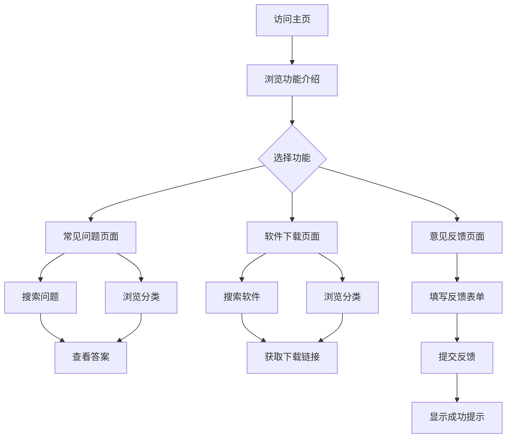

## 1. 产品概述
易芯是一个面向电脑新手的综合性学习网站，旨在帮助用户快速掌握电脑使用技能，解决常见问题，提供实用软件下载资源。
- 主要目的：为电脑小白提供友好、易懂的电脑知识学习平台
- 目标用户：电脑初学者、学生、职场新人等对电脑操作不熟悉的人群
- 市场价值：填补电脑新手学习资源的空白，提供一站式学习体验

## 2. 核心功能

### 2.1 用户角色
| 角色 | 注册方式 | 核心权限 |
|------|----------|----------|
| 普通用户 | 无需注册 | 浏览所有内容、搜索问题、下载软件、提交反馈 |

### 2.2 功能模块
1. **主页**：网站介绍、核心功能展示、快速导航
2. **常见问题**：电脑常见问题汇总、搜索功能、问题分类
3. **软件下载**：常用软件下载地址、软件分类、搜索功能
4. **意见反馈**：问题反馈表单、联系方式、提交成功提示

### 2.3 页面详情
| 页面名称 | 模块名称 | 功能描述 |
|----------|----------|----------|
| 主页 | Hero区域 | 网站名称展示、动态背景效果、核心价值主张 |
| 主页 | 功能介绍 | 四大功能模块的卡片式展示 |
| 主页 | 特色内容 | 热门问题、推荐软件等精选内容 |
| 常见问题 | 搜索框 | 支持关键词搜索问题 |
| 常见问题 | 问题分类 | 按类别展示问题（如系统、软件、网络等） |
| 常见问题 | 问题列表 | 问题标题和简要描述，点击展开详情 |
| 软件下载 | 搜索框 | 支持关键词搜索软件 |
| 软件下载 | 软件分类 | 按类别展示软件（如办公、安全、工具等） |
| 软件下载 | 下载链接 | 提供官方下载地址和简介 |
| 意见反馈 | 反馈表单 | 姓名、联系电话、问题描述等字段 |
| 意见反馈 | 提交验证 | 表单验证和提交成功动画 |

## 3. 核心流程
用户访问网站 → 浏览主页了解网站功能 → 根据需求选择进入常见问题/软件下载/意见反馈页面 → 搜索或浏览内容 → 获取所需信息或提交反馈

## 4. 用户界面设计

### 4.1 设计风格
- **设计理念**：液态玻璃效果（Glassmorphism），呈现高级、现代、科技感
- **主色调**：深蓝色系为主，搭配浅蓝、紫色渐变
- **辅助色**：青色、粉色作为点缀色
- **背景**：渐变背景配合动态光效
- **卡片样式**：半透明玻璃质感，毛玻璃效果
- **边框**：细微的发光边框效果
- **字体**：无衬线字体，现代简洁
- **动画**：平滑过渡、淡入淡出、悬浮效果

### 4.2 页面设计概述
| 页面名称 | 模块名称 | UI元素 |
|----------|----------|--------|
| 主页 | Hero区域 | 大标题、副标题、动态背景、CTA按钮 |
| 主页 | 导航栏 | 固定顶部、玻璃质感、logo、菜单链接 |
| 主页 | 功能卡片 | 四个功能入口卡片，悬浮放大效果 |
| 常见问题 | 搜索框 | 圆角输入框、搜索图标、实时搜索 |
| 常见问题 | 分类标签 | 可点击切换的分类标签 |
| 常见问题 | 问题卡片 | 玻璃质感卡片，点击展开详情 |
| 软件下载 | 搜索框 | 与常见问题页面风格一致 |
| 软件下载 | 软件卡片 | 软件图标、名称、简介、下载按钮 |
| 意见反馈 | 表单区域 | 玻璃质感表单容器、输入框、提交按钮 |

### 4.3 响应式设计
- **桌面优先**：主要针对桌面端用户设计
- **移动端适配**：响应式布局，在移动设备上自动调整为单列布局
- **触控优化**：按钮和可点击区域尺寸适合触摸操作

### 4.4 动画效果
- **页面切换**：淡入淡出动画
- **悬浮效果**：卡片悬浮放大、阴影增强
- **滚动动画**：元素随滚动淡入
- **搜索交互**：输入框聚焦动画
- **表单提交**：提交按钮加载动画、成功提示动画