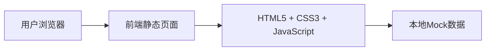

## 1. 架构设计


## 2. 技术描述
- 前端：HTML5 + CSS3 + JavaScript（原生开发）
- 样式：自定义CSS实现液态玻璃效果
- 图标：Font Awesome 图标库
- 数据：本地JSON Mock数据
- 构建工具：无需构建工具，纯静态文件

## 3. 路由定义
| 路由 | 用途 | 文件路径 |
|------|------|----------|
| / | 主页 | index.html |
| /faq.html | 常见问题页面 | faq.html |
| /software.html | 软件下载页面 | software.html |
| /feedback.html | 意见反馈页面 | feedback.html |

## 4. 页面结构
### 4.1 公共组件
- Header导航栏：固定顶部、玻璃质感、logo、菜单链接
- Footer页脚：版权信息、联系方式

### 4.2 页面组件
| 页面 | 组件 |
|------|------|
| index.html | Hero区域、功能介绍、热门内容、特色亮点 |
| faq.html | 搜索框、分类标签、问题列表、问题详情展开 |
| software.html | 搜索框、软件分类、软件列表、下载按钮 |
| feedback.html | 反馈表单、联系方式、提交成功提示 |

## 5. 数据模型

### 5.1 问题数据模型
```json
{
  "id": 1,
  "title": "电脑开机后黑屏怎么办？",
  "category": "系统问题",
  "description": "开机后屏幕显示黑色，没有任何反应",
  "answer": "1. 检查显示器连接线是否插紧...",
  "tags": ["开机", "黑屏", "系统"]
}
```

### 5.2 软件数据模型
```json
{
  "id": 1,
  "name": "微信",
  "category": "社交",
  "icon": "wechat",
  "description": "微信电脑版，支持聊天、文件传输等功能",
  "download_url": "https://pc.weixin.qq.com/",
  "size": "200MB",
  "version": "3.9.0"
}
```

### 5.3 反馈数据模型
```json
{
  "name": "用户姓名",
  "phone": "联系电话",
  "message": "问题描述内容"
}
```

## 6. 文件结构
```
/
├── index.html          # 主页
├── faq.html            # 常见问题页面
├── software.html       # 软件下载页面
├── feedback.html       # 意见反馈页面
├── css/
│   └── style.css       # 全局样式
├── js/
│   ├── main.js         # 公共脚本
│   ├── faq.js          # FAQ页面脚本
│   ├── software.js     # 软件页面脚本
│   └── feedback.js     # 反馈页面脚本
└── data/
    ├── faqs.json       # FAQ数据
    └── software.json   # 软件数据
```

## 7. 关键技术实现

### 7.1 液态玻璃效果（Glassmorphism）
使用CSS实现：
- backdrop-filter: blur() - 背景模糊
- background: rgba() - 半透明背景
- border: rgba() - 发光边框
- box-shadow - 发光阴影

### 7.2 页面切换动画
- 使用CSS transition实现淡入淡出
- 页面加载时添加动画类

### 7.3 搜索功能
- 实时监听输入框变化
- 使用JavaScript过滤数据
- 显示匹配结果

### 7.4 表单验证
- 验证姓名和电话格式
- 显示错误提示
- 提交成功后显示动画