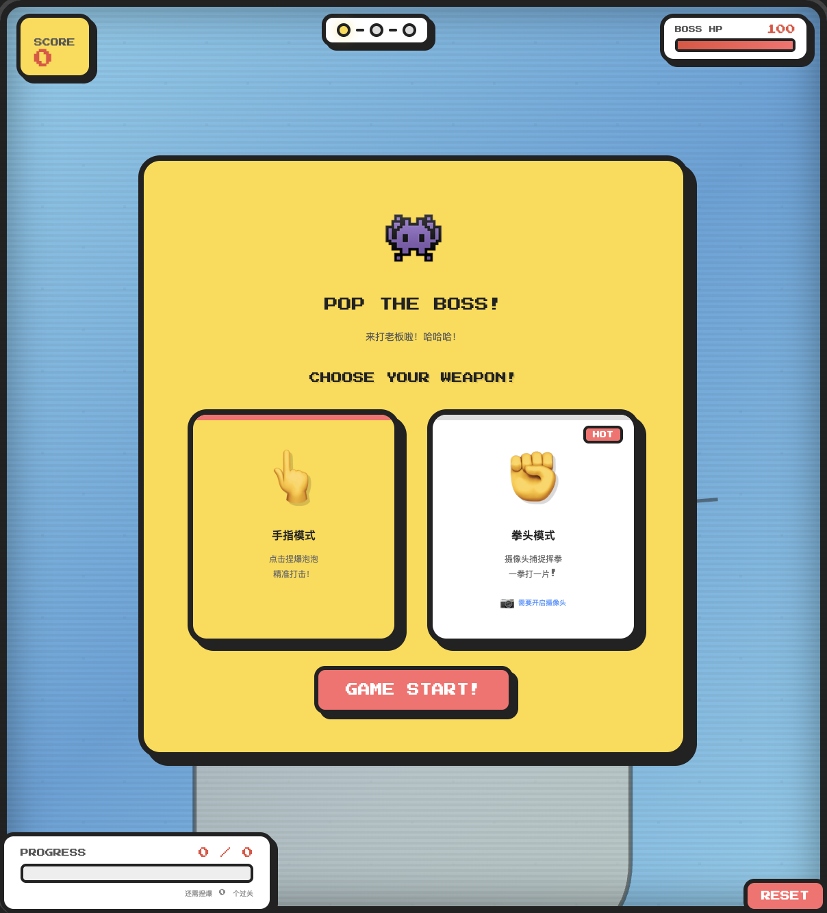
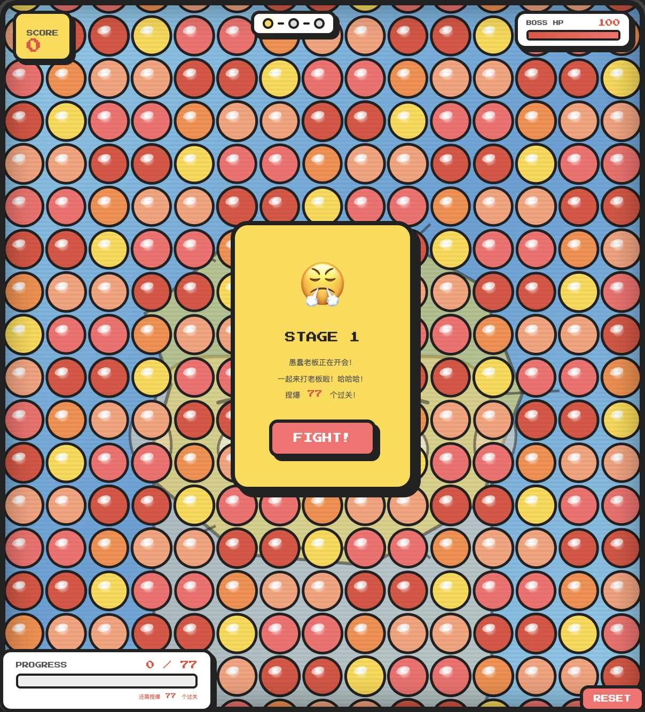
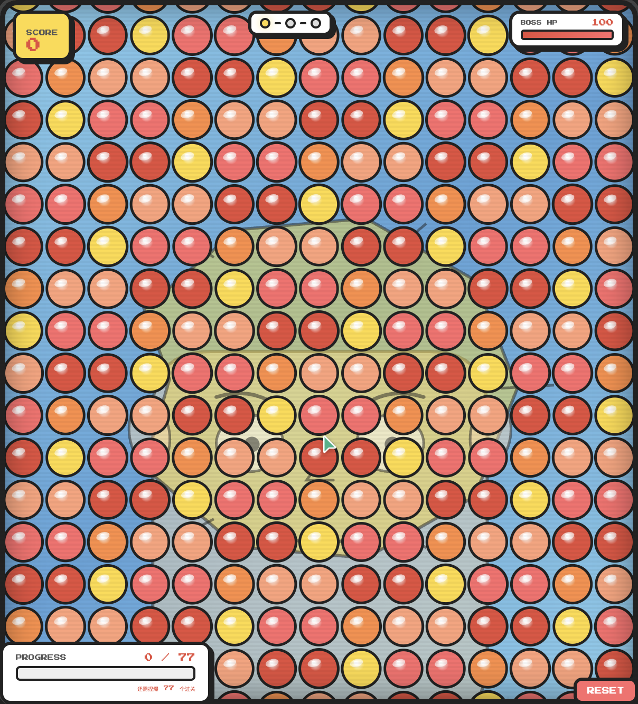
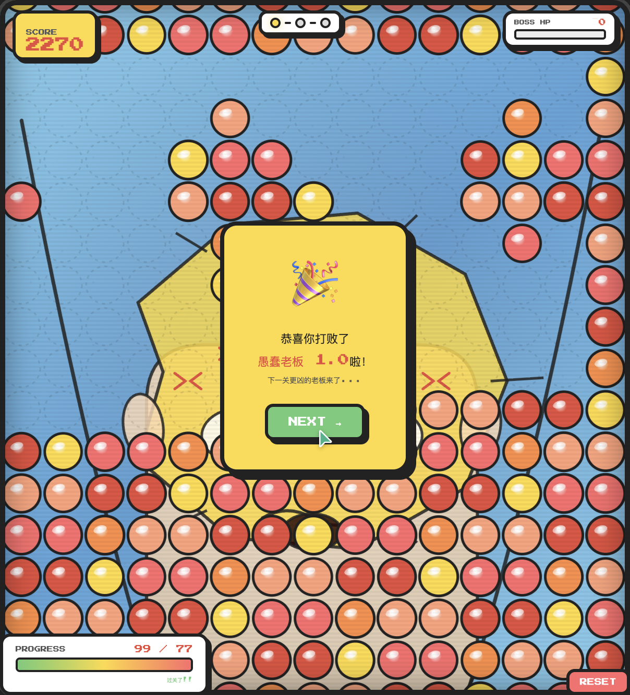

# 【生活娱乐赛道】Pop the Boss! — 捏泡泡解压小游戏

## 标签
`生活娱乐`

---

## 1. Demo 简介

**是什么：** 一款网页端复古街机风格的捏泡泡解压小游戏，用 TRAE Solo Design 从零构建。

**面向谁：** 工作压力大的上班族、需要快速解压放松的年轻人、喜欢休闲小游戏的用户。

**主要功能：**

| 功能 | 描述 |
|------|------|
| 捏泡泡解压 | 点击泡泡触发两阶段动画（按压→破裂），配合 Web Audio API 合成的多层拟真音效 |
| Boss 战斗系统 | 3个关卡，每关有卡通Boss脸（表情从开心→哭泣随进度渐变），配合HP条和进度追踪 |
| 摄像头拳头模式 | 通过摄像头帧差法检测挥手动作，一拳打爆一片泡泡，配5层合成打击音效 |
| 连击与成就 | Combo连击系统、里程碑Toast提示、通关烟花庆祝、全服Boss倒计时 |

**核心体验：** 看着Boss从开心变得哭泣、流眼泪，泡泡一个接一个被捏爆，配合复古街机音效和烟花，爽感拉满。

---

## 2. Demo 创作思路

**灵感来源：**
大家在办公室里都偷偷捏过泡泡纸吧？那种"啪"一声的满足感真的很解压。我想把这个物理体验搬到网页上，做成一款有游戏性的解压小游戏。再结合"打老板"这个打工人最懂的梗，让解压有了情感出口。

**想解决的问题：**
- 上班族缺乏快速、低成本的情绪释放途径
- 现有解压App太重（下载、安装、注册），需要打开即玩的轻量方案
- 单纯捏泡泡太无聊，需要游戏目标感来维持动力

**为什么做这个方向：**
- HTML5 游戏零门槛，打开浏览器就能玩
- 摄像头交互让"打老板"更有代入感（真的挥拳头）
- 复古街机风格降低了视觉预期，但把精力放在了音效和交互手感上

---

## 3. Demo 体验地址

**体验方式：** 解压ZIP包，用浏览器打开 `pop-the-boss.html` 即可体验。

> 建议用 Chrome / Edge 浏览器打开以获得最佳音效体验。
> 拳头模式需要授权摄像头权限，不支持摄像头的环境会自动降级为手指模式。

ZIP包已上传至本帖附件。

---

## 4. TRAE 实践过程

**开发工具：** TRAE Work（SOLO Design 模式）

**完整开发流程：**

### 第1步：基础捏泡泡体验
向TRAE描述需求："创建一个充满屏幕的数字捏泡泡纸，点击时有按压凹陷→破裂动画，播放拟真爆裂音效"。
- 使用 Canvas 2D + requestAnimationFrame 实现泡泡网格
- Web Audio API 5层合成音效（高频snap + 中频crinkle + 低频thud + 三角波ping + 气流pfft）
- 两阶段缓动动画：squish（easeIn）→ burst（easeOut）

### 第2步：拟真视觉升级
要求："颜色接近真实泡泡纸，声音更有塑料感"
- 调整泡泡颜色为接近透明LDPE塑料的低饱和度色调
- 增强 specular highlight 和 secondary dot
- 音效升级为更高Q值的bandpass filter

### 第3步：UI系统设计
要求："Apple简约设计感，解压感，让焦虑的人有治愈感"
- 添加磨砂玻璃HUD面板（backdrop-filter blur）
- 进度环、统计pill、里程碑toast
- 温暖暗色背景 + 环境光效

### 第4步：Boss战斗 + 关卡系统
要求："关卡形式，抽象Boss头像，2-3关，不要第一关就打败"
- Canvas绘制卡通Boss脸（方形头+尖刺头发+粗描边）
- 3关卡系统：愚蠢老板1.0 → 愤怒老板2.0 → 终极老板3.0
- HP条、关卡圆点指示器、百分比进度

### 第5步：复古街机风格重构
提供参考截图，要求："复古感、卡通感、铛铛铛音效、通关恭喜文字"
- Press Start 2P 像素字体
- 金色面板 + 3px黑色边框 + offset阴影
- CRT扫描线 + 机柜边框
- 5音符上行琶音开场 + 和弦收尾
- 胜利号角（方波 brass-like）
- "恭喜你打败了愚蠢老板 1.0 啦！" 通关文字

### 第6步：模式选择 + 摄像头交互
要求："两种模式（点击/拳头），拳头用摄像头，通关放烟花"
- 模式选择卡片UI（👆手指模式 / ✊拳头模式）
- navigator.mediaDevices.getUserMedia 摄像头接入
- 拳头模式：大范围打击（最多5个泡泡），配拳声音效
- 15个烟花 burst（每个30粒子，7色）
- 3层合成烟花boom音效

### 第7步：Boss表情渐进 + UI细化
要求："Boss从开心到哭泣，进度条显示数量，整体UI加细节"
- drawBoss() 重写为dmg参数驱动的连续表情插值
  - 0-30%: 开心微笑 + 正常瞳孔
  - 30-50%: 眉毛下垂 + 脸红 + 汗珠
  - 50-70%: 眼睛睁大 + 张嘴 + 更多汗珠
  - 70-85%: 红色瞳孔 + 流泪 + 哭泣嘴巴
  - 85-100%: 瞳孔颤抖 + 大量眼泪 + 暴怒标记
- 进度面板改为 "X / Y" 格式 + "还需捏爆X个过关"
- 模式卡片更大更醒目，拳头模式有"HOT"标签
- 摄像头预览增大 + 红色录制灯
- 浮动分数文字、里程碑ding音效

### 第8步：摄像头真实交互
要求："选择拳头时用摄像头互动，挥手触发打击"
- 帧差法运动检测（80x60小画布，每2像素采样）
- 运动中心映射到游戏坐标（镜像X轴）
- 状态指示器：蓝色等待 → 金色HIT! → 灰色冷却中
- 红色运动追踪圆点实时显示
- 5层合成拳声音效升级

**开发关键步骤截图：**
- （截图1）基础泡泡网格 + 拟真音效
- （截图2）Boss战斗系统 + 复古UI
- （截图3）摄像头拳头交互 + 表情变化
- （截图4）通关烟花 + 完整游戏循环

**关键任务 Session ID：**
> 请在TRAE中双击对话头像复制对应的Session ID填入此处
> - Session 1: [填写第一个任务的Session ID]
> - Session 2: [填写第二个任务的Session ID]
> - Session 3: [填写第三个任务的Session ID]

---

## 技术亮点

- **纯前端零依赖**：全部代码在单个HTML文件中，无外部JS/CSS依赖
- **Canvas 2D高性能渲染**：requestAnimationFrame + devicePixelRatio适配
- **Web Audio API音效合成**：所有音效（泡泡声、拳声、开场曲、胜利号角、烟花boom、笑声）均为代码合成，无需音频文件
- **摄像头帧差法**：80x60降采样 + 每2像素采样，30fps实时运动检测
- **表情连续插值**：Boss表情通过dmg参数平滑过渡，非离散切换

---

## 报名帖链接

> [在此附上你的大赛报名帖链接]
