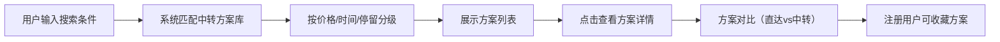
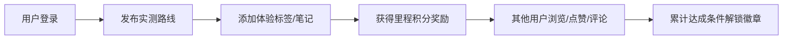

# 中转站 - 产品需求文档（PRD）

## 1. 产品概述

"中转站"是一款多式联运中转方案发现与展示工具，帮助出行者以更低成本、更高效的方式规划跨城路线，提供"回旋镖"航线、"开口程"方案及火车同车接续等创新中转模型推荐。

- **核心价值**：让用户发现更省钱、更有趣的中转出行方案
- **目标用户**：预算敏感型旅行者、通勤族、探索型出行者
- **市场定位**：国内首创的中转方案智能发现与社区分享平台

## 2. 核心功能

### 2.1 用户角色

| 角色 | 注册方式 | 核心权限 |
|------|----------|----------|
| 游客 | 无需注册 | 浏览中转方案、使用搜索功能 |
| 注册用户 | 手机号/邮箱注册 | 收藏路线、保存历史、发布实测、积分系统、成就徽章 |

### 2.2 功能模块

1. **首页/搜索页**：Hero搜索区、热门路线推荐、中转方案列表
2. **方案详情/对比页**：方案详情、多方案对比、参数可视化
3. **个人中心页**：收藏夹、历史记录、实测笔记、积分成就
4. **社区页**：实测路线分享、点赞评论、排行榜

### 2.3 页面详情

| 页面名称 | 模块名称 | 功能描述 |
|-----------|-------------|---------------------|
| 首页/搜索页 | Hero搜索区 | 出发地/目的地/日期输入，一键搜索中转方案 |
| 首页/搜索页 | 分级方案展示 | 按价格/时间/停留时长分级展示推荐方案 |
| 首页/搜索页 | 热门路线推荐 | 展示热门城市间的精选中转方案 |
| 方案详情页 | 方案信息卡片 | 总时长、总价、中转城市、停留时长、分段交通 |
| 方案详情页 | 方案对比 | 并列展示直达vs中转，高亮节省成本和额外体验 |
| 方案详情页 | 方案切换 | 一键切换不同中转方案对比 |
| 个人中心页 | 用户信息 | 头像、昵称、里程积分、成就徽章 |
| 个人中心页 | 收藏夹 | 已收藏的中转路线，支持管理 |
| 个人中心页 | 历史记录 | 自动保存的查询历史，支持快速复用 |
| 个人中心页 | 实测笔记 | 已走过路线的个人体验记录 |
| 社区页 | 实测路线列表 | 用户发布的实测中转路线，带体验标签 |
| 社区页 | 互动功能 | 点赞、评论、收藏实测路线 |
| 社区页 | 发布功能 | 发布实测路线，获取里程积分 |
| 社区页 | 成就体系 | 成就徽章展示与解锁进度 |

## 3. 核心流程

### 3.1 中转方案搜索流程

用户在首页输入出发地、目的地、出行日期，系统从路线库中匹配中转方案，按价格/时间/体验分级展示，用户点击方案查看详情并可进行多方案对比，注册用户可收藏方案。

### 3.2 社区分享流程

用户注册登录后，可发布实测中转路线，标注体验标签，其他用户可点赞评论，发布者获得里程积分，达成条件解锁成就徽章。

## 4. 用户界面设计

### 4.1 设计风格

- **主色调**：深邃旅行蓝（#1e3a5f）+ 活力橙（#ff6b35）
- **辅助色**：天空青（#4ecdc4）、暖金（#ffe66d）
- **中性色**：米白底（#faf9f7）、深墨灰（#2d3436）
- **按钮风格**：圆角胶囊按钮，主按钮渐变填充，次按钮描边
- **字体**：标题使用 "Playfair Display" 衬线体营造旅行杂志感，正文使用 "Inter" 保证可读性
- **布局风格**：卡片式布局，错落有致的网格，大留白营造呼吸感
- **图标风格**：线性图标，配合旅行主题的emoji点缀
- **整体调性**：旅行杂志风 × 现代极简，既有探索感又保持信息清晰

### 4.2 页面设计概览

| 页面名称 | 模块名称 | UI元素 |
|-----------|-------------|-------------|
| 首页/搜索页 | Hero搜索区 | 大标题、渐变背景、搜索卡片、毛玻璃效果 |
| 首页/搜索页 | 方案列表 | 分级Tab切换、卡片悬停动效、价格高亮 |
| 方案详情页 | 对比区域 | 双栏对比布局、节省金额高亮、时间轴可视化 |
| 个人中心页 | 用户信息 | 头像圆环、积分数字动效、徽章墙 |
| 社区页 | 路线卡片 | 瀑布流布局、用户头像、体验标签、点赞动效 |

### 4.3 响应式

- Desktop-first 设计，优先保证1280px以上桌面端体验
- 平板端（768px-1024px）：方案卡片两列布局，对比区域上下堆叠
- 移动端（< 768px）：单列布局，底部Tab导航，搜索区简化

### 4.4 动效设计

- 页面加载：元素渐入 + 轻微上移动画，staggered 延迟
- 卡片悬停：微上浮 + 阴影加深 + 边框发光
- 价格数字：滚动计数动效
- 收藏/点赞：心跳缩放动效
- 方案切换：淡入淡出 + 滑动过渡
