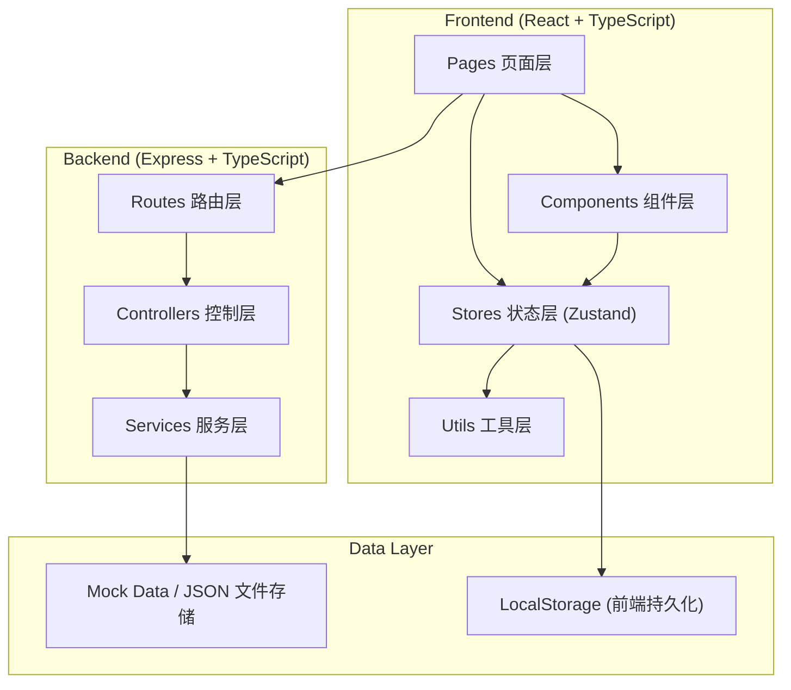
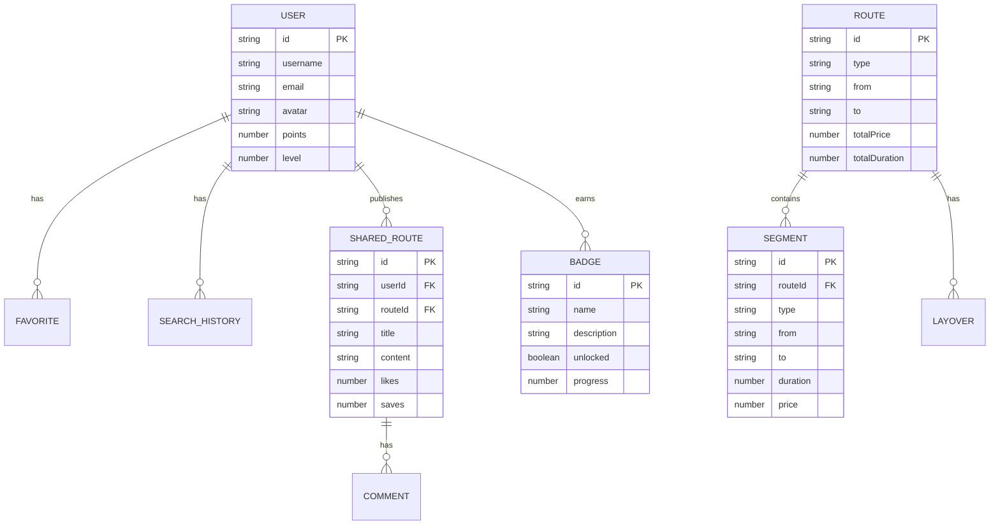

# 中转站 - 技术架构文档

## 1. 架构设计



## 2. 技术描述

- **前端**：React@18 + TypeScript + Vite
- **样式**：TailwindCSS@3 + CSS变量主题系统
- **状态管理**：Zustand
- **路由**：React Router DOM@6
- **图标**：Lucide React
- **后端**：Express@4 + TypeScript
- **数据存储**：JSON文件（Mock数据）+ LocalStorage（前端持久化）
- **初始化工具**：vite-init（react-express-ts模板）

## 3. 路由定义

| 路由 | 页面 | 用途 |
|-------|---------|---------|
| / | Home | 首页：搜索 + 方案列表 + 热门推荐 |
| /search | Search | 搜索结果页：分级方案展示 |
| /route/:id | RouteDetail | 方案详情 + 对比 |
| /community | Community | 社区：实测路线分享 |
| /profile | Profile | 个人中心：收藏/历史/积分/成就 |
| /login | Login | 登录页 |
| /register | Register | 注册页 |

## 4. API 定义

### 4.1 类型定义

```typescript
// 交通方式
type TransportType = 'flight' | 'train' | 'bus' | 'car';

// 中转方案类型
type RouteType = 'boomerang' | 'open_jaw' | 'same_train' | 'normal';

// 分段行程
interface Segment {
  id: string;
  type: TransportType;
  from: string;
  to: string;
  departureTime: string;
  arrivalTime: string;
  duration: number; // 分钟
  price: number;
  carrier: string;
  flightNo?: string;
  trainNo?: string;
}

// 中转停留
interface Layover {
  city: string;
  duration: number; // 分钟
  type: 'airport' | 'station' | 'city';
  tips?: string[];
}

// 中转方案
interface Route {
  id: string;
  type: RouteType;
  typeLabel: string;
  from: string;
  to: string;
  date: string;
  totalPrice: number;
  totalDuration: number; // 分钟
  segments: Segment[];
  layovers: Layover[];
  savings: number; // 相比直达节省金额
  extraTime: number; // 相比直达多花时间（分钟）
  highlights: string[];
  rating: number;
  reviewCount: number;
}

// 用户
interface User {
  id: string;
  username: string;
  email: string;
  avatar: string;
  points: number; // 里程积分
  level: number;
  badges: Badge[];
  createdAt: string;
}

// 成就徽章
interface Badge {
  id: string;
  name: string;
  description: string;
  icon: string;
  unlocked: boolean;
  progress: number; // 0-100
}

// 实测路线分享
interface SharedRoute {
  id: string;
  userId: string;
  user: User;
  routeId: string;
  title: string;
  content: string;
  tags: string[];
  likes: number;
  comments: Comment[];
  saves: number;
  createdAt: string;
}

// 评论
interface Comment {
  id: string;
  userId: string;
  user: User;
  content: string;
  createdAt: string;
}

// 搜索历史
interface SearchHistory {
  id: string;
  from: string;
  to: string;
  date: string;
  searchedAt: string;
}
```

### 4.2 API 接口列表

| 方法 | 路径 | 说明 |
|------|------|------|
| GET | /api/routes | 获取中转方案列表（支持搜索筛选） |
| GET | /api/routes/:id | 获取单个方案详情 |
| GET | /api/routes/compare | 多方案对比 |
| GET | /api/user/profile | 获取用户信息 |
| POST | /api/auth/login | 登录 |
| POST | /api/auth/register | 注册 |
| GET | /api/user/favorites | 获取收藏列表 |
| POST | /api/user/favorites | 添加收藏 |
| DELETE | /api/user/favorites/:id | 取消收藏 |
| GET | /api/user/history | 获取搜索历史 |
| POST | /api/user/history | 添加搜索历史 |
| GET | /api/community | 社区实测路线列表 |
| POST | /api/community | 发布实测路线 |
| POST | /api/community/:id/like | 点赞 |
| POST | /api/community/:id/comment | 评论 |
| GET | /api/user/badges | 获取成就徽章 |
| GET | /api/recommendations | 个性化推荐 |

## 5. 前端状态管理

### 5.1 Store 划分

- `useAuthStore`：用户认证状态
- `useSearchStore`：搜索条件与结果
- `useCompareStore`：方案对比状态
- `useFavoriteStore`：收藏管理
- `useCommunityStore`：社区数据

## 6. 数据模型

### 6.1 ER 图



### 6.2 初始Mock数据

- 预设20+条中转方案数据（覆盖主要城市）
- 5+条实测社区分享数据
- 3+个示例用户
- 8+个成就徽章定义
