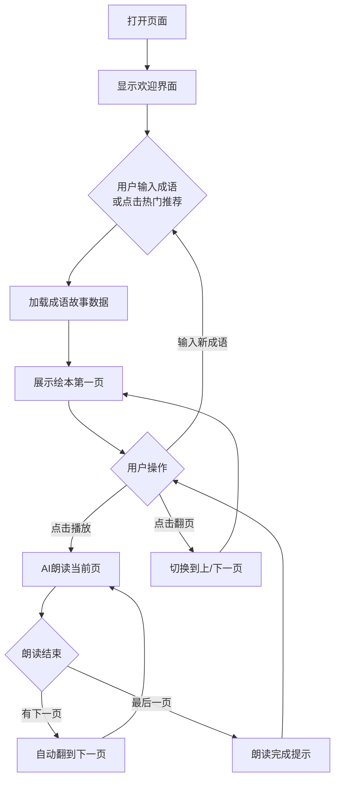

## 1. 产品概述

成语绘本是一个面向小学生的成语学习工具，以绘本形式呈现成语故事。用户输入一个成语后，系统生成对应绘本故事并逐页展示，配合 AI 语音朗读和语音跟读功能，帮助小学生在沉浸式阅读中理解和记忆成语。

- **解决问题**：传统成语学习枯燥乏味，小学生难以理解成语背后的典故和寓意
- **目标用户**：小学生（主要使用者）、家长和老师（陪伴学习、课堂导入、亲子共读的使用者）
- **第一阶段目标**：做一个可直接展示的 HTML Demo，验证核心体验闭环

## 2. 核心功能

### 2.1 用户角色

本阶段为 Demo，无需用户注册登录，以访客身份直接体验。

### 2.2 功能模块

1. **成语搜索与选择**：输入框输入成语，支持热门成语快捷选择
2. **绘本故事生成**：根据成语生成多页绘本故事，每页包含插画、文字、配音
3. **AI 语音朗读**：使用浏览器语音合成朗读故事内容，支持播放/暂停/翻页
4. **绘本翻页浏览**：支持前后翻页浏览故事，当前页高亮朗读

### 2.3 页面详情

| 页面名称 | 模块名称 | 功能描述 |
|---------|---------|---------|
| 主页面 | 顶部导航 | 显示项目名称"成语绘本"、品牌标识 |
| 主页面 | 搜索输入区 | 输入框输入成语名称，带有搜索按钮和热门成语标签 |
| 主页面 | 绘本展示区 | 书本翻页样式展示故事，每页包含插图占位区、故事文字、页码 |
| 主页面 | 朗读控制栏 | 播放/暂停按钮、上一页/下一页按钮、进度指示器、语速调节 |
| 主页面 | 跟读提示区 | 显示当前朗读文字，引导用户跟读 |

## 3. 核心流程

用户打开页面 → 看到欢迎状态和热门成语推荐 → 点击热门成语或在输入框中输入成语并点击搜索 → 系统展示该成语的绘本故事（以书本翻页形式呈现）→ 用户点击播放按钮，AI 语音开始朗读当前页 → 朗读完成后自动翻到下一页 → 用户也可以手动翻页 → 用户可随时暂停/继续朗读。

## 4. 用户界面设计

### 4.1 设计风格

- **主色调**：明亮蓝绿色海洋基调（#1A8FDD 天空蓝、#00B4D8 海洋蓝、#E8F6F3 浅薄荷绿）
- **辅助色**：温暖珊瑚橙（#FF6B6B）、阳光黄（#FFD93D）、柔和奶油色（#FFF8E7）
- **背景**：柔和的渐变背景，带有云朵、星星等贴纸元素
- **按钮风格**：大圆角、柔和阴影、按压动效
- **字体**：标题使用圆体/手写风格字体（体现绘本感），正文使用易读的圆体字
- **布局风格**：卡片式布局，绘本以书页形式居中展示，带有翻页动画
- **图标/贴纸**：云朵、星星、书本、小动物等国风神话贴纸点缀
- **整体感觉**：温暖、梦幻、可爱但不幼稚，具有绘本感和国风神话感

### 4.2 页面设计概览

| 页面名称 | 模块名称 | UI 元素 |
|---------|---------|---------|
| 主页面 | 顶部导航 | 居中品牌标题，右侧装饰云朵图标，背景半透明毛玻璃效果 |
| 主页面 | 搜索输入区 | 大圆角输入框（80px 圆角），白色背景 + 柔和阴影，右侧搜索按钮（橙色圆形），下方热门成语标签（圆角药丸形） |
| 主页面 | 绘本展示区 | 仿书本翻页容器，左右两页展开，中间书脊效果，柔和阴影 + 轻微倾斜 3D 透视，翻页滑动动画 |
| 主页面 | 朗读控制栏 | 底部固定栏，半透明背景，居中播放/暂停大按钮（带脉冲动画），左右翻页箭头，进度圆点指示器 |
| 主页面 | 装饰元素 | 漂浮云朵动画、闪烁星星、角落书本贴纸、页面过渡的轻动画 |

### 4.3 响应式设计

- **桌面端优先**（1280px+）：完整书本展开布局，左右双页显示
- **平板端**（768-1280px）：单页显示，保留翻页交互
- **手机端**（<768px）：单页显示，简化装饰元素，触摸滑动翻页

### 4.4 动画效果

- 页面加载：各模块依次淡入 + 上移（staggered reveal）
- 云朵装饰：缓慢水平漂浮动画
- 星星装饰：周期性闪烁
- 翻页：CSS 3D 翻页效果
- 播放按钮：脉冲呼吸动画
- 朗读文字：逐字高亮动画（可选，如实现复杂则改为整行高亮）
