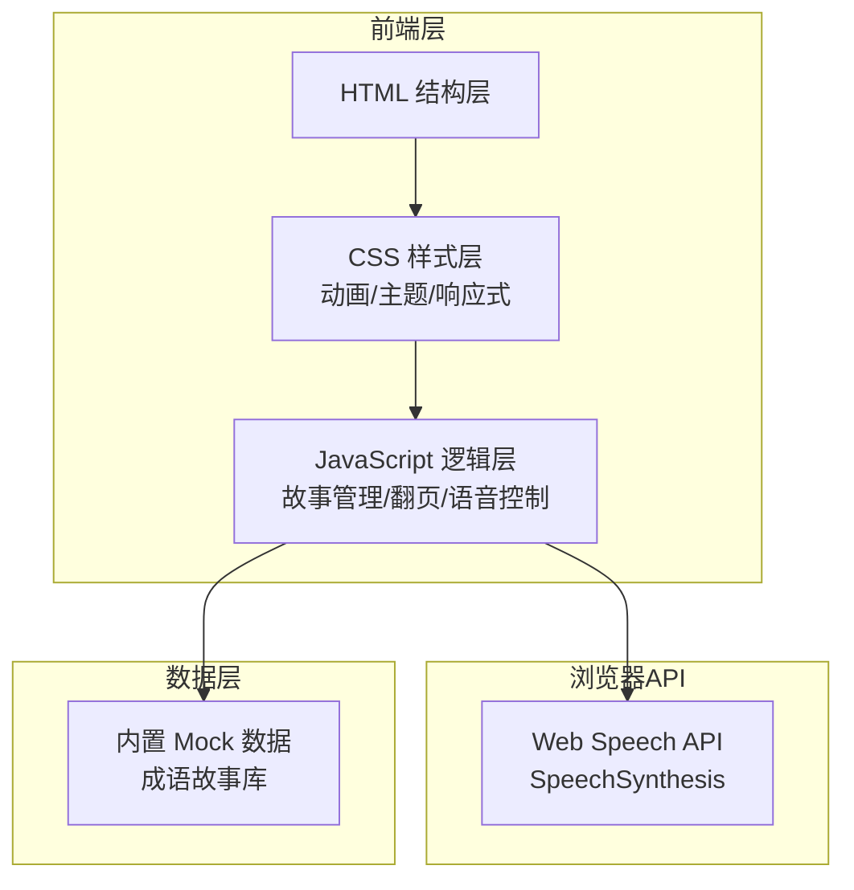

## 1. 架构设计

第一阶段为纯前端 HTML Demo，无需后端服务。使用浏览器原生 API 实现语音合成，成语故事数据采用内置 Mock 数据。



## 2. 技术选型

| 层级 | 技术选择 | 说明 |
|------|---------|------|
| 前端框架 | 纯 HTML/CSS/JS（单文件） | 第一阶段 Demo，无需构建工具 |
| 样式方案 | 原生 CSS + CSS Variables | 使用 CSS 自定义属性管理主题色 |
| 动画 | CSS Animations + Transitions | 纯 CSS 实现翻页、漂浮、闪烁动画 |
| 语音合成 | Web Speech API (SpeechSynthesis) | 浏览器原生 TTS，支持中文 |
| 图标 | CSS 绘制 + Emoji | 云朵、星星等装饰元素使用 CSS/SVG 绘制 |
| 字体 | Google Fonts (ZCOOL KuaiLe / Noto Serif SC) | 标题手写体 + 正文圆体 |
| 部署 | 单 HTML 文件 | 可直接在浏览器打开 |

## 3. 文件结构

```
/Users/wangchao/Documents/space/demo/
├── index.html          # 主页面（单文件包含所有 HTML/CSS/JS）
└── .trae/
    └── documents/
        ├── prd.md              # 产品需求文档
        └── technical-architecture.md  # 技术架构文档
```

## 4. 数据模型

### 4.1 成语故事数据结构

```typescript
interface IdiomStory {
  idiom: string;           // 成语名称，如 "画龙点睛"
  pinyin: string;          // 拼音，如 "huà lóng diǎn jīng"
  meaning: string;         // 释义
  pages: StoryPage[];      // 绘本页面列表
}

interface StoryPage {
  pageNumber: number;      // 页码（从1开始）
  text: string;            // 本页故事文字
  description: string;     // 插画描述（用于生成图片提示词）
  character?: string;      // 角色名称（用于多角色对话标记）
}
```

### 4.2 Mock 数据示例

内置 5 个成语故事：画龙点睛、守株待兔、井底之蛙、狐假虎威、亡羊补牢。每个成语故事 4-6 页，适配小学生阅读长度。

## 5. 核心模块设计

### 5.1 故事管理器（StoryManager）

- 根据成语名称匹配故事数据
- 管理当前页码状态
- 提供翻页（上一页/下一页）方法

### 5.2 语音控制器（SpeechController）

- 使用 `window.speechSynthesis` API
- 朗读指定文本
- 支持播放、暂停、恢复、停止
- 监听朗读结束事件以自动翻页
- 支持语速调节

### 5.3 UI 控制器（UIController）

- 渲染绘本页面内容
- 管理翻页动画
- 更新控制栏状态
- 响应窗口尺寸变化

## 6. API 定义（无需后端）

本阶段无后端 API。所有数据来自内置 Mock。后续阶段可接入：

- `POST /api/generate-story` - AI 生成成语故事
- `GET /api/idiom/:name` - 查询成语故事
- `POST /api/tts` - AI 语音合成（替换浏览器 TTS 以获得更好音质）
