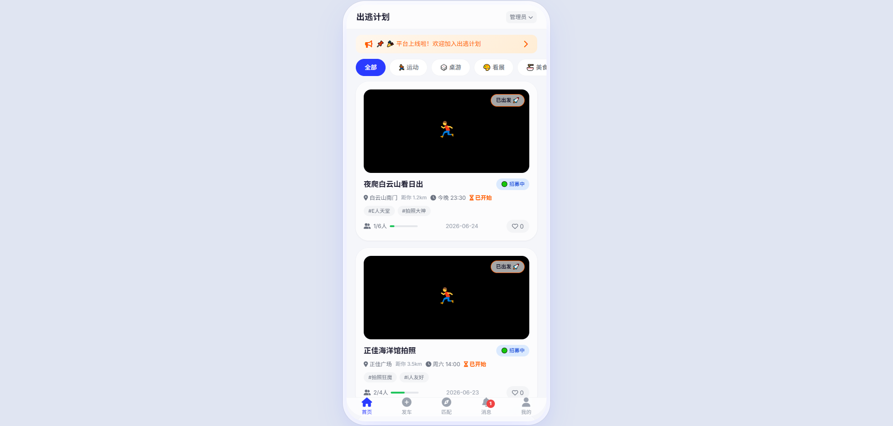
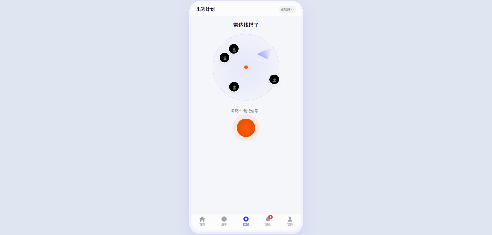
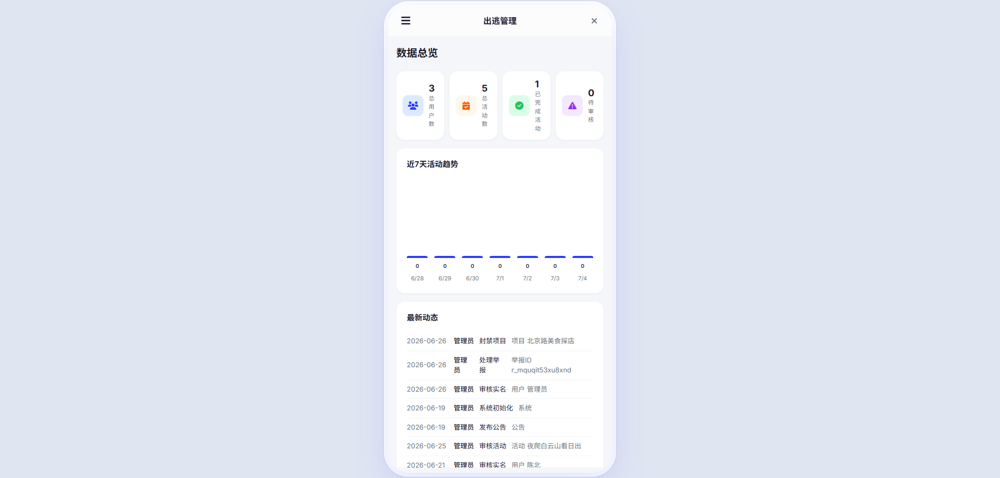

# 【生活娱乐赛道】出逃计划——周末搭子组局平台 Demo

## 一、项目概述

### 1.1 项目名称

出逃计划（Escapade）—— 周末兴趣搭子组局平台

### 1.2 产品定位

出逃计划是一款面向20-28岁城市青年的移动端社交应用，聚焦「兴趣搭子组局」这一细分场景。产品以「不谈恋爱，只找搭子」为核心主张，帮助用户快速找到同频伙伴，参与或发起线下活动。

产品形态为移动端Web应用（PWA风格单页应用），无需下载安装，浏览器打开即用。技术方案为单文件HTML，所有功能在浏览器端完成，包含完整的C端用户界面和B端管理后台。

### 1.3 核心价值主张

- **解决真实痛点**：降低周末组局的社交成本和沟通成本
- **建立信任机制**：实名认证体系保障线下活动安全
- **全链路闭环**：从发现活动到参与/发起，再到管理审核，流程完整

## 二、市场背景与用户需求

### 2.1 市场分析

「搭子社交」是当下青年文化中的显著趋势。据相关调研，超过60%的一线城市年轻人存在「周末想出门但约不到人」的困扰。现有解决方案存在明显不足：

| 现有方案 | 局限性 |
| :--- | :--- |
| 微信群/朋友圈组局 | 信息分散，效率低，无法触达精准人群 |
| 传统社交App（某探/某soul） | 目的性过强，用户预期不匹配，存在社交压力 |
| 兴趣社区（小红书/豆瓣） | 内容为主，缺乏组局工具和闭环流程 |

### 2.2 目标用户画像

| 维度 | 描述 |
| :--- | :--- |
| 年龄 | 20-28岁 |
| 地域 | 一二线城市 |
| 身份 | 职场新人、大学生、刚换城市的「空巢青年」 |
| 核心需求 | 想拓展兴趣社交圈，但不想被「查户口」 |
| 行为特征 | 周末有出门意愿，但缺乏组织者和同频伙伴 |

### 2.3 场景分析

| 场景类型 | 描述 | 频次 |
| :--- | :--- | :--- |
| 临时起意型 | 周五临时想看脱口秀/电影，找拼票搭子 | 高频 |
| 计划型 | 周末徒步/探店/看展，提前组队分摊成本 | 中频 |
| 兴趣深挖型 | 剧本杀/密室等需要凑人数，急需拼车拼场 | 中频 |

## 三、产品功能详述

### 3.1 功能架构概览

| 层级 | 模块 | 核心能力 |
| :--- | :--- | :--- |
| **用户前台（C端）** | 首页活动流 | 卡片展示、状态标签、分类筛选、倒计时、距离、下拉刷新 |
| | 活动详情 | 完整信息、参与者列表、留言板、分享、举报 |
| | 申请加入 | 实名校验、人数校验、状态校验、发起人审核 |
| | 极速发车 | 发布活动表单、搭子标签多选、实名要求开关 |
| | 雷达匹配 | 雷达扫描动画、浮动头像、摇一摇匹配 |
| | 实名认证 | 三张照片上传（正反面+手持）、审核状态管理 |
| | 个人中心 | 资料编辑、认证状态、项目管理、入群审核、数据看板 |
| | 消息中心 | 系统通知实时推送、已读未读 |
| **管理后台（B端）** | 数据总览 | 统计卡片、近7天趋势图、最新动态 |
| | 用户管理 | 列表展示、添加/编辑/删除、重置密码、封禁/启用 |
| | 实名审核 | 状态筛选（全部/待审核/已通过/已驳回/未认证）、照片预览、通过/驳回 |
| | 项目审核 | 待审核列表、通过/驳回（含原因） |
| | 项目管理 | 全状态Tab（8种状态）、添加/编辑/封禁/开始/结束/删除、代审核入群申请 |
| | 举报中心 | 列表展示、修改/删除、跳转处理 |
| | 公告管理 | 发布/编辑/删除、置顶、启用/停用 |
| | 操作日志 | 列表展示、按操作人搜索、分页 |
| | 系统工具 | 网站设置、数据导出/导入、存储监控、重置数据 |

### 3.2 核心功能说明

**首页活动流**：活动卡片展示标题、地点、时间、状态标签（🟢招募中/🟡即将满员/🔴已满员/⚫已结束）、倒计时胶囊、距离、参与人数进度条。顶部支持6大分类筛选（全部/运动/桌游/看展/美食/脱口秀），支持下拉刷新。

**极速发车**：用户可发布活动，填写标题、分类、地点、时间、人数、描述，选择搭子标签（#i人友好/#E人天堂/#菜鸡互啄/#拍照狂魔/#拒绝鸽子），设置是否要求参与者实名认证。提交后进入后台审核流程。

**实名认证**：用户上传身份证正反面照片和手持身份证照片（三张），提交后状态变为「审核中」。管理员在后台审核，通过后账号获得认证标识；驳回需填写原因，用户可重新提交。

**管理后台**：完整的运营级管理系统。用户管理支持添加/编辑/删除/重置密码/封禁；项目管理支持8种状态Tab切换、添加/编辑/封禁/开始/结束/删除、代审核入群申请；举报中心支持跳转至被举报对象进行处理。所有操作记录至操作日志。

### 3.3 产品截图说明

| 序号 | 截图内容 | 截图位置 | 展示目的 |
| :---: | :--- | :--- | :--- |
| 1 |  | 打开页面后首页 | 展示产品核心形态和视觉风格 |
| 2 |  | 底部Tab「发车」和「匹配」 | 展示用户发起活动流程和创新功能 |
| 3 |  | 个人中心 → 管理后台 | 展示产品完成度——具备运营级后台 |

## 四、技术方案

### 4.1 技术架构

| 层级 | 技术选型 | 说明 |
| :--- | :--- | :--- |
| 前端框架 | 原生HTML + CSS + JavaScript | 无外部依赖，单文件运行 |
| 数据存储 | localStorage | 所有数据本地持久化，无需服务器 |
| 样式方案 | CSS Variables + 毛玻璃效果 | 支持深色模式切换 |
| 图标库 | Font Awesome 6.4.0 | CDN引用 |
| 字体 | Google Fonts (Inter) | CDN引用 |

### 4.2 核心技术实现

| 功能模块 | 实现方案 | 技术细节 |
| :--- | :--- | :--- |
| 数据持久化 | localStorage封装 | 7张数据表（用户/活动/留言/举报/公告/通知/日志），统一CRUD接口 |
| 图片上传 | FileReader + Canvas压缩 | 自动压缩至200KB以内，存储为base64 |
| 身份证校验 | 纯前端算法 | 符合GB 11643-1999标准，前17位加权求和取模校验 |
| 用户认证 | 前端模拟 | 账号密码存储于localStorage，支持3级权限（未登录/普通用户/管理员） |
| 权限守卫 | 前端守卫函数 | 未登录拦截、非管理员后台拦截、账号禁用检测 |
| 深色模式 | CSS变量覆盖 | html.dark-mode类切换，偏好存储于localStorage |
| 响应式适配 | Mobile-First + 媒体查询 | 手机全屏，PC居中显示为手机卡片（390px宽，带圆角和阴影） |
| 后台表格适配 | 卡片化 + data-label | 手机上表格自动转为卡片列表，避免横向滚动 |

### 4.3 数据模型

| 数据表 | Key | 主要字段 |
| :--- | :--- | :--- |
| 用户表 | users | id, nickname, password, role, accountStatus, verifyStatus, realName, idNumber, idCardFront/Back/Handheld, escapeCount, hostCount, rating |
| 活动表 | activities | id, title, category, location, startTime, max, tags, img, description, requireRealName, creatorId, status, participants, joinRequests |
| 留言表 | comments | id, activityId, userId, content |
| 举报表 | reports | id, targetId, targetType, reporterId, reason, status, handlerId |
| 公告表 | announcements | id, title, content, isPinned, isActive |
| 通知表 | notifications | id, userId, type, title, content, isRead |
| 日志表 | logs | id, operatorId, operatorName, action, target, detail |

## 五、开发过程

### 5.1 开发工具

本作品使用 **TRAE Work** 完成全部开发，周期约10天，经历了6个迭代阶段：

| 阶段 | 周期 | 主要产出 |
| :--- | :--- | :--- |
| 1. 创意提案 | Day 1 | 初始HTML原型（用于报名） |
| 2. C端功能开发 | Day 2-3 | 首页活动流、发车页、个人中心、雷达匹配 |
| 3. 实名认证 + 管理后台 | Day 4-5 | 三张照片上传、实名审核流程、用户管理、项目审核 |
| 4. 手机适配 | Day 6 | 所有页面适配手机卡片形态 |
| 5. 运营级功能补全 | Day 7-8 | 完整CRUD、项目封禁/开始/代审核、举报跳转处理 |
| 6. UI修复 | Day 9 | 修复手机端表格错位、文字溢出 |

### 5.2 TRAE Work对话Session ID

以下Session ID用于证明作品由TRAE开发完成：

| 序号 | Session ID | 对应阶段 |
| :---: | :--- | :--- |
| 1 | `142284077665420:cadd5fd4cc9c922467e35c74f324aa6a_6a3d0f738398e92110b3e73d.6a3d0f76215feb5b7579fb4d.6a3d0f738398e92110b3e73e:TRAE Work CN.0.1.29.no_sid.no_ppe.T(2026/6/25 19:37:31)` | 初始原型 + C端核心功能 |
| 2 | `142284077665420:453efe0ae127df86df3418e14bef5afe_6a3d0f738398e92110b3e73d.6a3e2ce11118d02da93dedb8.6a3e2cdf31ee5b0531536e48:TRAE Work CN.0.1.29.no_sid.no_ppe.T(2026/6/26 15:50:03)` | 管理后台 + 实名审核 |
| 3 | `142284077665420:088cad8edb153a86e2578c6610261077_6a3d0f738398e92110b3e73d.6a3e66b749a71ed51745c2f1.6a3e66b7fb9b32055d1cbb96:TRAE Work CN.0.1.29.no_sid.no_ppe.T(2026/6/26 19:49:04)` | 手机适配 + 运营级功能补全 |

## 六、评审维度对照

| 评审维度 | 本作品达成情况 | 具体体现 |
| :--- | :--- | :--- |
| **创新性** | ⭐⭐⭐⭐ | 聚焦「兴趣搭子组局」细分方向；雷达匹配以趣味方式降低社交启动成本；实名认证建立线下安全保障 |
| **实用性** | ⭐⭐⭐⭐⭐ | 解决「周末想出门约不到人」真实痛点；本人即目标用户，需求真实；产品已覆盖用户全生命周期（发现→申请→参与→管理） |
| **完成度** | ⭐⭐⭐⭐⭐ | C端7大模块 + B端8大模块完整闭环；从用户前台到管理后台全链路打通；单HTML运行全部功能 |
| **美观度** | ⭐⭐⭐⭐ | 克莱因蓝+亮橙撞色设计语言；毛玻璃质感 + 大圆角；移动优先设计；支持深色模式 |

## 七、体验方式

### 7.1 体验入口

本作品为单文件HTML，已作为附件上传至本社区。下载后使用浏览器（Chrome/Edge/Safari）打开即可体验全部功能，无需部署服务器，无需安装任何软件。

### 7.2 体验账号

| 账号 | 密码 | 角色 | 建议体验场景 |
| :--- | :--- | :--- | :--- |
| admin_001 | admin123 | 管理员 | 后台管理系统全功能体验 |
| 陈北 | 123456 | 普通用户（已实名） | 完整C端流程（浏览/申请/发布/管理） |
| 小陈 | 123456 | 普通用户（未实名） | 实名认证流程体验 |

账号切换方式：点击顶部导航栏右侧用户下拉菜单，选择对应账号。

### 7.3 推荐体验路径

1. 首页浏览活动卡片 → 2. 点开活动查看详情 → 3. 尝试申请加入（触发实名校验） → 4. 切换「发车」Tab发布活动 → 5. 切换「匹配」Tab体验雷达匹配 → 6. 切换「我的」Tab查看个人中心 → 7. 管理员账号查看后台管理系统

## 八、报名帖链接

[【生活娱乐赛道】做一个“出逃计划”周末搭子组局应用](https://forum.trae.cn/t/topic/29572)

> 本作品由TRAE Work完成全部开发，所有功能在单HTML文件中完整实现。感谢TRAE AI创造力大赛平台。期待晋级复赛。