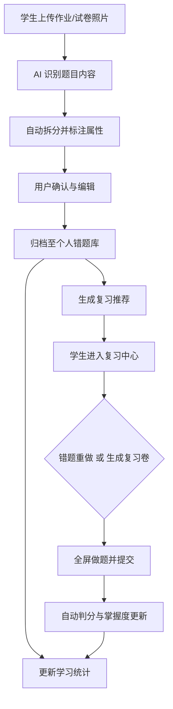

# AI 智能作业整理助手 - 产品需求文档（PRD）

## 1. 产品概述

AI 智能作业整理助手是一款面向中小学生与一线教师的网页端 AI 工具，聚焦"作业杂乱、错题难找、复习低效"三类高频痛点。通过拍照上传、AI 识别、自动归档与智能复习推荐，将原本耗时的手工整理变成一键完成的日常流程，让零散的纸质资料转化为可检索、可追踪、可复习的数字化学习资产。

- **目标用户**：小学至高中学生、校内任课教师
- **核心价值**：将学生整理错题时间压缩 70%，知识点自动标签化，大幅提升复习效率
- **产品形态**：网页端 AI 工具（桌面优先，响应式适配）

## 2. 核心功能

### 2.1 用户角色

| 角色 | 进入方式 | 核心权限 |
|------|---------|---------|
| 学生 | 默认进入 | 上传作业、查看错题库、生成复习卷、查看学习统计 |
| 教师 | 顶部切换身份 | 班级错题汇总、典型错题标记、批量导出复习卷 |

### 2.2 功能模块

1. **工作台首页**：今日整理概览、待复习提醒、学习数据快照、快捷上传入口
2. **上传整理页**：拍照/拖拽上传、AI 识别结果预览、知识点确认、归档入库
3. **错题库页**：错题列表、多维度筛选、详情查看、编辑标签、删除/归档
4. **复习中心页**：智能复习清单、一键生成复习卷、错题重做、掌握度更新
5. **学习统计页**：学科分布、知识点掌握度、错题趋势、薄弱点雷达图

### 2.3 页面详情

| 页面名称 | 模块名称 | 功能描述 |
|---------|---------|---------|
| 工作台首页 | 顶部导航栏 | 品牌标识、主菜单、身份切换、用户头像 |
| 工作台首页 | Hero 概览卡 | 今日待整理、待复习数量、本周新增错题、掌握度提升 |
| 工作台首页 | 快捷操作 | 拍照上传、扫描试卷、生成复习卷、查看错题库四个入口 |
| 工作台首页 | 最近整理 | 横向滚动卡片展示最近 5 条归档记录 |
| 工作台首页 | 薄弱知识点 | 右侧侧栏展示错误率 TOP5 知识点 |
| 上传整理页 | 上传区域 | 大型拖拽区，支持拍照/选图/拖拽，多文件并行 |
| 上传整理页 | 识别进度 | 实时显示 AI 识别状态：上传中→识别中→完成 |
| 上传整理页 | 结果卡片 | 每道题展示题干预览、学科、知识点、题型、难度，可编辑 |
| 上传整理页 | 批量操作 | 全选、批量归档、批量设置错因、批量删除 |
| 错题库页 | 筛选侧栏 | 学科、章节、知识点、错因、难度、时间范围、掌握度 |
| 错题库页 | 错题列表 | 卡片/列表切换，展示题干预览、标签、最后复习时间 |
| 错题库页 | 详情抽屉 | 点击查看完整题目、原图、答案、解析、复习历史 |
| 错题库页 | 导出功能 | 选中错题一键导出为复习卷 PDF（含/不含答案） |
| 复习中心页 | 智能清单 | 基于艾宾浩斯曲线和错误率生成的今日复习清单 |
| 复习中心页 | 复习卷生成 | 按知识点/题型/数量自定义生成新复习卷 |
| 复习中心页 | 错题重做 | 全屏做题模式，提交后自动判分并更新掌握度 |
| 复习中心页 | 复习历史 | 日历视图展示每日复习量与正确率 |
| 学习统计页 | 总览数据 | 累计错题、已掌握、待复习、平均掌握度四个核心指标 |
| 学习统计页 | 学科分布 | 环形图展示各学科错题占比 |
| 学习统计页 | 知识点雷达 | 雷达图展示各章节掌握度 |
| 学习统计页 | 趋势曲线 | 折线图展示近 30 天每日新增错题与复习量 |

## 3. 核心流程

### 3.1 作业上传整理流程

学生上传作业照片 → 系统进行 AI OCR 识别 → 自动拆分题目 → 推断学科/知识点/题型/难度 → 用户确认与编辑 → 入库归档 → 更新统计与复习清单。

### 3.2 考前复习流程

学生进入复习中心 → 系统基于错误率+遗忘曲线生成今日推荐清单 → 用户选择"错题重做"或"生成复习卷" → 全屏做题 → 提交判分 → 自动更新掌握度 → 同步至统计页。

### 3.3 教师班级整理流程

教师切换身份 → 上传班级试卷 → AI 批量识别 → 按学生/知识点汇总 → 标记典型错题 → 一键导出班级复习卷。

## 4. 用户界面设计

### 4.1 设计风格

- **主题基调**：现代教育科技风，明亮、可信、有秩序感，区别于传统教育产品的沉闷
- **主色调**：以"知识蓝" `#3c63ff` 为主，搭配"成长青" `#4fd2c2` 作为强调色，"温暖黄" `#ffd76a` 用于警示与高亮
- **背景**：浅色玻璃拟态（Glassmorphism），柔和径向渐变叠加细网格纹理
- **字体**：标题使用 `Smiley Sans` 或 `Noto Serif SC`（思源宋体）凸显书卷气，正文使用 `Noto Sans SC`，数字使用 `JetBrains Mono`
- **圆角**：大圆角为主（卡片 24-28px，按钮 999px 胶囊），营造友好亲和感
- **阴影**：柔和长投影，配合背景模糊营造空间层次
- **动效**：滚动渐入、卡片悬停微抬、数字滚动动画、上传进度流光、AI 识别脉冲

### 4.2 页面设计概览

| 页面名称 | 模块名称 | UI 元素 |
|---------|---------|---------|
| 工作台首页 | Hero 概览 | 浅色玻璃卡片，渐变光晕背景，4 个核心指标数字滚动动画 |
| 工作台首页 | 快捷操作 | 4 个胶囊按钮，icon+文字，悬停上浮+发光 |
| 工作台首页 | 最近整理 | 横向滚动卡片，每张含缩略图、学科色条、标题、时间 |
| 上传整理页 | 上传区域 | 大型虚线边框拖拽区，上传时显示进度环与流光效果 |
| 上传整理页 | 识别进度 | 三段式状态指示器，AI 识别中显示脉冲动画 |
| 错题库页 | 筛选侧栏 | 左侧固定侧栏，折叠式分组，多选标签胶囊 |
| 错题库页 | 错题卡片 | 卡片含学科色条左侧、题干截断、标签胶囊、悬停展开操作 |
| 复习中心页 | 智能清单 | 优先级排序列表，每项含知识点、错因、推荐理由、上次正确率 |
| 复习中心页 | 做题模式 | 全屏沉浸式，居中题卡，底部上一题/下一题/提交 |
| 学习统计页 | 图表区 | 环形图、雷达图、折线图，搭配数字大屏风格 |

### 4.3 响应式

- 桌面优先（≥1280px）：完整三栏布局
- 平板（768-1280px）：侧栏折叠为抽屉
- 移动端（<768px）：单栏堆叠，底部导航栏

### 4.4 3D 场景指引

本项目不涉及 3D 场景。
