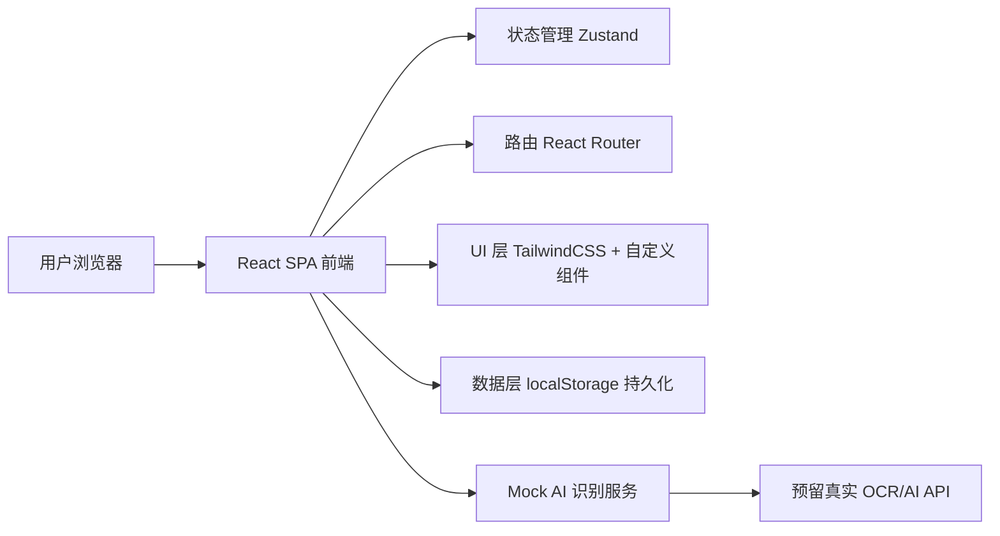
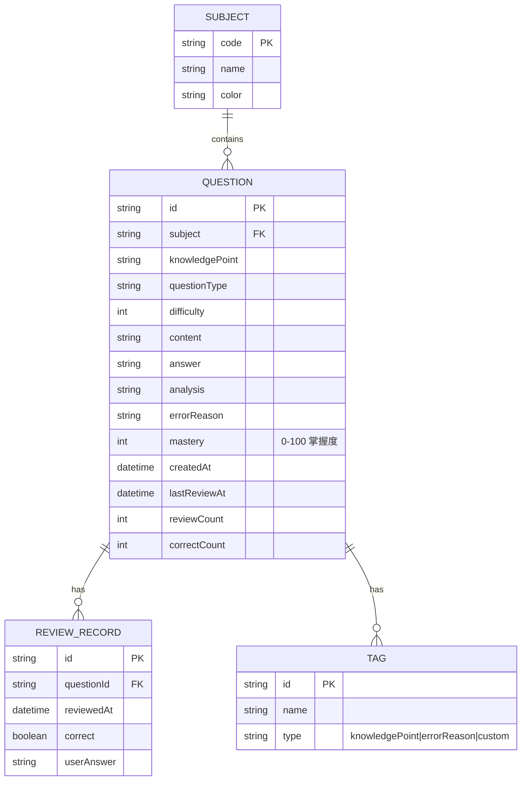

# AI 智能作业整理助手 - 技术架构文档

## 1. 架构设计

本项目为纯前端单页应用，不依赖后端服务，所有数据使用浏览器 localStorage 持久化，AI 识别能力通过本地 mock 数据模拟（保留真实 API 接入位）。



## 2. 技术说明

- **前端框架**：React@18 + Vite@5
- **样式方案**：TailwindCSS@3 + 自定义 CSS 变量
- **路由方案**：React Router@6
- **状态管理**：Zustand（轻量、持久化中间件）
- **图表库**：Recharts（学科分布环形图、知识点雷达图、趋势折线图）
- **图标库**：lucide-react
- **动画库**：framer-motion（页面切换、卡片入场、做题模式转场）
- **字体方案**：通过 Google Fonts 引入 `Noto Serif SC`、`Noto Sans SC`、`JetBrains Mono`
- **初始化工具**：vite-init（`npm create vite@latest`）
- **后端**：无（mock 数据 + localStorage）
- **数据库**：无（localStorage 模拟持久化）

## 3. 路由定义

| 路由 | 用途 |
|------|------|
| `/` | 工作台首页，展示概览与快捷入口 |
| `/upload` | 上传整理页，拍照上传与 AI 识别 |
| `/library` | 错题库页，多维度筛选与查看 |
| `/review` | 复习中心页，智能复习清单与做题 |
| `/stats` | 学习统计页，图表化数据分析 |
| `/review/session` | 全屏做题模式（路由级全屏） |

## 4. API 定义

本项目无后端 API。所有"AI 识别"通过前端 mock 函数模拟，返回延时与结构化数据，便于后续替换为真实接口。

### 4.1 Mock AI 识别接口（前端模拟）

```typescript
// 模拟 OCR + AI 识别
interface RecognizedQuestion {
  id: string;
  subject: Subject;          // 学科
  knowledgePoint: string;    // 知识点
  questionType: QuestionType; // 题型
  difficulty: 1 | 2 | 3 | 4 | 5;
  content: string;           // 题干
  options?: string[];        // 选项（选择题）
  answer?: string;           // 答案
  analysis?: string;         // 解析
  errorReason?: string;      // 错因
  imageUrl?: string;         // 原图
}

async function mockRecognize(imageFiles: File[]): Promise<RecognizedQuestion[]> {
  // 延时 1.5-2.5s 模拟识别耗时
  // 返回内置题库中随机 N 道题
}
```

### 4.2 数据操作接口（Zustand Store）

```typescript
interface QuestionStore {
  questions: Question[];              // 全部错题
  addQuestions: (qs: Question[]) => void;
  updateQuestion: (id: string, patch: Partial<Question>) => void;
  removeQuestion: (id: string) => void;
  reviewQuestion: (id: string, correct: boolean) => void;  // 复习后更新掌握度
  exportReviewPaper: (ids: string[], withAnswer: boolean) => void;
}
```

## 5. 服务端架构

不适用（纯前端项目）。

## 6. 数据模型

### 6.1 数据模型定义



### 6.2 数据定义语言（localStorage Schema）

```typescript
// localStorage key 命名
const STORAGE_KEYS = {
  QUESTIONS: 'ai-homework:questions',
  REVIEW_RECORDS: 'ai-homework:review-records',
  USER_PREFS: 'ai-homework:user-prefs',
};

// 学科枚举
type Subject = 'chinese' | 'math' | 'english' | 'physics' | 'chemistry' | 'biology' | 'history' | 'geography' | 'politics';

// 题型枚举
type QuestionType = 'single' | 'multiple' | 'fill' | 'judge' | 'short' | 'essay' | 'calc';

// 完整 Question 类型
interface Question {
  id: string;
  subject: Subject;
  knowledgePoint: string;
  chapter: string;
  questionType: QuestionType;
  difficulty: 1 | 2 | 3 | 4 | 5;
  content: string;
  options?: string[];
  answer: string;
  analysis?: string;
  errorReason?: string;
  tags: string[];
  mastery: number;          // 0-100
  imageUrl?: string;
  createdAt: string;        // ISO
  lastReviewAt?: string;
  reviewCount: number;
  correctCount: number;
  source: 'upload' | 'manual' | 'import';
}

// 内置 mock 题库（约 30-50 道题，覆盖 9 学科）
// 用于演示 AI 识别结果与初始错题库数据
```

## 7. 项目目录结构

```
src/
  components/         # 通用组件
    layout/           # 布局：Sidebar, TopBar, AppShell
    ui/               # 基础 UI：Button, Card, Tag, Modal, Drawer
    charts/           # 图表：DonutChart, RadarChart, TrendLine
  pages/              # 页面
    Dashboard.tsx
    Upload.tsx
    Library.tsx
    Review.tsx
    ReviewSession.tsx
    Stats.tsx
  store/              # Zustand store
    useQuestionStore.ts
    useUserStore.ts
  data/               # mock 数据
    mockQuestions.ts
    subjects.ts
  lib/                # 工具
    utils.ts
    mockRecognize.ts
  types/              # TypeScript 类型
    index.ts
  App.tsx
  main.tsx
  index.css
```
