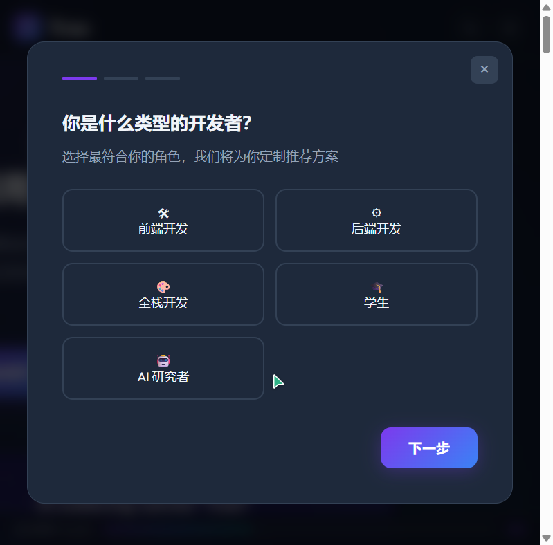
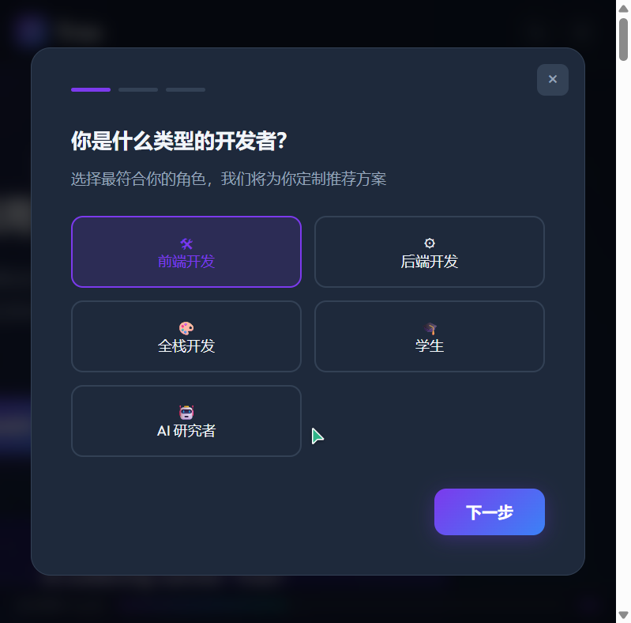

# 初赛 Demo 作品帖内容

## 标签
生活娱乐

## 标题
【生活服务赛道】Trae 新人欢迎页 — 互动式 AI 编程入门体验

---

## 正文

### 1. Demo 简介

**是什么：** 一个自包含的交互式 HTML 响应式网页，为 Trae IDE 的新用户打造沉浸式的产品探索体验。不再是静态的信息展示页，而是一个可以交互、可以个性化、可以收藏的智能引导系统。

**面向谁：** 刚刚了解或下载 Trae 的开发者、编程学习者、以及对 AI 编程工具感兴趣的科技爱好者。

**核心功能：**

- **互动式新手引导**：3 步引导流程，根据用户角色（前端/后端/全栈/学生/AI研究者）和使用目标，智能推荐个性化的 Trae 使用方案
- **快捷键探索器**：可搜索、可分类筛选的 TRAE 快捷键面板，涵盖编辑、导航、AI 辅助三大类别共 15+ 条常用快捷键，点击展开详细说明
- **智能学习路径推荐**：根据用户选择的角色动态生成 5 阶段学习路径时间线，每个角色拥有专属学习内容
- **主题切换 + 资源收藏夹 + 进度追踪**：支持暗色/亮色主题一键切换，可收藏感兴趣的功能模块，实时追踪页面探索进度

**产品截图：**

> 
> 页面顶部：导航栏集成主题切换和收藏夹按钮，Hero 区域新增"开始探索 Trae"互动入口

> 
> 互动式新手引导 Step 1：选择你的开发者角色

> 
> 新手引导最终结果：根据选择生成个性化推荐方案

> 
> 主题切换：一键切换暗色/亮色主题，所有颜色平滑过渡

> 
> 分享功能：一键复制链接分享给朋友

---

### 2. Demo 创作思路

**灵感来源：** 作为 Trae 社区的活跃用户，我发现许多新用户下载安装后不知道从何入手。现有的产品介绍分散在各平台，缺乏一个集中、直观、有吸引力的引导入口。我想做一个"打开就能玩、玩完就会用"的欢迎体验。

**想解决的问题：**
- 新用户认知成本高：需要自行搜索、拼凑 Trae 的功能信息
- 缺乏个性化引导：不同背景的开发者（前端 vs 后端 vs 学生）需要不同的上手路径
- 首次体验不够深刻：静态页面无法让用户"感受"到 AI 编程的魅力

**为什么做这个方向：**
- Trae 拥有 600 万注册用户，每天都有大量新用户加入，一个高质量的欢迎体验能显著降低流失率
- 我选择了"可交互"作为核心差异化，让用户在浏览过程中就能体验到 Trae 的 AI 驱动理念
- 纯前端实现，零依赖，一个 HTML 文件即可运行，符合大赛对 Demo"可体验"的要求

---

### 3. Demo 体验地址

**方式：** 交互式可体验的 HTML 格式文件（Zip 打包上传）

请下载下方附件，解压后打开 `trae-welcome-page.html` 即可在浏览器中体验全部功能。

> [上传 trae-welcome-page.zip]

---

### 4. TRAE 实践过程

本次 Demo 从报名阶段的静态展示页，迭代升级为包含 10 大交互功能的完整体验，全程使用 TRAE IDE 的 SOLO 模式和 Chat 模式协作完成。

**开发流程：**

**Step 1 — 需求分析与功能规划（Chat 模式）**
在 TRAE Chat 中分析了初赛评审要求，对照现有静态页面的不足，确定了 10 个需要增加的交互功能模块，并按优先级排序。

**Step 2 — 互动式新手引导 + 快捷键探索器开发（SOLO 模式）**
使用 SOLO 模式，让 AI 自动分析原有 HTML 结构，在不破坏现有设计风格的前提下，新增了新手引导模态框组件和快捷键搜索面板，实现了多步骤问答交互和分类筛选功能。

**Step 3 — 功能对比增强 + 代码编辑预览（SOLO 模式）**
改造了原有的 Modes Section 和代码预览区，新增了动画展开/收起的对比详情面板，以及可编辑的代码试玩区域。

**Step 4 — 学习路径推荐 + 进度追踪（SOLO 模式）**
新增了基于角色选择动态渲染的学习路径时间线，以及基于 IntersectionObserver 的页面浏览进度追踪系统。

**Step 5 — 主题切换 + 收藏夹 + 计数器动画 + 分享功能（SOLO 模式）**
完成了暗色/亮色主题切换（CSS 变量驱动）、localStorage 收藏夹系统、数字统计区计数器动画、以及分享面板。

**Step 6 — 整体测试与优化（Chat 模式）**
在 Chat 中逐项验证了 10 个功能的交互逻辑，修复了移动端适配问题，优化了动画过渡效果。

**开发关键步骤截图：**

> [截图1：在 TRAE Chat 中分析需求和规划功能的对话截图]
> **请在 TRAE IDE 中找到本次对话，双击头像复制 Session ID，并截图保存**

> [截图2：SOLO 模式开发互动式新手引导的过程截图，显示 AI 正在编辑 HTML 文件]
> **请在 TRAE IDE 中找到对应的 SOLO 任务，双击头像复制 Session ID，并截图保存**

> [截图3：SOLO 模式开发快捷键探索器和学习路径的过程截图]
> **请在 TRAE IDE 中找到对应的 SOLO 任务，双击头像复制 Session ID，并截图保存**

> [截图4：Chat 模式下测试验证交互功能的过程截图]
> **请在 TRAE IDE 中找到测试验证的对话，双击头像复制 Session ID，并截图保存**

> [截图5：最终效果在浏览器中的预览截图]
> 见上方"产品截图"部分，已自动生成

**关键任务 Session ID：**

> [Session ID 1：需求分析与功能规划] — 双击 TRAE 对话头像复制
> [Session ID 2：新手引导 + 快捷键开发] — 双击 TRAE 对话头像复制
> [Session ID 3：功能对比 + 代码编辑开发] — 双击 TRAE 对话头像复制
> [Session ID 4：学习路径 + 进度追踪开发] — 双击 TRAE 对话头像复制
> [Session ID 5：主题切换 + 收藏夹 + 动画 + 分享开发] — 双击 TRAE 对话头像复制
> [Session ID 6：整体测试与优化] — 双击 TRAE 对话头像复制

---

**报名帖链接：** [【生活服务赛道】做一个欢迎新人加入trae页面](https://forum.trae.cn/t/topic/32256)
