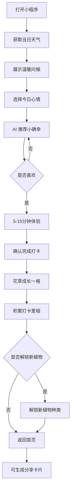

## 1. 产品概述

「小确幸花园」是一款微信小程序风格的 HTML 单页 Demo，主打「即刻可做的小幸福」。每次打开根据当日天气与用户心情，AI 推荐一个 5-15 分钟的碎片化体验活动，完成后虚拟花园里的花草成长一格，积累打卡里程解锁新植物，并可生成分享卡片。

- 目标用户：压力大的都市上班族、需要情绪出口的年轻群体
- 核心价值：用 5-15 分钟的小确幸仪式感，对抗日常焦虑与疲惫

## 2. 核心功能

### 2.1 功能模块

1. **首页（问候 · 天气 · 心情）**：打开即获取当日天气，展示温暖问候语，提供心情标签选择
2. **小确幸推荐页**：结合天气 + 心情，AI 生成一个 5-15 分钟的即刻可做活动卡片
3. **打卡完成页**：确认完成后触发花草成长一格动画，给予情绪正向反馈
4. **我的花园**：展示累计打卡里程、已解锁植物图鉴、当前养护的花草状态
5. **分享卡片**：生成当日小确幸 + 花草成长的可分享图文卡片

### 2.2 页面详情

| 页面名称 | 模块名称 | 功能描述 |
|---------|---------|---------|
| 首页 | 问候横幅 | 根据时段（早/午/晚）展示温暖问候语 + 当日日期 |
| 首页 | 天气卡 | 自动获取/模拟当日天气（晴/阴/雨/雪/雾），配粒子动效 |
| 首页 | 心情选择 | 5 个表情标签：平静、疲惫、焦虑、开心、低落 |
| 推荐页 | AI 推荐卡 | 展示活动名称、时长、步骤、为什么适合此刻 |
| 推荐页 | 换一个 | 不喜欢可重新生成（限 3 次） |
| 打卡页 | 完成确认 | 一键确认完成，触发花草成长动画 |
| 打卡页 | 成长反馈 | 花草从种子→幼苗→成长一格，伴随粒子绽放 |
| 花园页 | 里程看板 | 累计打卡天数、连续打卡、里程进度条 |
| 花园页 | 植物图鉴 | 已解锁植物网格，未解锁为剪影 |
| 分享页 | 卡片预览 | 生成精美分享卡，含花草插画 + 今日小确幸文案 |

## 3. 核心流程

用户打开小程序 → 自动获取天气并展示问候 → 选择心情 → AI 推荐小确幸活动 → 用户完成打卡 → 花草成长一格 → 积累里程解锁新植物 → 可生成分享卡片。

## 4. 用户界面设计

### 4.1 设计风格

- **整体调性**：水彩自然 · 治愈系 · 温暖手作感
- **主色调**：奶油米色 `#FBF7F0` 背景 + 鼠尾草绿 `#7C9885` 主色
- **辅助色**：琥珀黄 `#D4A574`、陶土玫瑰 `#C97B63`、雾蓝 `#A8B5C5`
- **文字色**：深棕 `#3A3A3A`、灰褐 `#6B6157`
- **字体**：标题用「霞鹜文楷 / Fraunces」手作衬线感，正文用「LXGW WenKai」温润可读
- **按钮**：圆角胶囊形，柔和阴影，按下有回弹
- **布局**：移动端竖屏卡片流，模拟微信小程序顶部胶囊 + 底部 TabBar
- **图标**：植物 SVG 插画 + 天气 emoji + 手绘风分隔线
- **动效**：天气粒子（雨滴/雪花/阳光光斑）、花草成长 stagger 动画、心情卡片悬浮

### 4.2 页面设计概览

| 页面名称 | 模块名称 | UI 元素 |
|---------|---------|---------|
| 首页 | 问候横幅 | 顶部水彩渐变背景，手作衬线大标题，日期小字 |
| 首页 | 天气卡 | 圆角卡片，天气插画 + 温度 + 天气描述，背景粒子动效 |
| 首页 | 心情选择 | 5 个圆形表情卡，横向排列，选中放大 + 描边 |
| 推荐页 | 推荐卡 | 大卡片，顶部活动名，中部步骤列表，底部时长标签 + 换一个按钮 |
| 打卡页 | 成长动画 | 中央 SVG 花草，茎叶逐节生长，花瓣绽放粒子 |
| 花园页 | 里程看板 | 顶部大数字（累计天数），下方进度条 + 连续打卡火苗 |
| 花园页 | 植物图鉴 | 3 列网格，已解锁彩色插画，未解锁灰度剪影 + 锁标 |
| 分享页 | 卡片预览 | 竖版卡片，花草插画 + 文案 + 二维码占位 + 保存提示 |

### 4.3 响应式

- 移动端优先（模拟微信小程序 375×667 视口）
- 桌面端居中显示手机外壳框架，两侧留白装饰
- 触控优化：按钮最小 44px，卡片间距 16px

## 5. 数据与规则

### 5.1 心情 → 活动推荐规则

| 天气 \ 心情 | 平静 | 疲惫 | 焦虑 | 开心 | 低落 |
|------------|------|------|------|------|------|
| 晴 | 阳台晒太阳 5min | 闭眼听风 10min | 户外深呼吸 5min | 转圈拍照 10min | 阳光拉伸 8min |
| 阴 | 看云发呆 10min | 热茶慢饮 10min | 写下烦恼 5min | 整理桌面 15min | 涂鸦 10min |
| 雨 | 听雨声 10min | 泡脚 15min | 撕纸解压 5min | 跳支舞 10min | 抱抱自己 5min |
| 雪 | 哈气成霜 5min | 围巾裹紧 5min | 写给未来的信 15min | 堆迷你雪人 15min | 热可可 10min |
| 雾 | 闭眼冥想 10min | 香薰嗅吸 5min | 缓慢数数 5min | 哼首歌 10min | 看窗发呆 10min |

### 5.2 植物解锁里程

| 里程（打卡次数） | 解锁植物 |
|----------------|---------|
| 1 | 蒲公英 |
| 3 | 雏菊 |
| 6 | 三叶草 |
| 10 | 向日葵 |
| 15 | 薰衣草 |
| 21 | 玫瑰 |
| 30 | 樱花 |
| 50 | 银杏 |
