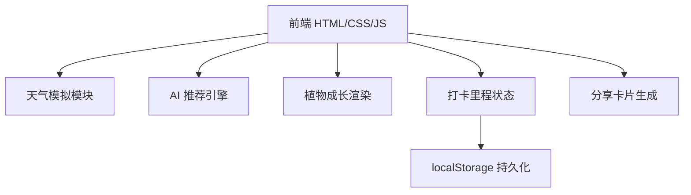

## 1. 架构设计

纯前端单页应用，无后端服务。天气与 AI 推荐通过本地规则引擎模拟，打卡数据持久化于 localStorage，植物插画使用 SVG 矢量绘制。



## 2. 技术说明

- **前端**：原生 HTML5 + CSS3 + 原生 JS（ES6+），无构建工具，单文件可直接打开
- **样式方案**：CSS 变量 + Flexbox/Grid 布局，自定义动画 keyframes
- **字体**：Google Fonts 引入 Fraunces（英文衬线）+ 霞鹜文楷 LXGW WenKai（中文）
- **图标**：内联 SVG 绘制植物、天气粒子使用 Canvas 或纯 CSS 动画
- **数据存储**：localStorage（key: `xqx_garden_state`），保存打卡天数、解锁植物、当前花草阶段
- **天气模拟**：根据当前日期 + 随机种子生成天气，含温度与描述
- **AI 推荐**：本地规则矩阵（天气 × 心情 → 活动库），随机从匹配池抽取

## 3. 文件结构

```
小确幸花园/
├── index.html              # 主入口，包含全部页面与路由
├── styles/
│   ├── base.css            # 变量、字体、reset
│   ├── components.css      # 卡片、按钮、TabBar
│   ├── pages.css           # 各页面专属样式
│   └── animations.css      # 动画与粒子
├── scripts/
│   ├── app.js              # 主入口与页面路由
│   ├── weather.js          # 天气模拟
│   ├── recommender.js      # AI 推荐引擎
│   ├── garden.js           # 花园状态与植物渲染
│   ├── checkin.js          # 打卡与里程逻辑
│   └── share.js            # 分享卡片生成
└── assets/
    └── plants/             # 植物 SVG 内联于 JS
```

## 4. 路由定义（页面切换）

| 路由（hash） | 用途 |
|------------|------|
| `#home` | 首页：问候 + 天气 + 心情选择 |
| `#recommend` | AI 推荐活动卡片 |
| `#checkin` | 打卡完成 + 花草成长动画 |
| `#garden` | 我的花园：里程 + 图鉴 |
| `#share` | 分享卡片预览 |

## 5. 数据模型

### 5.1 状态结构

```javascript
// localStorage key: xqx_garden_state
{
  totalCheckins: 0,         // 累计打卡次数
  streakDays: 0,            // 连续打卡天数
  lastCheckinDate: null,    // 上次打卡日期 YYYY-MM-DD
  unlockedPlants: [1],      // 已解锁植物 id 数组
  currentPlant: {           // 当前养护的花草
    plantId: 1,
    stage: 0                // 0=种子 1=幼苗 2=花苞 3=盛开
  },
  todayActivity: null,      // 今日推荐的活动对象
  todayMood: null           // 今日心情
}
```

### 5.2 活动数据结构

```javascript
{
  id: 'sun_balcony_5min',
  name: '阳台晒太阳',
  duration: 5,               // 分钟
  durationLabel: '5 分钟',
  weather: 'sun',
  mood: 'calm',
  steps: [
    '走到阳台或窗边',
    '闭上眼睛，让阳光洒在脸上',
    '感受温度，深呼吸三次'
  ],
  reason: '阳光能让身体合成维生素 D，也会让心情变得明亮起来。'
}
```

### 5.3 植物图鉴

```javascript
[
  { id: 1, name: '蒲公英',  unlockAt: 1,  color: '#F5D547', emoji: '🌼' },
  { id: 2, name: '雏菊',    unlockAt: 3,  color: '#F8F4E3', emoji: '🌸' },
  { id: 3, name: '三叶草',  unlockAt: 6,  color: '#7C9885', emoji: '🍀' },
  { id: 4, name: '向日葵',  unlockAt: 10, color: '#E8B647', emoji: '🌻' },
  { id: 5, name: '薰衣草',  unlockAt: 15, color: '#9B7EBD', emoji: '💜' },
  { id: 6, name: '玫瑰',    unlockAt: 21, color: '#C97B63', emoji: '🌹' },
  { id: 7, name: '樱花',    unlockAt: 30, color: '#F5C2C7', emoji: '🌺' },
  { id: 8, name: '银杏',    unlockAt: 50, color: '#D4A574', emoji: '🍂' }
]
```

## 6. 关键模块说明

### 6.1 天气模拟

根据当前日期生成稳定天气（同一天打开结果一致），天气类型影响首页粒子动效（晴=光斑、雨=雨滴、雪=雪花、雾=雾气、阴=云朵漂浮）。

### 6.2 AI 推荐引擎

维护「天气 × 心情」活动池，每次推荐从未展示过的活动中随机抽取，最多 3 次换一换机会。

### 6.3 植物成长渲染

使用 SVG path + transform，按 stage（0→3）逐级呈现：
- stage 0：种子（小圆）
- stage 1：幼苗（茎 + 子叶）
- stage 2：花苞（茎 + 叶 + 苞）
- stage 3：盛开（茎 + 叶 + 花瓣展开 + 粒子绽放）

每次打卡 currentPlant.stage +1，到 3 后下次打卡切换为新解锁植物，stage 重置为 0。

## 7. 性能与兼容

- 单文件总大小目标 < 80KB（不含字体 CDN）
- 动画优先使用 transform / opacity，避免重排
- 移动端 60fps 流畅，桌面端居中显示手机壳框架
- 兼容现代浏览器（Chrome 90+ / Safari 14+ / Edge 90+）
