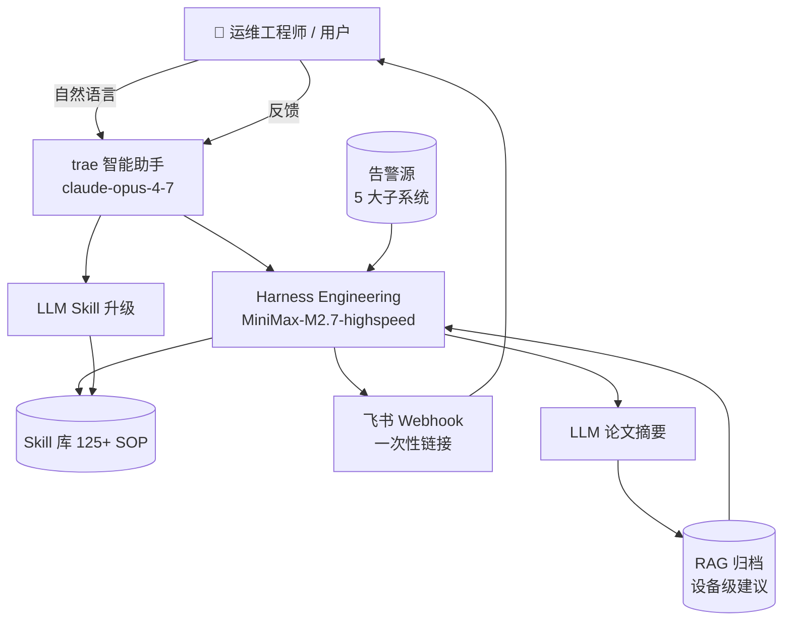

# ToKen Matrix · 智能体工作台

> 原生 AI token 孵化器 · trae 出品
> 面向数据中心 5 大楼宇子系统的"告警 → 自闭环运维"控制台


---

## 目录

1. [项目简介](#项目简介)
2. [整体架构](#整体架构)
3. [5 大子系统详解](#5-大子系统详解)
4. [双 LLM 模型栈](#双-llm-模型栈)
5. [7 步闭环](#7-步闭环)
6. [快速开始](#快速开始)
7. [文件清单](#文件清单)
8. [致谢与版权](#致谢与版权)

---

## 项目简介

**ToKen Matrix** 是 trae 出品的"原生 AI token 孵化器"，定位为面向数据中心 **5 大楼宇子系统**（BMS / 动环 / 消防 / 安防 / BA）的统一告警自闭环运维控制台。
系统以 **Harness Engineering（自主调度工程）** 为编排核心，融合 **claude-opus-4-7（产品对话层）** 与 **MiniMax-M2.7-highspeed（编排调度层）** 双 LLM 模型栈，
内置 125+ 自迭代 SOP Skill 库，可主动拉取运维领域论文并以 RAG 形式归档。当告警触发时，AI Agent 在 7 步之内完成"感知-匹配-执行-推送-确认-反馈-迭代"闭环，把人工介入降到最低。

### 核心特性

- 🚨 **告警 → 7 步闭环自动收敛** — 告警产生后无需人工发起，Agent 自动跑完闭环。
- 🧠 **Harness Engineering 自主调度** — 状态机推进，工具调用可观测、可回放。
- 📚 **自迭代 Skill 库** — LLM 根据人工反馈自动输出 Skill vN → vN+1 的核心规则变更建议。
- 📑 **主动论文拉取** — LLM + Cloudsway Search 检索，输出"设备级"建议并入 RAG 库。
- 🏢 **5 大子系统统一管控** — BMS / 动环 / 消防 / 安防 / BA 一张图。
- 💬 **trae 智能助手对话** — 自然语言问"F3 温度异常怎么处置？"，秒级答复。
- 🪟 **一次性链接拍照确认** — 飞书集成，人工点击链接即可拍照确认修复结果。

---

## 整体架构

### ASCII 总览

```
                         ┌──────────────────────────────────┐
                         │   trae 产品对话层 (claude-opus)   │
                         └──────────────────┬───────────────┘
                                            │ 自然语言
                                            ▼
┌──────────────────────────────────────────────────────────────────────────────┐
│                       Harness Engineering 编排调度层                          │
│                       (MiniMax-M2.7-highspeed)                               │
└──────────────────────────────────────────────────────────────────────────────┘
                                            │
   ┌──────────┬──────────┬──────────┬──────────┼──────────┬──────────┐
   ▼          ▼          ▼          ▼          ▼          ▼          ▼
[告警源]  [AI 调度]  [Skill 执行] [飞书推送] [人工反馈] [LLM 迭代] [RAG 归档]
   │          │          │           │          │          │          │
   ▼          ▼          ▼           ▼          ▼          ▼          ▼
[BMS      125+ SOP    修复/调节    Webhook   OK/需调   Skill vN→vN+1  设备级
动环      匹配        自动执行     富文本    拍照确认  规则变更      建议
消防
安防
BA]
   ▲
   │  外层数据源覆盖 5 大子系统
   └──────────────────────────────────────────────────────────────────────
```

### Mermaid 版本



整体由外向内分为三层：**trae 产品对话层 → Harness Engineering 编排层 → 5 大子系统数据源**。

---

## 5 大子系统详解

### 🔋 BMS 电池系统

负责机房 UPS 后备电池组的健康监控、充放电管理与寿命预测。结合 AI 大模型，可对簇电压偏差、SOC 漂移、内阻异常做出分钟级告警收敛。
覆盖铅酸与磷酸铁锂两类电池簇，支持整流模块、逆变模块、电池巡检仪的统一数据拉通。

**关键 KPI**

- SOC 健康度：**96%**（目标 ≥ 90%）
- SOH 寿命：**≥ 80%**（低于阈值触发更换 Skill）
- 簇电压偏差：**± 50 mV**
- 内阻偏差：**≤ 15%**（单体间一致性指标）
- 充放电温度：**25–35 °C**

**关联 Skill 示例**

- `skill.bms.soc-drift-recover` —— SOC 漂移自动修复
- `skill.bms.cluster-voltage-balance` —— 簇电压均衡调节
- `skill.bms.soh-replacement-plan` —— SOH 寿命到期更换计划

---

### 🌡 动环监控

负责机房环境（温度、湿度、露点、漏水）的实时感知与调节，是 CRAC / 空调末端的核心输入。
系统联动空调、加湿除湿机、应急风机，保证机房始终处于 A 级温湿度区间。

**关键 KPI**

- 温度：**22–24 °C**（A 级机房国标）
- 湿度：**40–60 %** RH
- 露点温度：**5.1–7.4 °C**
- CRAC 调节响应：**≤ 90 s**（从告警到下发指令）
- 漏水绳在线：**12/12**

**关联 Skill 示例**

- `skill.ps.env.temp-drift-reset` —— 温度漂移重置
- `skill.ps.env.humidity-ramp` —— 湿度缓升策略
- `skill.ps.crac.fan-speed-adjust` —— CRAC 风机转速调节

---

### 🔥 消防系统

负责极早期烟雾探测、烟感、温感、喷淋、气体灭火、防火门的统一告警与处置。
所有告警进入 Harness 编排层前都会被加上"是否涉及正在运行设备""是否需要立即断电"等元数据标签。

**关键 KPI**

- 烟感在线率：**128/128**（目标 100%）
- 喷淋压力：**≥ 0.25 MPa**
- 极早期烟雾探测（VESDA）：**≤ 0.005 % obs/m**
- 防火门常闭率：**100%**
- 气体灭火延时：**≤ 30 s** 可配置

**关联 Skill 示例**

- `skill.fire.smoke-isolate-power` —— 烟感触发自动隔离动力
- `skill.fire.sprinkler-pressure-check` —— 喷淋压力巡检
- `skill.fire.gas-discharge-delay` —— 气体灭火延时下发

---

### 🛡 安防系统

门禁、视频巡检、入侵检测、巡更打卡的统一管控层。
所有视频流接入 AI 算法（绊线、区域入侵、人脸识别）后输出结构化事件，落库到事件总线供 Harness 调用。

**关键 KPI**

- 门禁事件：**156 条/日**（高峰时段）
- 视频巡检覆盖率：**98.6%**（点位 NVR 在线率）
- 入侵检测误报率：**≤ 0.8%**
- 巡更打卡准时率：**99.2%**
- 双因素认证：**强制**（关键机房门）

**关联 Skill 示例**

- `skill.sec.video-patrol` —— 视频巡检 SOP
- `skill.sec.door-forced-open` —— 门禁暴力开启处置
- `skill.sec.intrusion-area-lockdown` —— 入侵区域封锁

---

### 🏢 BA 楼宇

楼宇自动化层，负责空调箱（AHU）启停、照明、电梯、冷热源、能耗策略。
通过数字孪生（轻量级 BIM + 实时点位）实现"按需供冷""按人照明"，节能率约 12%。

**关键 KPI**

- 节能率：**12%**（同比基线）
- AHU 启停控制：**32 台** 在线
- 照明联动：**98%** 时段策略命中
- 电梯健康度评分：**≥ 92/100**
- 冷热源 COP：**≥ 4.1**

**关联 Skill 示例**

- `skill.ba.ahu-startup-sequence` —— AHU 启停时序
- `skill.ba.lighting-timezone-policy` —— 照明时段策略
- `skill.ba.elevator-fault-rollback` —— 电梯故障回滚

---

## 双 LLM 模型栈

### 5.1 产品对话层：`claude-opus-4-7 (from trae)`

- **用途**：LLM 推理、Skill 升级、文章摘要、用户对话
- **来源**：trae 出品（原生 AI token 孵化器）
- **接入协议**：`MiniMax / Anthropic Messages / OpenAI Chat Completions` 三协议兼容
- **关键调用场景**：
  - **Skill 升级**：用户反馈 + 当前 Skill 文本 → 输出核心规则变更建议（diff 形式）
  - **论文摘要**：标题+摘要+结论 → 设备级可执行建议，并入 RAG 库
  - **自然语言对话**：用户提问如"F3 温度异常怎么处置？" → 直接给出 SOP 引用

### 5.2 编排调度层：`MiniMax-M2.7-highspeed`

- **用途**：Harness Engineering Agent 调度、状态机推进、7 步闭环日志、Skill 编排
- **协议端点**：`https://api.minimaxi.com/v1/chat/completions`
- **关键特性**：高速、低延迟、强工具调用（function calling 稳定），专为状态机 + 工具调用场景优化

### 5.3 双模型协作示意

```
            ┌───────────────────────────────────────────┐
            │  trae 智能助手 (产品对话层)                │
            │  claude-opus-4-7 (from trae)              │
            └─────────────────────┬─────────────────────┘
                                  │ 调用 (Skill 升级 / 摘要 / 对话)
                                  ▼
            ┌───────────────────────────────────────────┐
            │  Harness Engineering (编排调度层)         │
            │  MiniMax-M2.7-highspeed                   │
            └─────────────────────┬─────────────────────┘
                                  │ 状态机推进
                                  ▼
            ┌───────────────────────────────────────────┐
            │  Skills (5 大子系统 · 125+ SOP)           │
            └───────────────────────────────────────────┘
                                  │ 触发
                                  ▼
            ┌───────────────────────────────────────────┐
            │  5 大子系统 (BMS/动环/消防/安防/BA)        │
            └───────────────────────────────────────────┘
```

两层分工清晰：**claude-opus-4-7 负责"会思考的脑"**，**MiniMax-M2.7-highspeed 负责"会干活的手"**。

---

## 7 步闭环

### 1️⃣ 告警触发

- **输入**：5 大子系统事件总线（Kafka / MQTT / Modbus TCP 任选）
- **输出**：标准化告警 payload（告警 ID / 设备 / 严重等级 / 时间戳）
- **关键实现**：每条告警带上"是否影响 SLA""是否双因素""是否需立即断电"等元数据

### 2️⃣ SOP 匹配 125+

- **输入**：标准化告警 payload
- **输出**：候选 SOP 列表（Top-3，按相似度排序）
- **关键实现**：向量检索 + 关键词检索混合召回

### 3️⃣ Skill 执行（自动修复）

- **输入**：选中的 SOP
- **输出**：设备指令下发记录、修复前快照
- **关键实现**：所有指令下发走"指令沙箱"，可回滚

### 4️⃣ 飞书 webhook 推送

- **输入**：Skill 执行结果
- **输出**：飞书群消息 + 富文本卡片（含一次性链接）
- **关键实现**：签名校验 + 重试队列

### 5️⃣ 一次性链接拍照确认

- **输入**：人工点击飞书卡片链接
- **输出**：上传照片 + 设备编号 + 备注
- **关键实现**：链接 30 分钟有效，一次性 token，不能二次访问

### 6️⃣ 人工反馈（OK / 需调）

- **输入**：`fix-confirmed` / `need-tune`
- **输出**：反馈事件 + diff 草稿
- **关键实现**：`need-tune` 触发 Skill diff 草稿，走步骤 7

### 7️⃣ LLM 迭代（版本号 +1）

- **输入**：`need-tune` + 当前 Skill + 反馈
- **输出**：Skill v(N+1) diff（核心规则变更建议）
- **关键实现**：人工 review 后入库，版本号自增

---

## 快速开始

```bash
# 1. 直接双击打开 fix-console.html（已自包含，无依赖）
open fix-console.html    # macOS
start fix-console.html   # Windows

# 2. 创意 HTML 页（README 的 HTML 版，更适合演示分享）
open fix-readme.html

# 3. 主控制台（含 trae 品牌主视觉）
open console.html
```

> 所有 HTML 页面**零依赖**：字体、图标、PNG logo 全部 inline，离线可用。

---

## 文件清单

```
trae比赛/
├── 下载.png                # trae logo
├── console.html            # 主产品控制台（含 trae 品牌）
├── fix-console.html        # 离线自包含版（PNG base64 内联）
├── fix-readme.html         # 创意文案页（README HTML 版）
└── token-matrix/
    └── README.md           # 本文件
```

| 文件 | 用途 | 依赖 |
| --- | --- | --- |
| `下载.png` | trae 品牌 logo | — |
| `console.html` | 主产品控制台 | 内联资源 |
| `fix-console.html` | 离线自包含版 | 无依赖 |
| `fix-readme.html` | 创意文案页 | 无依赖 |
| `token-matrix/README.md` | 项目矩阵说明 | Markdown |

---

## 致谢与版权

- **trae**：合作方与品牌方，提供 `claude-opus-4-7 (from trae)` 模型与产品对话入口
- **Cloudsway Search**：云端搜索能力，为论文主动拉取提供检索服务
- **Harness Engineering**：自主调度工程的概念与最佳实践，让 Agent 编排更可观测
- **5 大子系统数据模型**：参考国标 GB 50174 / GB 50016 / GB 50348 等规范建模

© ToKen Matrix · trae 出品 · 仅用于参赛演示
