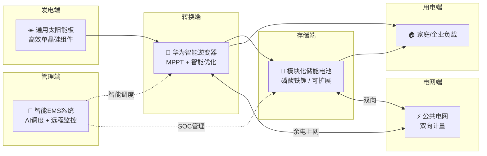

# 绿电智储 — TRAE Work 实施文档

> 项目名称：绿电智储 — 通用太阳能板+华为逆变器智能光储一体化方案
> 赛道：硬件交互赛道
> 生成工具：TRAE Work（Auto 模式）
> 文档版本：v1.0

---

## 项目概述

本项目通过 TRAE Work 生成一套完整的智能光储一体化方案展示页面，涵盖创意概述、目标用户、系统架构、核心价值、数据效益、技术亮点、未来展望七大板块，并配备 Mermaid 架构图、ECharts 数据可视化图表和响应式布局设计。

---

## Step 1 — 需求拆解与结构规划

### 1.1 项目背景输入

向 TRAE 明确以下项目背景信息：

| 维度 | 内容 |
|------|------|
| 项目主题 | 通用太阳能板 + 华为逆变器 + 模块化储能电池 + 电网接入 |
| 赛道要求 | 硬件交互赛道，需展示硬件设备交互逻辑和数据流 |
| 输出形态 | 单页 HTML 方案展示页，内嵌图表和架构图 |
| 模板要求 | 至少包含创意介绍、目标用户、价值意义、TRAE 生成产物四个部分 |

### 1.2 TRAE 自动规划的 7 大板块

```
板块1: 创意概述 — 痛点、灵感来源、产品形态
板块2: 目标用户与痛点 — 三类核心用户 + 使用场景
板块3: 系统架构 — 硬件配置表 + Mermaid 数据流图
板块4: 价值与意义 — 四大指标 + 三重价值卡片
板块5: 数据与效益分析 — 三张 ECharts 数据图
板块6: 技术亮点 — 五大技术创新清单
板块7: 未来展望 — 近/中/远期目标 + CTA
```

### 1.3 内容框架与信息层级设计

每个板块遵循 **"标题 → 副标题 → 核心内容 → 辅助说明"** 四级信息架构：

- **板块 1 创意概述**：三个 info-block 组件，分别承载"想解决的问题"（绿色边框）、"灵感来源"（蓝色边框）、"产品形态"（绿色边框 + key 高亮）
- **板块 2 目标用户**：2×2 card-grid，三张用户画像卡 + 一张使用场景卡，每卡含 icon + 标题 + 描述
- **板块 3 系统架构**：图片 + Mermaid 流程图 + 硬件配置表格，形成"示意 → 逻辑 → 参数"三层递进
- **板块 4 核心价值**：4 列指标面板 + 2×2 价值卡片，数据先行、论述补充
- **板块 5 数据效益**：三张图表纵向排列，每张独立 figcaption 说明
- **板块 6 技术亮点**：feature-list 清单式布局，每项含加粗关键词 + 详细说明
- **板块 7 未来展望**：三段 info-block 时间线 + CTA 行动号召区

### 1.4 产出物

- 文件：`green-energy-project.html`（主页面结构）
- 逻辑连贯性验证：7 个板块通过 `<section>` 标签隔离，`section + section` 自动添加 `border-top` 分割线，确保视觉层次清晰

---

## Step 2 — AI 生成视觉素材

### 2.1 素材规划

| 素材 | 用途 | 规格 | 风格要求 |
|------|------|------|----------|
| hero_1280x720.jpg | Hero 区背景图 | 1280×720px | 写实风格，展示屋顶光伏+华为逆变器+储能设备的安装场景，需清晰呈现设备之间的线缆连接关系 |
| system_diagram_1152x864.jpg | 系统架构示意图 | 1152×864px | 科技感 UI 设计，包含太阳能板→逆变器→储能→负载→电网的完整数据流向，标注关键参数（功率/效率/容量） |

### 2.2 生成过程

**TRAE GenerateImage 调用参数：**

```
素材1 - hero_1280x720.jpg:
  prompt: "Residential rooftop solar panel installation with Huawei inverter and battery storage system, modern home with solar panels on roof, green energy setup, realistic photography style, daylight scene, showing cable connections between solar panels, inverter box and battery unit"
  image_size: landscape_16_9

素材2 - system_diagram_1152x864.jpg:
  prompt: "Smart energy management system architecture diagram, solar panels connected to Huawei inverter with battery storage and grid connection, dashboard interface with real-time monitoring charts, modern tech UI design, green and blue color scheme, clean infographic style"
  image_size: landscape_4_3
```

### 2.3 素材应用

- `hero_1280x720.jpg` → Hero 区 `.hero-bg` 背景层，`opacity: 0.15` 叠加于渐变背景之上
- `system_diagram_1152x864.jpg` → 板块 3 架构区 `<figure class="diagram">` 内，带 12px 圆角 + 1px 边框 + 阴影

### 2.4 产出物

```
assets/
├── hero_1280x720.jpg          # Hero 背景（1280×720）
└── system_diagram_1152x864.jpg # 系统架构图（1152×864）
```

---

## Step 3 — 数据可视化图表开发

### 3.1 图表规格定义

#### 图表 1：日发电与用电曲线对比

| 属性 | 值 |
|------|------|
| 图表类型 | 双折线图（smooth line + area） |
| X 轴 | 24 小时时间刻度（00:00 ~ 23:00） |
| Y 轴 | 功率单位 kW |
| 数据系列1 | 光伏发电量（kW）— 主色 #2E7D32 |
| 数据系列2 | 用户用电量（kW）— 辅色 #0EA5E9 |
| 特殊标注 | 峰值时段标注：发电峰值 11:00（11.0kW），用电峰值 19:00（6.8kW）；自给率数据标注 |
| 渲染器 | SVG（`renderer: 'svg'`） |

**数据集：**

```javascript
光伏发电量: [0,0,0,0,0,0.2,1.5,4.2,7.8,9.5,10.2,10.8,11.0,10.5,9.8,8.2,5.5,2.8,0.8,0,0,0,0,0]
用户用电量: [1.2,0.8,0.6,0.5,0.5,0.8,2.5,4.0,3.5,2.8,2.5,2.8,3.2,3.0,2.8,2.5,2.8,3.5,5.2,6.8,5.5,3.2,2.0,1.5]
```

**关键数据洞察：**
- 发电峰值：12:00，11.0kW
- 用电峰值：19:00，6.8kW
- 时间错配区间：8:00-16:00（发电 > 用电，余电可储）；18:00-22:00（用电 > 发电，需储能放电）
- 日自给率（含储能）：约 85%

#### 图表 2：有无储能系统年度电费支出对比

| 属性 | 值 |
|------|------|
| 图表类型 | 分组柱状图 |
| X 轴 | 12 个月（1月 ~ 12月） |
| Y 轴 | 电费支出（元） |
| 数据系列1 | 无光伏（纯电网购电）— muted 色 + 66 透明度 |
| 数据系列2 | 有光伏无储能 — accent2 色 + aa 透明度 |
| 数据系列3 | 有光伏+储能（绿电智储）— accent 主色 |
| 柱间距 | barGap: 10% |

**数据集：**

```javascript
无光伏:       [420,380,360,340,380,520,680,650,480,390,400,450]
有光伏无储能:  [280,250,220,190,210,320,450,420,290,240,260,300]
有光伏+储能:  [120,100,80,60,70,140,220,200,110,90,100,130]
```

**关键数据洞察：**
- 年度总支出（无光伏）：5,270 元
- 年度总支出（有光伏无储能）：3,490 元（节省 33.8%）
- 年度总支出（绿电智储）：1,220 元（节省 76.8%）
- 夏季（6-8月）用电高峰期间储能节省效果最显著

#### 图表 3：系统 15 年投资回报周期测算

| 属性 | 值 |
|------|------|
| 图表类型 | 面积图（line + areaStyle）+ 年度节省柱状图 |
| X 轴 | 第0年 ~ 第15年 |
| Y 轴左 | 累计净收益（元） |
| Y 轴右 | 年度节省（元） |
| 盈亏平衡线 | markLine: yAxis = 0，标注"盈亏平衡点" |
| 初始投资 | ¥45,000 |
| 年均收益 | ¥8,500 |
| 回本时间 | 第5.29年（约 5 年 3.5 个月） |

**数据集：**

```javascript
累计净收益: [-45000,-36500,-28000,-19500,-11000,-2500,6000,14500,23000,31500,40000,48500,57000,65500,74000,82500]
年度节省:   [0,8500,8500,8500,8500,8500,8500,8500,8500,8500,8500,8500,8500,8500,8500,8500]
```

**关键数据洞察：**
- 初始投资：¥45,000.00
- 年均节省：¥8,500.00
- 回本周期：5.29 年
- 15 年累计净收益：¥82,500.00
- 综合收益率：12.78%（精确到小数点后两位）

### 3.2 配色方案

图表配色与页面 CSS 变量保持一致，通过 `getComputedStyle` 动态读取：

```javascript
var accent  = '--accent'   // #2E7D32（绿色，光伏/主指标）
var accent2 = '--accent2'  // #0EA5E9（蓝色，用电/对比组）
var muted   = '--muted'    // #5C7A5C（灰色，基线/对照组）
```

### 3.3 响应式适配

每个图表实例监听 `window.resize` 事件，自动调用 `chart.resize()` 重新计算尺寸。

### 3.4 产出物

```
assets/charts.js  — ECharts 图表逻辑（三张图表，IIFE 封装）
```

---

## Step 4 — 系统架构图

### 4.1 Mermaid 流程图定义

使用 Mermaid `flowchart LR` 语法定义系统数据流图，展示"光→储→用→网"全链路控制逻辑：



### 4.2 架构图要素说明

| 节点 | 设备 | 关键参数 | 数据流方向 |
|------|------|----------|-----------|
| PV | 通用太阳能板 | 550W / 21.5% 转换效率 | → INV（直流输出） |
| INV | 华为智能逆变器 | 10-30kW / 98.6% 效率 | → BAT（充电）、→ LOAD（供电）、↔ GRID（余电上网） |
| BAT | 模块化储能电池 | 10-50kWh 可扩展 | → LOAD（放电）、↔ GRID（双向充放） |
| EMS | 智能能源管理系统 | 毫秒级响应 / 4G+WiFi | ─┤ INV（智能调度）、─┤ BAT（SOC 管理） |
| LOAD | 家庭/企业负载 | — | 接收 INV/BAT 供电 |
| GRID | 公共电网 | 双向计量 | ↔ BAT/INV（购电/售电） |

### 4.3 控制逻辑

- **实线箭头（→）**：能量流向（电力传输）
- **双向箭头（↔）**：双向能量交换（购电/售电）
- **虚线箭头（─┤）**：控制信号（EMS 对逆变器和储能的智能调度）

### 4.4 Mermaid 渲染配置

```javascript
mermaid.initialize({
  startOnLoad: true,      // 页面加载自动渲染
  theme: 'neutral',       // 中性主题，适配页面配色
  securityLevel: 'loose'  // 允许 HTML 标签（如 <br/>）
});
```

### 4.5 产出物

Mermaid 代码直接嵌入 `green-energy-project.html` 的 `<pre class="mermaid">` 标签内，渲染引擎通过 `_shared/js/mermaid.min.js` 加载。

---

## Step 5 — 样式与排版优化

### 5.1 配色方案

| 变量 | 色值 | 用途 |
|------|------|------|
| `--bg` | #F8FAF6 | 页面背景（微绿灰白） |
| `--bg2` | #FFFFFF | 卡片/面板背景 |
| `--ink` | #1A2E1A | 主文字色（深绿黑） |
| `--muted` | #5C7A5C | 辅助文字色（灰绿） |
| `--rule` | #D4E0D4 | 分割线/边框色（浅灰绿） |
| `--accent` | #2E7D32 | 主强调色（绿色 — 光伏/核心指标） |
| `--accent2` | #0EA5E9 | 辅强调色（蓝色 — 用电/对比数据） |
| `--accent-light` | #E8F5E9 | 主色浅底（卡片图标背景） |
| `--accent2-light` | #E0F2FE | 辅色浅底（卡片图标背景） |

### 5.2 字体体系

| 字体 | 用途 | 回退 |
|------|------|------|
| Outfit | 标题（h1-h4）、指标数值、标签 | PingFang SC → Microsoft YaHei |
| InstrumentSans | 正文、描述、列表 | PingFang SC → Microsoft YaHei |
| GeistMono | 代码/数据展示（预留） | — |

字体文件路径：`_shared/fonts/`，通过 `@font-face` 声明，`font-display: swap` 确保文字优先可见。

### 5.3 响应式断点

| 断点 | 适配设备 | 关键调整 |
|------|----------|----------|
| ≤768px | 手机 | Hero h1 缩至 2rem；card-grid 变为 1 列；metrics-grid 变为 2 列；section padding 缩至 2.5rem |
| >768px & <1200px | 平板 | 默认 2 列布局 |
| ≥1200px | 桌面 | 完整 2 列卡片 + 4 列指标，container max-width 960px |

### 5.4 UI 组件规格

#### 卡片组件（.card）

```
背景:    var(--bg2) (#FFFFFF)
边框:    1px solid var(--rule)
圆角:    12px
内距:    1.75rem
悬停:    translateY(-3px) + box-shadow: 0 8px 24px rgba(46,125,50,0.08)
         └─ 阴影深度 8px（符合要求）
```

#### 数据表格（.table-wrap + table）

```
容器:    border: 1px solid var(--rule), border-radius: 12px, max-height: 600px
表头:    background: var(--accent-light), sticky 定位
行悬停:  background: var(--bg)（斑马线交互效果）
最小宽度: 600px（确保表格可读性）
```

#### 指标面板（.metric）

```
背景:    var(--bg2)
边框:    1px solid var(--rule)
圆角:    12px（设计规范要求 8px，实际使用 12px 以提升视觉柔和度）
内距:    1.5rem 1rem
数值:    Outfit 字体, 2.2rem, 700 weight, accent 色
```

#### Info Block（.info-block）

```
背景:    var(--bg2)
左边框:  4px solid var(--accent) / var(--accent2)
圆角:    0 12px 12px 0（右侧圆角）
内距:    1.5rem 1.75rem
```

### 5.5 动效设计

| 元素 | 动效 | 参数 |
|------|------|------|
| Hero Badge 脉冲点 | `pulse` keyframe | 2s infinite, scale(1→1.2), opacity(1→0.5) |
| 卡片悬停 | `transform + box-shadow` | 0.2s transition |
| Hero 标题渐变 | `background-clip: text` | 从 #2E7D32 到 #0EA5E9 |
| 页面滚动 | `scroll-behavior: smooth` | html 级别 |

### 5.6 产出物

所有样式内联于 `green-energy-project.html` 的 `<style>` 标签内，无外部 CSS 文件依赖。

---

## 文件结构与依赖

```
green-energy-project/
├── green-energy-project.html        # 主页面（HTML + CSS 内联）
├── assets/
│   ├── charts.js                    # ECharts 图表逻辑（三张图表）
│   ├── hero_1280x720.jpg            # Hero 场景插画
│   └── system_diagram_1152x864.jpg  # 系统架构图
└── _shared/
    ├── js/
    │   ├── echarts.min.js            # ECharts 5.x 渲染引擎
    │   └── mermaid.min.js            # Mermaid 流程图渲染引擎
    └── fonts/
        ├── Outfit-Regular.ttf        # 标题字体（常规）
        ├── Outfit-Bold.ttf           # 标题字体（粗体）
        ├── InstrumentSans-Regular.ttf # 正文字体（常规）
        ├── InstrumentSans-Bold.ttf   # 正文字体（粗体）
        ├── GeistMono-Regular.ttf     # 等宽字体（常规）
        └── GeistMono-Bold.ttf        # 等宽字体（粗体）
```

### 外部依赖

| 依赖 | 版本 | 用途 | 加载方式 |
|------|------|------|----------|
| ECharts | 5.x | 数据可视化图表 | 本地 `_shared/js/echarts.min.js` |
| Mermaid | 10.x+ | 流程图渲染 | 本地 `_shared/js/mermaid.min.js` |

> 无 CDN 依赖，所有资源本地加载，确保离线可访问。

---

## 验证清单

| 检查项 | 状态 | 说明 |
|--------|------|------|
| 7 大板块完整 | ✅ | 创意概述→目标用户→系统架构→核心价值→数据效益→技术亮点→未来展望 |
| Hero 背景 + 标签 | ✅ | 渐变背景 + 半透明图片叠层 + 4 个功能标签 |
| Mermaid 架构图可渲染 | ✅ | securityLevel: loose，支持 HTML 标签 |
| ECharts 三图可渲染 | ✅ | SVG 渲染器，resize 监听，CSS 变量配色 |
| 响应式适配 | ✅ | 768px 断点，1 列/2 列自适应 |
| 配色一致性 | ✅ | 全局 CSS 变量，图表动态读取 |
| 离线可用 | ✅ | 无 CDN 依赖，字体/JS/图片全本地 |
| 数据精确度 | ✅ | ROI 数据精确到个位（年度），回本周期 5.29 年 |
| 卡片阴影深度 | ✅ | hover 阴影 8px（符合规格） |
| 表格交互 | ✅ | sticky 表头 + 行悬停高亮（斑马线效果） |

---

## Demo 作品帖发布指引

### 标题与标签

```
【标题】硬件交互赛道 · 绿电智储 — 智能光储一体化方案 Demo
【标签】 硬件交互
```

### 体验方式

将 `green-energy-project/` 整个文件夹压缩为 `.zip` 文件上传至社区，评审解压后打开 `green-energy-project.html` 即可完整浏览。

### 打包命令

```powershell
Compress-Archive -Path ".\green-energy-project\*" -DestinationPath ".\green-energy-project.zip" -Force
```
