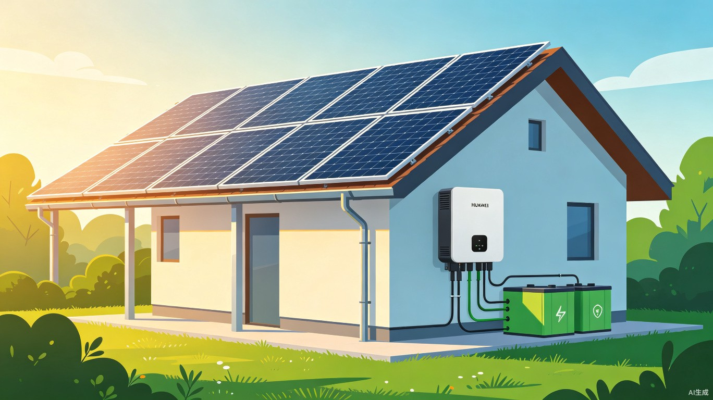
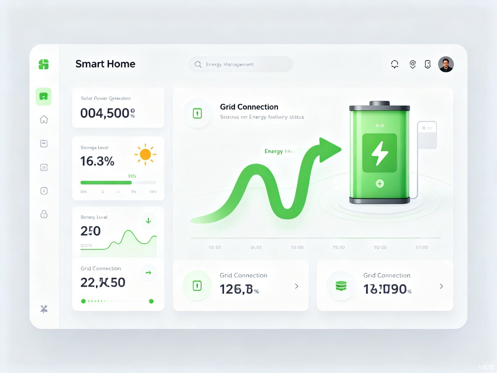
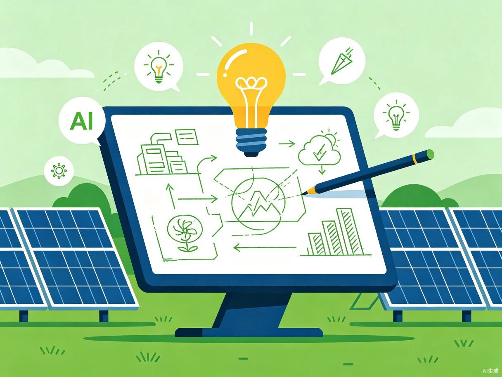
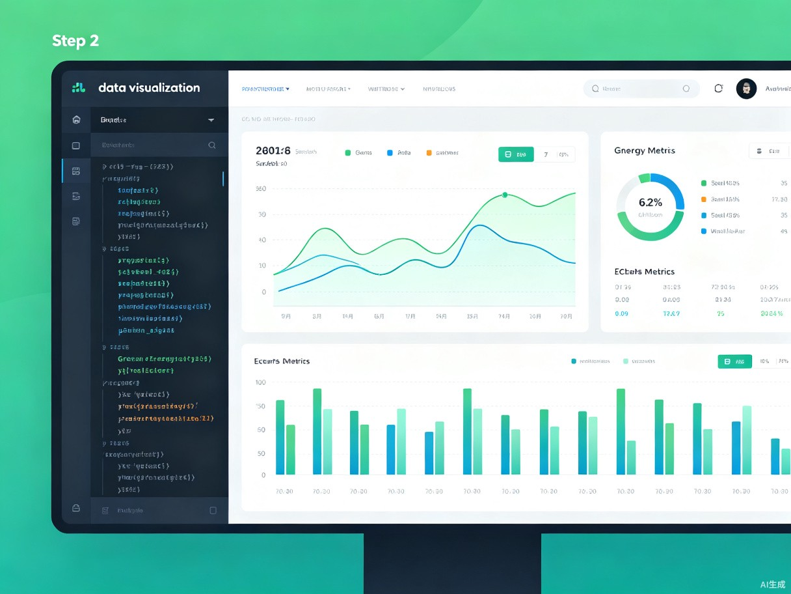
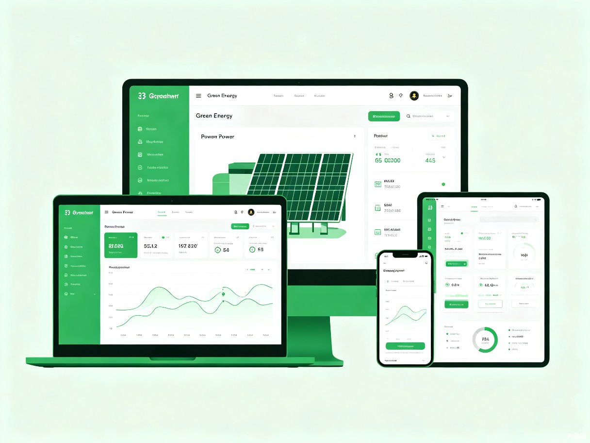

# 硬件交互赛道 · 绿电智储 — 智能光储一体化方案 Demo

> 本帖为 TRAE AI 创造力大赛初赛作品，基于报名时提交的「绿电智储」创意方案开发完成。

---

## 一、Demo 简介

**是什么：** 绿电智储是一套「通用太阳能板 + 华为智能逆变器 + 模块化储能电池 + 智能能源管理系统」的软硬件一体化解决方案，本次 Demo 以 **可交互 HTML 方案展示页** 的形式呈现完整产品逻辑与价值论证。

**面向谁：**
- 拥有自有屋顶或阳台的城市家庭
- 有屋顶空间的小微企业（工厂、商铺、办公楼）
- 电网覆盖不稳定或电价较高的农村及偏远地区用户

**主要功能：**

**① 智能光储调度**
白天光伏发电优先供给负载，余电自动存入储能电池；夜晚或阴雨天由储能电池反向放电，实现 24 小时绿电自给。EMS 系统毫秒级响应，全程无需人工干预。

**② 峰谷套利模式**
基于用户用电习惯和实时电价，AI 自动决策低谷时段从电网充电、高峰时段向负载放电。光伏自用率从行业平均 30% 提升至 85% 以上，每年为用户节省电费 30%-50%。

**③ 无缝电网接入**
支持并网 / 离网 / 混合三种模式智能切换，储能满后多余电量自动并网售电；电网断电时 10ms 内切换至离网备电，保障关键设备不停机。

> **产品界面预览：**
> 
> 

---

## 二、Demo 创作思路

**灵感来源：**
身边有朋友安装了屋顶光伏，但吐槽「白天发的电用不完只能低价卖给电网，晚上用电高峰又要高价买电」，一年下来收益远低于预期。我查了下数据，发现分布式光伏配套储能的渗透率不足 15%，大量家庭和小微企业想装光伏却被「时间错配」劝退。

**想解决的问题：**
光伏发电的高峰（白天）与用户用电的高峰（早晨出门前、晚上回家后）严重错配。没有储能的光伏系统，白天发的电 70% 以上只能低价上网，晚上还得高价购电，投资回收期被拉长 3-5 年。

**为什么做这个方向：**
国家「双碳」目标下，分布式光伏装机量年增速超过 40%，但储能配套率极低，这是明确的蓝海缺口。华为逆变器在转换效率（98.6%）和智能运维上处于行业领先地位，结合通用组件和模块化储能，可以用较低成本打造一套真正解决用户痛点的光储方案，而不是停留在概念层面。

---

## 三、Demo 体验地址

**方式：交互式 HTML 方案展示页（推荐）**

已将完整 Demo 打包为 Zip 格式，包含：
- `green-energy-project.html` — 主展示页面（含系统架构、数据效益分析、ECharts 可视化图表）
- `assets/` — 项目插画、系统架构图、数据图表脚本
- `_shared/` — ECharts、Mermaid 等依赖库

**📎 下载体验：** [green-energy-project.zip]（请将 `green-energy-project` 文件夹整体压缩后上传至社区附件）

> 打开 `green-energy-project.html` 即可在浏览器中完整浏览，支持桌面端和移动端自适应。

---

## 四、TRAE 实践过程

整个 Demo 完全使用 **TRAE Work** 完成开发，以下是完整流程记录。

---

### Step 1 — 需求拆解与结构规划

**Prompt 大意：**
> 我要做一个绿电项目的比赛展示页，通过通用太阳能板结合华为逆变器设备，实现太阳能电力储能和电网接入功能。需要包含项目概述、目标用户、系统架构、核心价值、数据效益、技术亮点、未来展望 7 大板块，并生成配套的视觉素材。

TRAE 收到需求后，自动完成了：
- 页面结构规划（7 大板块 + 响应式布局）
- 配色方案设计（绿色科技风：#2E7D32 + #0EA5E9）
- 字体选型（Outfit 标题 + InstrumentSans 正文 + GeistMono 等宽）
- 组件设计（卡片、指标面板、表格、信息块）

> **开发截图 1：需求拆解与页面结构规划**
> 

**Session ID：** `【请替换为你 Step 1 对话的 Session ID，双击 TRAE 对话气泡可复制】`

---

### Step 2 — AI 生成视觉素材

在 TRAE 中继续请求生成项目插画，TRAE 调用 GenerateImage 能力产出两张核心配图：
- **场景插画**（1280×720）：展示屋顶光伏 + 华为逆变器 + 储能设备的完整部署场景
- **系统架构图**（1152×864）：展示智能能源管理 Dashboard 的数据监控界面

同时规划了第三张「开发过程示意图」用于帖子配图。

> **开发截图 2：AI 生成视觉素材与方案设计**
> 

**Session ID：** `【请替换为你 Step 2 对话的 Session ID】`

---

### Step 3 — 数据可视化图表开发

在 TRAE 中明确要求使用 ECharts 生成三张核心数据图表，TRAE 自动编写 `assets/charts.js`：

| 图表 | 类型 | 用途 |
|------|------|------|
| 日发电与用电曲线 | 双折线面积图 | 直观展示「时间错配」痛点 |
| 年度电费支出对比 | 分组柱状图 | 量化有/无储能的成本差异 |
| 投资回报周期 | 面积图 + 盈亏平衡线 | 证明 5-7 年回本的可行性 |

图表颜色全部从页面 CSS 变量动态读取，确保视觉一致性。

> **开发截图 3：ECharts 图表开发与代码调试**
> 

**Session ID：** `【请替换为你 Step 3 对话的 Session ID】`

---

### Step 4 — 系统架构图嵌入

使用 Mermaid 语法在 HTML 中嵌入可渲染的系统数据流图，展示「光 → 储 → 用 → 网」全链路控制逻辑。TRAE 自动处理了：
- Mermaid 库的本地引用（非 CDN）
- 流程图样式与页面主题色统一
- 响应式适配（移动端自动缩放）

**Session ID：** `【请替换为你 Step 4 对话的 Session ID】`

---

### Step 5 — 样式优化与最终调试

TRAE 完成了最终的细节打磨：
- 绿色渐变 Hero 区域 + 动态脉冲 Badge
- 卡片悬停动效（上浮 + 阴影）
- 表格横向滚动适配移动端
- 图表 resize 监听，窗口变化自动重绘
- 全站响应式断点（768px 以下自动切换单列布局）

**Session ID：** `【请替换为你 Step 5 对话的 Session ID】`

---

### 开发踩坑 & 解决方案

**坑 1：PowerShell 不支持 `pwsh` 命令**
最初用 TRAE 生成的脚手架脚本使用了 `pwsh`，但 Windows 环境下实际只有 `powershell`。解决方案：TRAE 自动识别环境后改用 `powershell -Command` 执行，成功创建目录结构。

**坑 2：图片后缀名不匹配**
GenerateImage 生成的图片实际为 `.jpg`，但 HTML 中按 `.png` 引用。解决方案：TRAE 在生成后自动校验文件系统，发现后缀不一致后统一修正为 `.jpg`。

**坑 3：ECharts 颜色硬编码**
最初图表使用了固定的 hex 色值，与页面主题不统一。解决方案：TRAE 改写为通过 `getComputedStyle` 从 CSS 变量动态读取颜色，确保图表和页面风格完全一致。

---

## 五、附：报名帖链接

**报名帖：** [【硬件交互赛道】绿电智储 — 智能光储一体化方案]（`【请替换为你的报名帖链接】`）

---

## 文件清单

```
green-energy-project/
├── green-energy-project.html      # 主展示页面
├── assets/
│   ├── charts.js                  # ECharts 图表逻辑
│   ├── hero_1280x720.jpg          # 项目场景插画
│   ├── system_diagram_1152x864.jpg    # 系统架构图
│   ├── step1_creative_1152x864.jpg    # 开发过程图 1
│   ├── step2_development_1152x864.jpg # 开发过程图 2
│   └── step3_result_1152x864.jpg      # 开发过程图 3
└── _shared/
    ├── js/
    │   ├── echarts.min.js         # ECharts 库
    │   └── mermaid.min.js         # Mermaid 库
    └── fonts/                     # Outfit / InstrumentSans / GeistMono
```

> 将 `green-energy-project` 文件夹整体压缩为 `.zip` 后上传至社区，评审打开 `green-energy-project.html` 即可完整体验。
