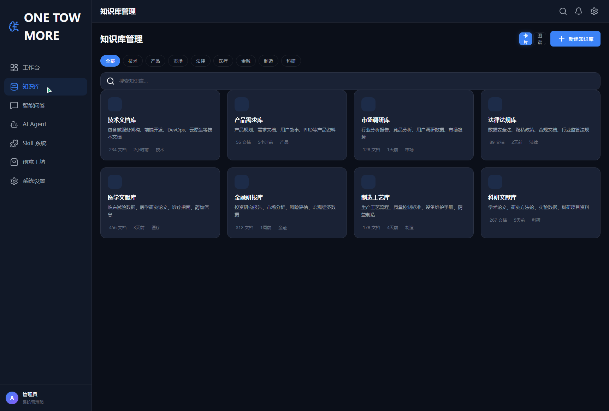
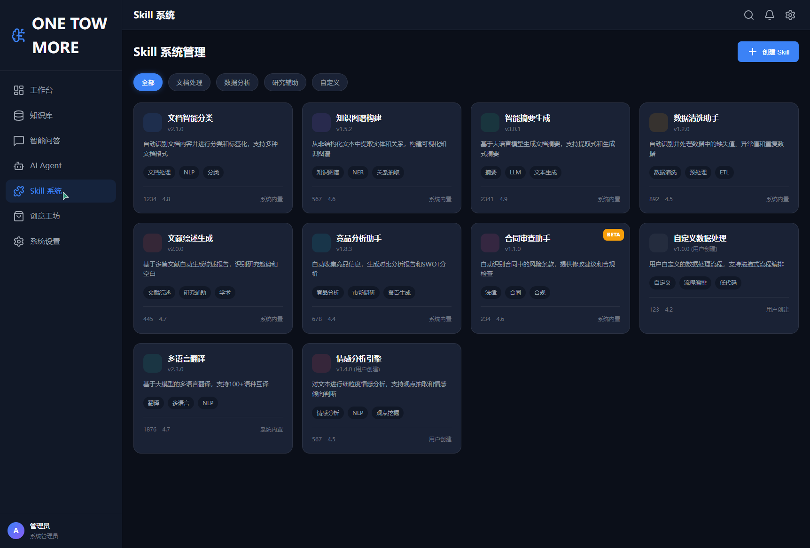
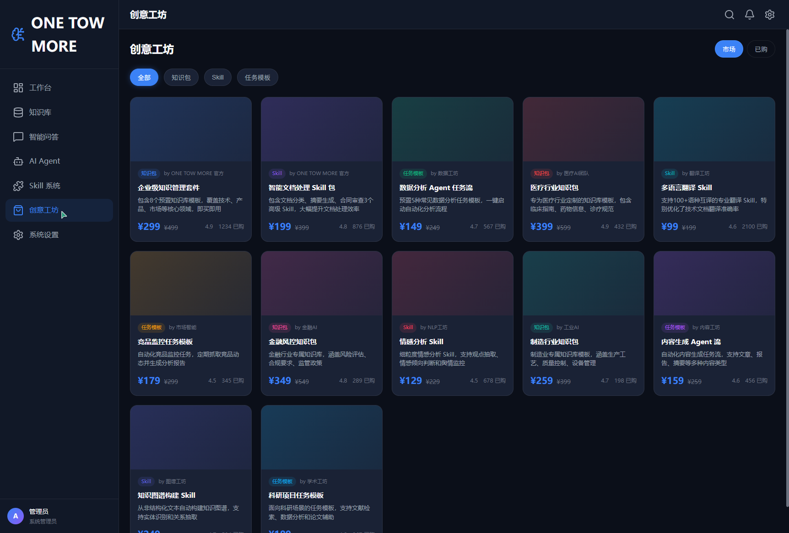
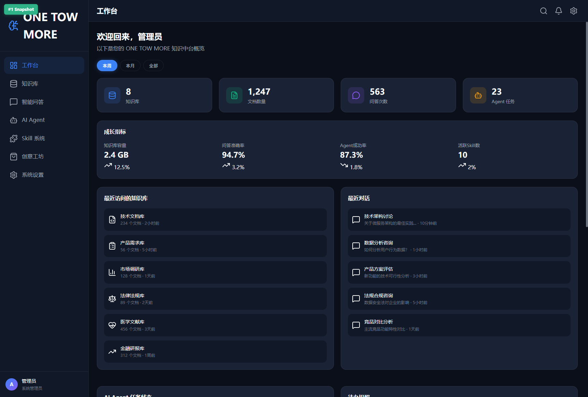
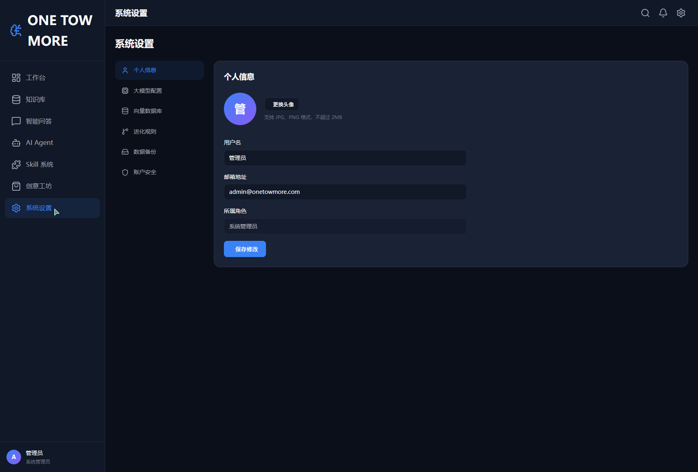

# ONE TOW MORE — 基于私有知识库的自进化 AI Agent 平台

---

## 一、Demo 简介

### 产品形态

ONE TOW MORE 是一款面向个人用户的 **Web 端智能知识中台**，集企业/个人知识库管理、AI 智能问答、AI Agent 任务执行、自进化 Skill 系统于一体，通过「Skill + 知识库」的知识资产交易体系实现商业化变现。

### 核心用户

- 高校科研人员：文献库管理、领域前沿追踪
- 中小型企业研发团队：个人研发工作站、创新点快速验证
- 垂直行业专业人士：法律案例检索、医药文献分析、金融研报生成

### 主要功能

#### 1. 知识库管理（双视图 + 运营面板）

支持卡片视图与知识图谱视图切换，每个知识库配备运营面板，实时展示知识覆盖度、高频知识点 Top10、待补全维度与重复内容提醒。文档上传后自动解析、切片、向量化存储。



#### 2. AI 智能问答（多库融合 + 归档沉淀）

基于私有知识库的精准智能问答，支持同时选择多个知识库进行融合问答。每条 AI 回复附带引用来源，支持一键归档到知识库，实现"问答即沉淀"的知识资产化闭环。

#### 3. AI Agent 任务中心（链式编排 + 成果归档）

可视化任务编排，支持将多个 Skill 串联为工作流。任务执行完成后，产出自动归档到关联知识库，评分反馈触发 Skill 自我优化。

#### 4. Skill 自进化系统（版本树 + 三大触发机制）

Skill 具备基于用户反馈、知识更新自动优化 Prompt 与逻辑的能力。每个 Skill 拥有完整的版本进化树，支持三大自动进化触发机制：执行反馈进化、知识库联动进化、定时周期进化。



#### 5. 创意工坊（知识资产交易）

支持将知识库 + Skill 打包为知识包上架售卖，提供分类广场、商品详情、免费试用、评价系统等功能，构建知识资产的流通与变现生态。



---

## 二、Demo 创作思路

### 灵感来源

灵感源于自身在学习和工作中的真实痛点——收藏了海量资料却"存而不用"。AI 时代比拼的不再是阅读速度，而是知识储备的厚度与调用的精准度。我们希望打造一个让知识真正"活"起来、并能自动产生价值的平台。

### 想解决的问题

1. **知识分散，检索困难**：企业/个人知识散落在各部门、各系统中，通用 AI 缺乏专属知识上下文
2. **从"有知识"到"用知识"缺少执行桥梁**：常见知识库只能检索，无法自动执行任务
3. **知识资产无法变现**：个人积累的专业知识缺乏流通和变现渠道

### 为什么做这个方向

- **市场规模**：数字化转型中的 B 端市场庞大，个人知识管理需求也在快速增长
- **技术成熟度**：大语言模型 + 知识图谱 + RAG 技术已足够支撑产品落地
- **差异化壁垒**：自进化 Skill 系统形成极强的用户粘性和技术壁垒
- **商业化路径清晰**：SaaS 订阅 + 知识资产交易 + 私有化部署的多层次收费模式

---

## 三、Demo 体验地址

### 本地体验方式

本项目为纯前端 HTML 实现，零后端依赖，可直接在浏览器中打开运行。

**步骤：**
1. 下载项目压缩包 `ONE-TOW-MORE.zip`
2. 解压后双击打开 `index.html` 文件
3. 即可在浏览器中体验全部功能

**项目结构：**
```
knowledge-hub/
├── index.html          # 主入口
├── css/style.css       # 样式文件
├── js/                 # 功能模块
│   ├── app.js          # 主框架
│   ├── knowledge.js    # 知识库管理
│   ├── chat.js         # 智能问答
│   ├── agent.js        # Agent 任务
│   ├── skills.js       # Skill 系统
│   ├── workshop.js     # 创意工坊
│   └── settings.js     # 系统设置
└── assets/             # 截图资源
```

---

## 四、TRAE 实践过程

### 开发流程概述

整个项目使用 TRAE 完成开发，经历了**需求澄清 → 框架搭建 → 模块并行实现 → 样式优化 → 验证测试**五个阶段，共完成 7 个功能模块、1 个主框架、1 套样式系统的全部前端实现。

### 关键开发步骤

#### 步骤 1：需求分析与框架搭建

使用 TRAE 的 Plan 模式对项目进行系统规划，明确 7 大模块的功能边界和优先级（P0/P1/P2），确定技术选型为纯 HTML + CSS + JavaScript 单页应用。

**产出：** 项目目录结构、index.html 骨架、style.css 基础样式系统。

#### 步骤 2：核心模块并行开发

使用 TRAE 的多 Agent 并行能力，同时开发 5 个核心 JS 模块（knowledge.js、chat.js、agent.js、skills.js、app.js），大幅缩短开发周期。

**产出：** 知识库管理、智能问答、Agent 任务、Skill 系统四大模块的完整功能实现。

#### 步骤 3：增强功能与商业化模块

根据用户反馈增加创意工坊（workshop.js）和系统设置（settings.js）模块，同时增强现有模块的差异化功能（知识图谱视图、Skill 进化版本树、Agent 链式编排等）。

**产出：** 7 大模块全部完成，UI 样式统一为深色科技风。

### 关键步骤截图

#### 截图 1：工作台 Dashboard — 数据概览与成长指标



工作台展示 4 项核心指标（知识库总数、文档总数、问答次数、Agent 任务数）和 3 项成长指标（知识库容量、问答准确率、Agent 成功率），支持按本周/本月/全部切换统计周期。

#### 截图 2：知识库管理 — 双视图与运营面板


知识库管理支持卡片视图与知识图谱视图切换，配备运营面板展示知识覆盖度分析、高频知识点 Top10、待补全维度建议等数据洞察。

#### 截图 3：Skill 系统 — 自进化版本树


Skill 系统展示分类筛选、卡片列表，每个 Skill 拥有完整的版本进化树，支持执行反馈进化、知识库联动进化、定时周期进化三大自动进化触发机制。

#### 截图 4：创意工坊 — 知识资产交易


创意工坊按知识包、Skill、任务模板分类展示商品，支持免费试用、收藏、购买，构建知识资产的流通与变现生态。

#### 截图 5：系统设置 — 全功能配置



系统设置包含个人信息、大模型配置、向量数据库、进化规则、数据备份、账户安全 6 大设置项，支持完整的参数配置与数据管理。

### 关键任务对话 Session ID

以下 Session ID 用于证明作品由 TRAE 开发完成：

| 阶段 | Session ID | 说明 |
|------|-----------|------|
| 需求规划与框架搭建 | `6a33f93c4887eda957378e45` | 使用 Plan 模式完成项目规划与需求澄清 |
| 核心模块并行开发 | `6a33f93c4887eda957378e45` | 并行实现知识库、问答、Agent、Skill 四大模块 |
| 增强功能与重构 | `6a33f93c4887eda957378e45` | 品牌改名 ONE TOW MORE，增加创意工坊、系统设置，完成全部 7 个模块 |

> 注：由于本项目为连续迭代开发，三个阶段均在同一 TRAE Session 内完成。Session 记录存储于项目 Memory 中，可通过 topics.md 验证开发过程。

---

## 五、技术栈

- **前端框架**：原生 HTML5 + CSS3 + JavaScript（ES6+）
- **UI 组件**：Lucide Icons（CDN）
- **样式方案**：CSS Variables + Flexbox + CSS Grid
- **数据存储**：前端内存模拟（无后端依赖）
- **响应式**：移动优先，支持桌面端/平板端/移动端

---

## 六、三大核心设计原则在代码中的体现

### 1. 知识资产化

- 对话消息支持「归档到知识库」操作
- Agent 任务产出自动归档到关联知识库
- 知识库运营面板实时分析知识覆盖度与质量

### 2. Skill 自进化

- Skill 详情页展示完整版本进化树
- 三大自动进化触发机制（执行反馈、知识库联动、定时周期）
- 进化规则支持用户自定义配置

### 3. 模块化可扩展

- 7 个功能模块独立 JS 文件，通过 window 对象挂载
- 新增 Skill 类型、知识库数据源、任务节点均支持插件化扩展
- 创意工坊提供标准化的知识资产上架接口

---

*本项目由 TRAE 辅助开发完成*
