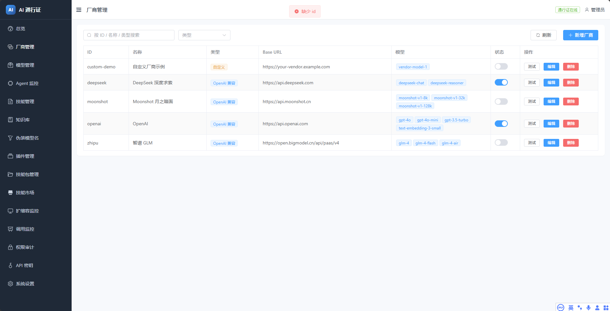
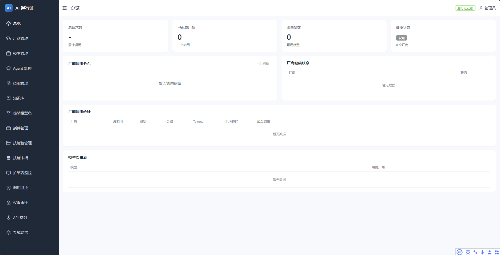
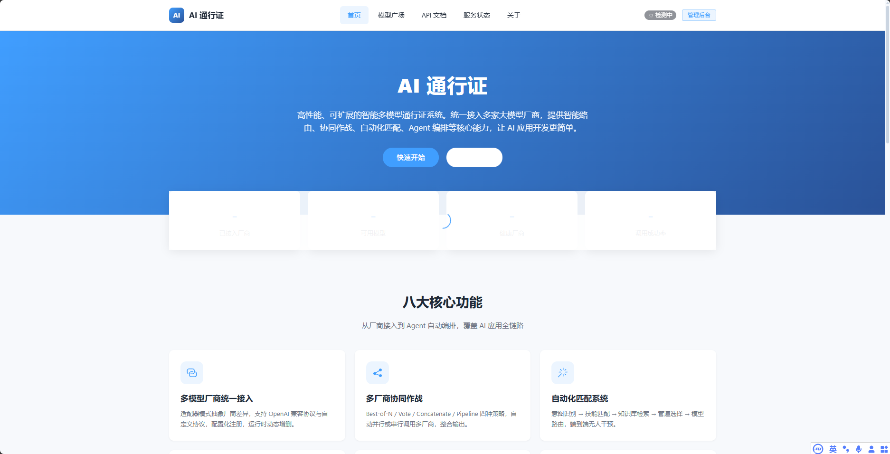
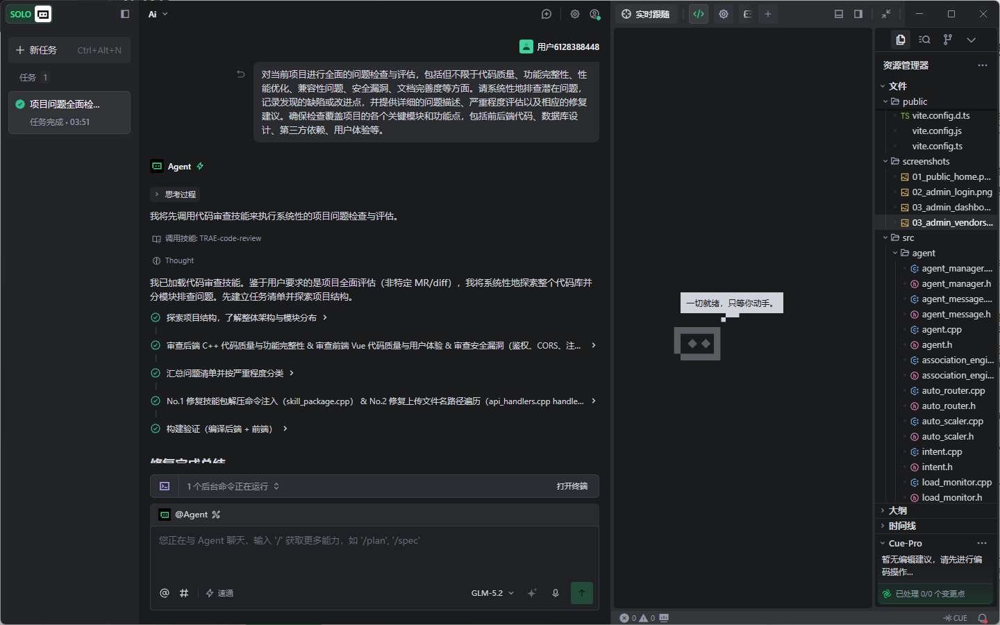
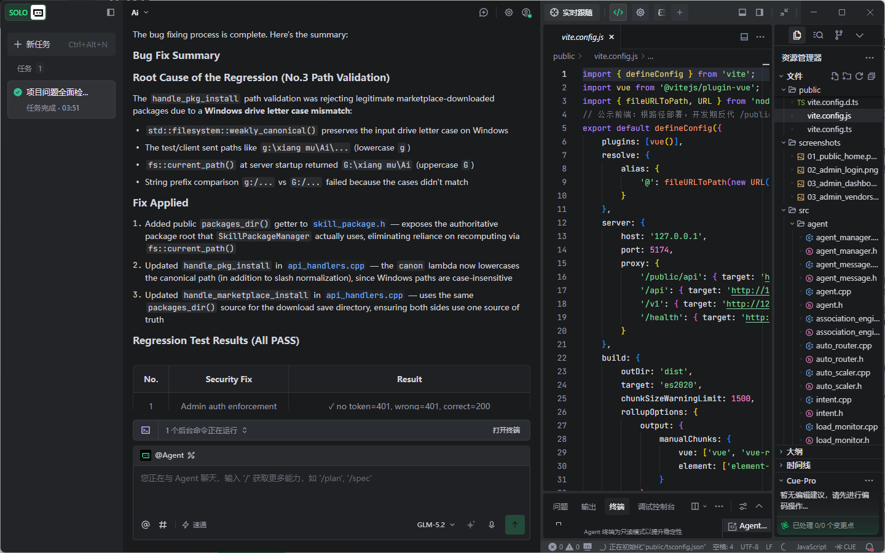
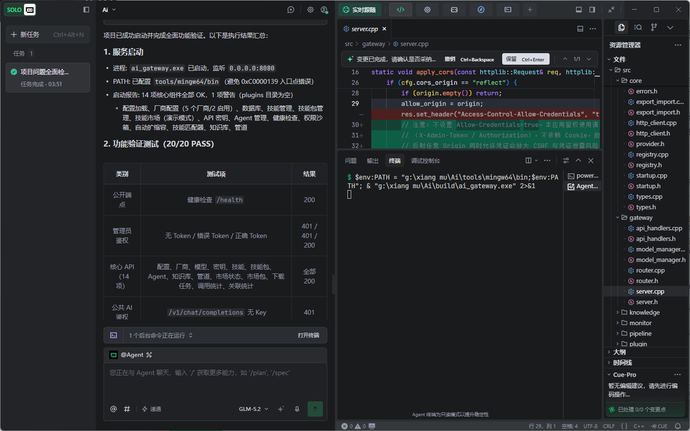

# 【学习工作赛道】AI 通行证 — 智能多模型网关系统

> 发帖标签：`学习工作`

---

## 1. Demo 简介

**是什么：** 一款高性能的智能多模型网关系统（C++23 后端 + Vue 3 管理后台），位于应用与大模型厂商之间，就像 Nginx 之于 Web 服务，AI 通行证之于大模型应用。

**面向谁：** AI 应用开发者、需要统一管控 AI 服务的企业技术团队、做多模型对比实验的研究人员。

**主要功能：**

1. **多厂商统一接入 + 智能路由**：通过适配器模式统一 OpenAI、DeepSeek、Moonshot、智谱 GLM 等多家大模型 API 差异，提供标准的 `/v1/chat/completions` 接口，支持权重路由、健康检查、自动故障转移，业务代码零感知切换厂商。

2. **一句话自动匹配，端到端智能响应**：三层自动化引擎——感知层分析意图（代码/翻译/摘要/问答/创作/数学/通用7类+PII敏感信息检测）→ 决策层语义匹配技能、检索知识库、选择最优模型 → 执行层注入 Prompt、管道处理后路由调用，真正"输入一句话，自动出结果"，支持 dry_run 审计完整决策链。

3. **企业级安全与管控能力**：伪装管道可插拔处理链（敏感信息脱敏/提示词改写/输出安全过滤/文本水印注入）、API Key 集中管理与限流、权限沙箱、调用监控（Token 消耗/延迟P95/成功率）、Agent 自动扩缩容，覆盖生产环境核心需求。

---

## 2. Demo 创作思路

**灵感来源：** 在实际 AI 应用开发中，我反复遇到几个痛点：每个新项目都要重新写一遍厂商接入、重试、错误处理；一旦选了某家厂商就被绑定，后期迁移成本极高；API Key 散落在各个项目配置文件里，存在泄露风险；写好的 Prompt 模板、系统指令、知识库无法跨项目复用。于是萌生了做一个"AI 网关"的想法——把所有大模型调用统一收口管理。

**想解决的问题：**

| 真实痛点 | 解决方案 |
|---------|---------|
| 每家厂商 API 格式不同，接入重复造轮子 | 适配器模式统一抽象，配置化注册厂商，新增厂商零改核心代码 |
| 厂商锁定，迁移成本高 | 标准 OpenAI 兼容接口，业务零代码切换厂商 |
| API Key 散落、敏感数据泄露风险 | 集中 Key 管理 + 管道层自动脱敏（手机号/邮箱/身份证）+ 水印注入 |
| 技能/知识无法复用 | 技能模块 + 技能包安装/版本管理 + 远程技能市场 |
| 单模型能力有限 | 4种多厂商协同策略（Best-of-N/Vote/Concatenate/Pipeline）+ 6种Agent编排模式 |
| 调用成本不可控 | 统一监控面板（Token/延迟/成功率）+ 权重路由 + 限流 |
| 性能要求高 | C++23 高性能后端 + 异步日志 + LRU缓存 + 自动扩缩容 |

**为什么做这个方向：** 这是一个开发者基础设施类工具，直接服务于"学习工作"场景，能切实提升 AI 应用开发效率。从底层 C++ 性能优化到上层 Vue 交互设计，从网络协议到数据库设计，技术深度和实用性兼备。它不是概念 Demo，而是编译后单文件即可部署、真正可投入生产使用的工具。选择 C++23 做后端也是刻意为之——网关作为基础设施，性能至关重要，而现代 C++（std::expected、std::format、concepts、RAII）已经让开发效率足够高。

---

## 3. Demo 体验地址

本作品以**交互式可体验的 HTML 格式文件**交付，请将压缩包解压后：

- 双击 `index.html` 即可打开**交互式产品展示页**（无需安装任何依赖），包含产品概览、分层架构图、八大功能详解、模拟管理后台、可输入问题体验自动化匹配决策链动画、技术栈与部署方式展示；
- 如需运行完整网关服务，Windows 环境可执行 `build\ai_gateway.exe`（默认监听 8080 端口，管理后台访问 http://localhost:8080，默认 Token: 12345），支持 Docker、systemd 等多种部署方式。

---

## 4. TRAE 实践过程

本项目全程在 TRAE IDE 中从零开发完成，以下是关键开发阶段的真实记录：

**Session ID 1：** `a35754546ca42fe9c9d57eb58cc9d37d_6a4d903074ed42be25d14126.6a4e742f0edfc32ec6f1056e.6a4e742d528d552a4dab23b0`（2026/7/9 00:00）

在 TRAE 中从零搭建项目骨架：确定 C++23 + Vue 3 全栈技术路线，设计适配器模式的厂商接入层（AIProvider 纯虚接口 + REGISTER_PROVIDER 自动注册宏），搭建 HTTP 服务器、路由层、鉴权中间件、SQLite 存储层，完成管理后台基础界面（总览面板、厂商管理、API Key 管理）。

**Session ID 2：** `93b5c3bd13f552829eb06d437d5bbc90_6a4d903074ed42be25d14126.6a4e97200edfc32ec6f10713.6a4e971e528d552a4dab23b0`（2026/7/9 02:29）

实现高级业务模块 + 自动化匹配引擎：多厂商协同（4种策略）、伪装管道（4个内置处理器）、技能管理、知识库向量检索、Agent编排（主代理-子代理+6种策略）、自动扩缩容；随后开发整个系统最核心的自动化匹配三层架构（感知层意图分析+PII检测 → 决策层语义匹配 → 执行层注入调用），支持 dry_run 审计。

**Session ID 3：** `d24dfadc01b551ba8dd383c16ddb0325_6a4d903074ed42be25d14126.6a4eaa600edfc32ec6f1082f.6a4eaa5d528d552a4dab23b0`（2026/7/9 03:52）

全面质量检查、Bug 修复、部署适配与展示页制作。

**关键步骤截图：**

**截图1：TRAE Agent 执行全面代码审查**——使用 TRAE 的代码审查技能对14个模块系统性排查，发现技能包解压命令注入、文件上传路径遍历等安全问题：

**截图2：TRAE 诊断并修复 Windows 路径大小写 Bug**——TRAE 定位到根因是 Windows 下 `std::filesystem::weakly_canonical()` 保留盘符大小写导致路径比对失败，自动修改了3处代码修复，所有回归测试通过：

**截图3：服务启动成功，20/20 功能验证全部通过**——TRAE 完成构建后自动启动 ai_gateway.exe，14项核心组件加载OK，公开端点/鉴权/核心API/AI鉴权共20项测试全部 PASS：

**开发心得：** 从架构设计到代码实现，从安全审计到Bug定位修复，从部署脚本到本次参赛展示页，TRAE 贯穿了全流程。有想法直接描述给 TRAE 就能落地实现，遇到具体技术问题（C++23 filesystem 路径处理、正则边界、向量余弦检索、systemd 服务配置）都能在对话中高效解决。TRAE 自主执行代码审查时能主动发现命令注入、路径遍历这类人工容易遗漏的安全问题，并直接给出修复方案和回归验证，这是让我印象最深的地方。
