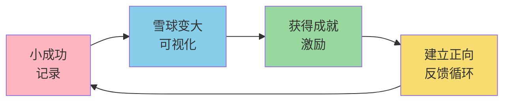
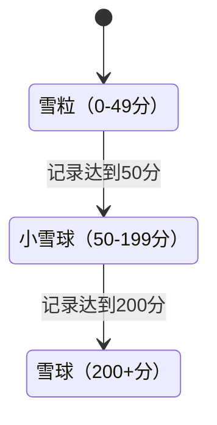
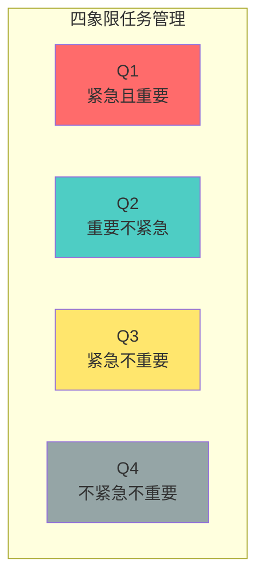
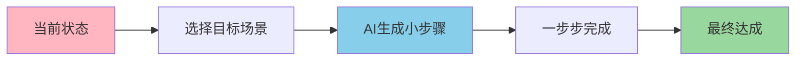
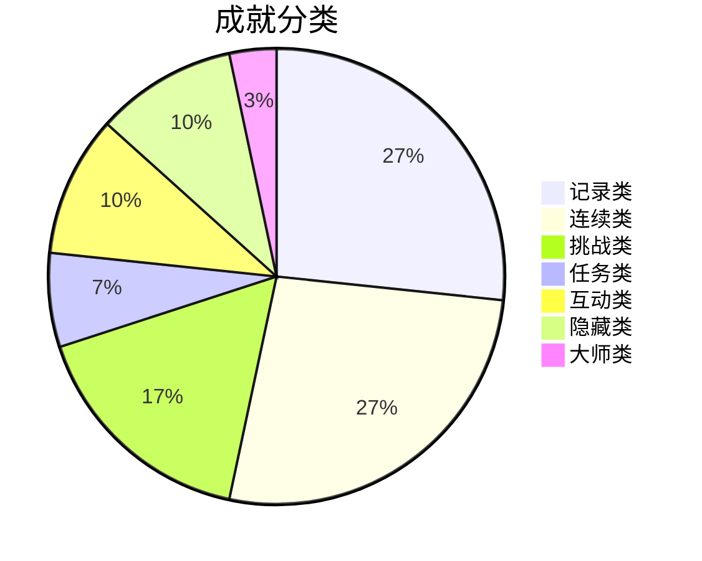
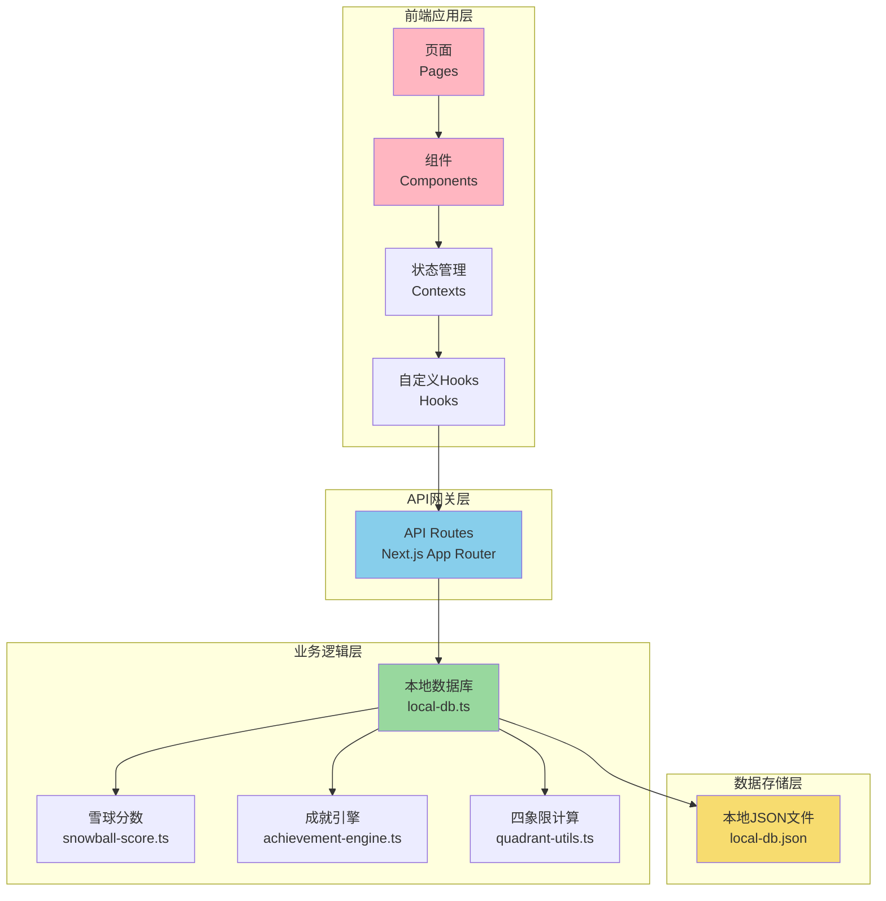
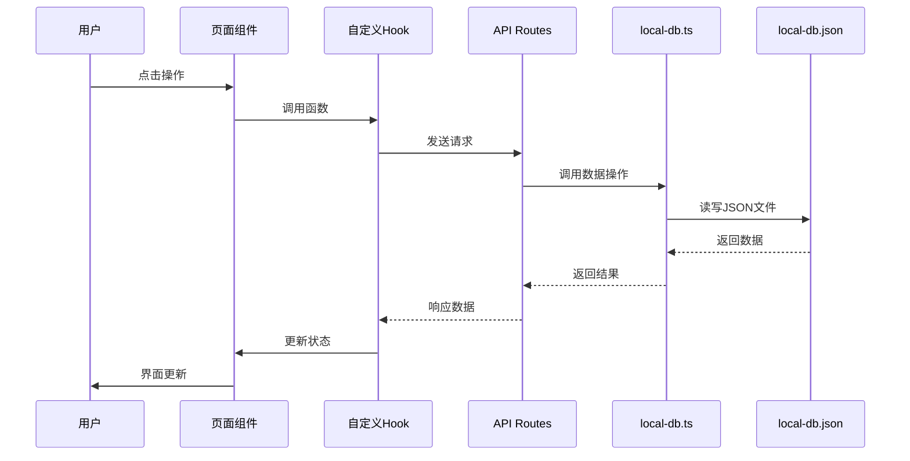
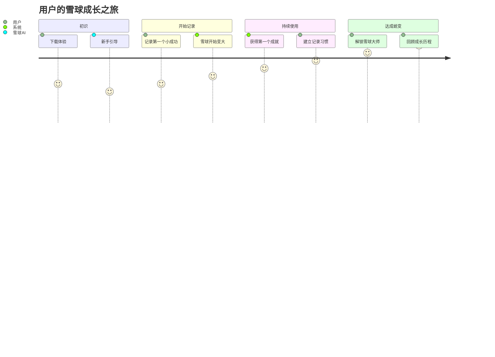

# 雪球日记

## 让微小的成功被看见
### - 用 AI 陪伴与可视化成长

---

# 目录

1. 产品概述与价值主张
2. 产品功能总览
3. 核心功能详解
4. 技术架构设计
5. 技术栈与实现
6. 产品特点与亮点
7. 未来规划

---

# 产品首页

> 雪球日记首页 - 温暖的视觉设计，清晰的功能入口

---

# 一、产品概述与价值主张

## 问题痛点

| 问题 | 传统方式的困扰 |
|------|----------------|
| **小成就容易被忽略** | 每天都在努力，但进步不易察觉 |
| **缺乏持续动力** | 缺乏正向反馈机制 |
| **拖延症难克服** | 目标大到无从下手 |
| **习惯养成困难** | 缺少持续的记录与反馈 |
| **成长轨迹模糊** | 不记得自己的努力与成果 |

---

## 雪球日记 - 解决之道

### 核心理念
> **每天记录一个小成功，雪球会越来越大！**

---

# 二、产品功能总览

## 功能全景图

| 模块 | 核心功能 |
|------|----------|
| **📝 记录系统** | 3秒快速记录、AI自动标签、情感分析 |
| **❄️ 雪球成长** | 分数计算、阶段进化、庆祝动画 |
| **🎯 任务管理** | 四象限优先级、长任务分解、习惯打卡 |
| **🏆 成就体系** | 37个成就、7大分类、里程碑激励 |
| **🤖 AI陪伴** | 智能反馈、每日提问、拖延急救 |
| **📊 成长分析** | 成长时间线、数据统计、AI报告 |

---

# 任务管理页面

> 任务管理 - 四象限优先级、长任务分解、习惯追踪

---

# 记录系统页面

> 记录系统 - 快速记录，成长动力

---

# 三、核心功能详解

## 1. 雪球成长系统

| 动作 | 分数奖励 |
|------|----------|
| 创建记录 | +5 分 |
| 完成普通任务 | +5 分 |
| 完成快速任务 | +2 分 |
| 习惯打卡 | +5 分 |
| 完成长任务 | +10 分 |

---

## 2. 任务管理

### 四象限优先级

**任务类型：**
- 快速任务：简单快捷
- 普通任务：标准任务
- 长任务：目标级任务，可分解
- 习惯：每日/每周重复

---

## 3. 拖延急救

### 躺平 → 行动 的魔法分解术

### 支持的场景
- 躺平刷手机 → 去图书馆学习
- 躺着不想动 → 去运动
- 发呆 → 去做饭
- 短视频停不下 → 开始工作
- 游戏入迷 → 去睡觉

---

## 4. 成就体系

### 个人成就中心页面

> 成就体系 - 37个成就，装饰奖励系统

### 37个成就，7大分类

| 级别 | 说明 |
|------|------|
| **micro** | 入门级，轻松获得 |
| **minor** | 普通级，稍加努力 |
| **growth** | 成长级，持续坚持 |
| **major** | 大师级，显著成就 |
| **transformation** | 蜕变级，终极目标 |

---

# 四、技术架构设计

## 系统整体架构

---

## 技术架构详解

### 分层设计

| 层级 | 职责 | 关键文件 |
|------|------|----------|
| **页面层** | 路由、页面布局 | [src/app/page.tsx](file:///d:/code/python/test/snowball-diary-new/src/app/page.tsx) |
| **组件层** | 可复用UI组件 | [src/app/components/](file:///d:/code/python/test/snowball-diary-new/src/app/components/) |
| **状态层** | React Context状态管理 | [src/contexts/](file:///d:/code/python/test/snowball-diary-new/src/contexts/) |
| **业务逻辑层** | 核心业务规则 | [src/lib/](file:///d:/code/python/test/snowball-diary-new/src/lib/) |
| **数据层** | 本地JSON持久化 | [data/local-db.json](file:///d:/code/python/test/snowball-diary-new/data/local-db.json) |

---

## 核心数据流

---

## 核心模块设计

### 数据持久化层 - local-db.ts

```mermaid
flowchart LR
    subgraph "数据模型"
        Users[用户<br/>users]
        Tasks[任务<br/>tasks]
        Records[记录<br/>records]
        Achievements[用户成就<br/>userAchievements]
        Challenges[挑战<br/>challenges]
        UserChallenges[用户挑战<br/>userChallenges]
        Growth[成长数据<br/>growthData]
    end
    
    subgraph "操作函数"
        GetUser[getUser]
        CreateTask[createTask]
        UpdateTask[updateTask]
        CreateRecord[createRecord]
        CheckAchievement[checkAndUnlockAchievements]
        GetStats[getUserStats]
    end
    
    操作函数 --> 数据模型
    数据模型 --> JSON[JSON文件<br/>local-db.json]
    
    style JSON fill:#F7DC6F
```

---

# 五、技术栈与实现

## 技术栈总览

| 类别 | 技术 | 版本 |
|------|------|------|
| **前端框架** | Next.js | 16.2.4 |
| **UI库** | React | 19.2.4 |
| **样式** | Tailwind CSS | 4 |
| **动画** | Framer Motion | 12.38.0 |
| **图表** | Recharts | 3.8.1 |
| **语言** | TypeScript | 5+ |
| **测试** | Vitest | 4.1.5 |
| **数据存储** | 本地JSON文件 | - |
| **AI服务** | 智谱AI GLM-4-Flash | - |

---

## 核心技术选型原因

| 技术 | 选择理由 |
|------|----------|
| **Next.js 16** | App Router、API Routes一体化、SSR能力 |
| **Tailwind CSS** | 原子化CSS、快速开发、一致性设计 |
| **Framer Motion** | 流畅动画、简单API、雪球成长特效 |
| **本地JSON存储** | 零配置、无需服务器、开箱即用 |
| **TypeScript** | 类型安全、良好开发体验、代码可维护性 |

---

# 六、产品特点与亮点

## 七大核心特点

| 特点 | 说明 |
|------|------|
| ✨ **极简设计** | 界面清爽、交互直观、3秒快速记录 |
| ❄️ **雪球成长** | 从雪粒到雪球的可视化成长过程 |
| 🎨 **精美动画** | Framer Motion驱动的流畅交互体验 |
| 🤖 **AI陪伴** | 智能反馈、每日提问、拖延急救 |
| 🎯 **任务分解** | 四象限优先级、长任务拆解、习惯追踪 |
| 🏆 **成就激励** | 37个成就、正向反馈、持续激励 |
| 📊 **数据洞察** | 成长时间线、统计分析、AI报告 |

---

## 用户价值实现路径

---

# 七、未来规划

## 产品迭代路线图

| 阶段 | 时间 | 核心功能 |
|------|------|----------|
| **V1.0** | ✅ 已完成 | 基础记录、任务管理、雪球成长 |
| **V2.0** | ✅ 已完成 | 成就系统、AI反馈、拖延急救 |
| **V3.0** | ✅ 已完成 | 本地持久化、挑战系统、成长时间线 |
| **V4.0** | 🛠️ 规划中 | 云端同步、多设备支持、社区功能 |
| **V5.0** | 📋 规划中 | 移动端APP、数据导出、高级分析 |

---

# Q&A

## 常见问题

| 问题 | 回答 |
|------|------|
| 数据存储在哪里？ | 本地 `data/local-db.json` 文件 |
| 需要联网使用吗？ | 核心功能离线可用，AI功能需联网 |
| 可以重置数据吗？ | 删除 `data/local-db.json` 即可 |
| 支持多用户吗？ | 当前本地版单用户，云端版支持多用户 |

---

# 谢谢观看

## 让每一天的努力都被看见

### 雪球日记 - 与你的雪球一起成长

> **项目地址**  
> GitHub: [查看代码](file:///d:/code/python/test/snowball-diary-new/)  
> 文档: [docs/](file:///d:/code/python/test/snowball-diary-new/docs/)  
> Code Wiki: [docs/code-wiki.md](file:///d:/code/python/test/snowball-diary-new/docs/code-wiki.md)
